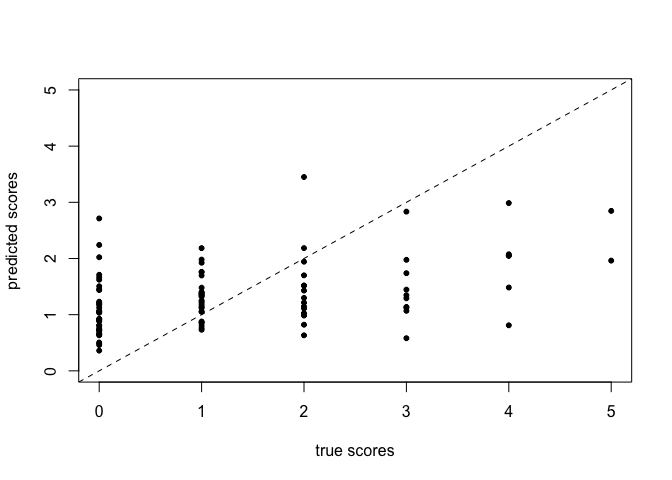
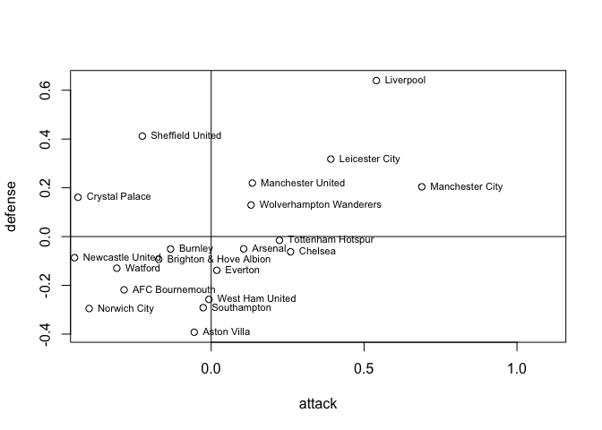
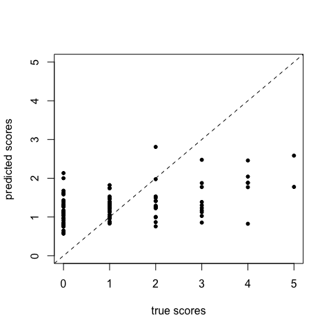
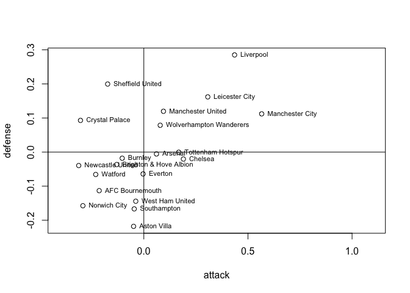

# Excercise:

This notebook compares a non-hierarchical model and a hierarchical model
to predict the scores of English premier league matches.

## Your tasks

Step through the notebook and try to understand it. Try to answer the
following questions:

- Why the $log$ in $log(theta_g2) = att_at + def_ht$?
- For 15 games and for 200 games in the training set. Answer the
  following questions:
  - What are the effective number of parameters in the hierarchical
    model and non-hierarchical model (use the output of the `loo`
    function)?
  - What is the average score (for definition see below) and
- What is the home advantage in the non-hierarchical model and the
  hierarchical model?

### Background

This notebook is a tutorial on Hierarchical modelling using Stan which
is adopted from
<https://github.com/MaggieLieu/STAN_tutorials/blob/master/Hierarchical/Hierarchical.Rmd>.
The model is also described in the paper:
<https://discovery.ucl.ac.uk/id/eprint/16040/1/16040.pdf>

Modifications include:

- Removing of the pooled model

- Removing the fixed prior for home advantage (which has a std of about
  1e-4)

- Nevertheless, it appears necessary, as mentioned in the paper, to
  implement a sum-to-zero restriction for both the defense and offense.
  This stems from the fact that teams compete against one another,
  making these abilities dependent on each other. For further details,
  please refer to the aforementioned paper and its associated
  references.

``` r
lsg = TRUE #Set to FALSE before submitting
#require(rstan)
#set.seed(1) #set seed 
library(cmdstanr)
```

    ## This is cmdstanr version 0.8.0.9000

    ## - CmdStanR documentation and vignettes: mc-stan.org/cmdstanr

    ## - CmdStan path: /Users/oli/.cmdstan/cmdstan-2.34.1

    ## - CmdStan version: 2.34.1

    ## 
    ## A newer version of CmdStan is available. See ?install_cmdstan() to install it.
    ## To disable this check set option or environment variable cmdstanr_no_ver_check=TRUE.

``` r
options(mc.cores = parallel::detectCores())
```

### Reading the data

First we read in the data

``` r
#data = read.csv('https://raw.githubusercontent.com/MaggieLieu/STAN_tutorials/master/Hierarchical/premiereleague.csv',col.names = c('Home','score1', 'score2', 'Away'), stringsAsFactors = FALSE)

# Uncomment the following line to read the data for the Euro 24
data = read.csv('../../stan/Euro24/games_before_euro24.csv', stringsAsFactors = FALSE)[,1:4]
colnames(data) = c('Home','score1', 'score2', 'Away')
```

``` r
head(data)
```

    ##      Home score1 score2        Away
    ## 1 Denmark      3      1     Finland
    ## 2   Italy      1      2     England
    ## 3  France      4      0 Netherlands
    ## 4 Czechia      3      1      Poland
    ## 5   Spain      3      1     Georgia
    ## 6 Romania      1      0 Switzerland

``` r
ng = nrow(data)
cat('we have G =', ng, 'games \n')
```

    ## we have G = 115 games

``` r
nt = length(unique(data$Home))
cat('We have T = ', nt, 'teams \n')
```

    ## We have T =  24 teams

### Data Preparation

Now convert team names for each match into numbers (for the lookup)

``` r
#Some R-Magic to convert the team names to numbers, no need to understand this
teams = unique(data$Home)
ht = unlist(sapply(1:ng, function(g) which(teams == data$Home[g])))
at = unlist(sapply(1:ng, function(g) which(teams == data$Away[g])))
```

``` r
# we will save the last np games to predict
np=1
ngob = ng-np #ngames obsered ngob = number of games to fit
print(paste0("Using the first ", ngob, " games to fit the model and ", np, " games to predict"))
```

    ## [1] "Using the first 114 games to fit the model and 1 games to predict"

``` r
my_data = list(
  nt = nt, 
  ng = ngob,
  ht = ht[1:ngob], 
  at = at[1:ngob], 
  s1 = data$score1[1:ngob],
  s2 = data$score2[1:ngob],
  np = np,
  htnew = ht[(ngob+1):ng],
  atnew = at[(ngob+1):ng]
)
```

### Traditional (non-hierachical) method

We will assume that the goals scored come from a poisson distribution

- s1 ~ Poisson(theta_g1) \#game g score by home team

- s2 ~ Poisson(theta_g2) \#game g score by away team

Assuming a log-linear random effect model

- log(theta_g1) = home + att_ht + def_at

- log(theta_g2) = att_at + def_ht

Where home is a constant for the advantage for the team hosting the game
att and def are the attack and defense abilities of the teams where the
indices at,ht correspond to the t=1-20 teams.

``` r
library(here)
library(cmdstanr)
nhmodel <- cmdstan_model(here('lab/football1/non_hier_model.stan'))
nhfit = nhmodel$sample(data = my_data)
d = loo::loo(nhfit$draws("log_lik"))
print(d)
```

#### Non-Hierarchical model predicted scores of the unseen

``` r
library(tidyverse)
```

    ## ── Attaching core tidyverse packages ──────────────────────── tidyverse 2.0.0 ──
    ## ✔ dplyr     1.1.1     ✔ readr     2.1.4
    ## ✔ forcats   1.0.0     ✔ stringr   1.5.0
    ## ✔ ggplot2   3.5.1     ✔ tibble    3.2.1
    ## ✔ lubridate 1.9.2     ✔ tidyr     1.3.0
    ## ✔ purrr     1.0.1     
    ## ── Conflicts ────────────────────────────────────────── tidyverse_conflicts() ──
    ## ✖ dplyr::filter() masks stats::filter()
    ## ✖ dplyr::lag()    masks stats::lag()
    ## ℹ Use the conflicted package (<http://conflicted.r-lib.org/>) to force all conflicts to become errors

``` r
s1new = nhfit$draws(format = "df", 's1new') %>% select(-.chain, -.iteration, -.draw)
```

    ## Warning: Dropping 'draws_df' class as required metadata was removed.

``` r
s2new = nhfit$draws(format = "df", 's2new') %>% select(-.chain, -.iteration, -.draw)
```

    ## Warning: Dropping 'draws_df' class as required metadata was removed.

``` r
pred_scores = c(colMeans(s1new),colMeans(s2new))
true_scores = c(data$score1[(ngob+1):ng],data$score2[(ngob+1):ng] )
plot(true_scores, pred_scores, xlim=c(0,5), ylim=c(0,5), pch=20, ylab='predicted scores', xlab='true scores')
abline(a=0,  b=1, lty='dashed')
```

<!-- -->

``` r
sqrt(mean((pred_scores - true_scores)^2))
```

    ## [1] 0.156375

``` r
cor(pred_scores, true_scores)
```

    ## Warning in cor(pred_scores, true_scores): the standard deviation is zero

    ## [1] NA

Below is a function to calculate the score of the model. Using the
following rules:

1.  Exact Score Prediction: 3 Points are awarded if both the predicted
    home and away scores match the actual scores exactly.
2.  Draw Prediction: 1 Point is awarded if the predicted result is a
    draw (both teams score the same number of goals) and the actual
    result is also a draw.
3.  Correct Outcome Prediction: 1 Point is awarded if the predicted
    outcome (win/loss) matches the actual outcome, even if the exact
    scores do not match.

``` r
get_score = function(s1new, s2new, data){
  s1_pred_score = round(colMeans(s1new),0)
  s2_pred_score = round(colMeans(s2new),0)
  points = 0
  for (i in 1:length(s1_pred_score)){
      pred_scorediff = s1_pred_score - s2_pred_score
      if (s1_pred_score[i] == data$score1[ngob+i]
          && s2_pred_score[i] == data$score2[ngob+i]){
        points = points + 3
      } else {
        if (s1_pred_score[i] == s2_pred_score[i]){ #Call it a draw
          if (data$score1[ngob+i] == data$score2[ngob+i]) {
            points = points + 1
          }
        } else {#No draw
           if(sign(pred_scorediff[i]) == sign(data$score1[ngob+i] - data$score2[ngob+i])){
             points = points + 1
           }
        }
      } 
  }
  return (points)
}
get_score(s1new, s2new, data)
```

    ## [1] 3

#### Defense / Attack Non-Hierachical

We can also look at the attack/defense of the teams:

``` r
attack = nhfit$draws(format = "df", 'att') %>% 
  select(-.chain, -.iteration, -.draw) %>% colMeans()
```

    ## Warning: Dropping 'draws_df' class as required metadata was removed.

``` r
defense = nhfit$draws(format = "df", 'def') %>% 
  select(-.chain, -.iteration, -.draw) %>% colMeans()
```

    ## Warning: Dropping 'draws_df' class as required metadata was removed.

``` r
plot(attack,defense,xlim=c(-0.4,1.1))
abline(h=0)
abline(v=0)
text(attack,defense, labels=teams, cex=0.7, pos=4)
```

<!-- -->

### Your Excercise / Determine the home advantage

Plot the posterior of the variable `home`

``` r
library(tidybayes)
#home_adv = rstan::extract(nhfit)$home
#hist(home_adv, 100, freq = FALSE, main=paste0("Home Adv, mean: ", round(mean(home_adv),2)))
#lines(density(home_adv))

tidy_draws(nhfit) %>% 
  select(home) %>% 
  ggplot(aes(x=home)) + geom_density() 
```

<!-- -->

# Hierarchical model

In a hierarchical model, the parameters of interest, in our case the
attack and defense ability are drawn from the population distribution.

- att\[t\] ~ normal(mu_att, tau_att)

- def\[t\] ~ normal(mu_def, tau_def)

Instead we define priors on the population, known as the hyperpriors.

``` r
hmodel <- cmdstan_model('~/Documents/GitHub/da/stan/football/hier_model.stan')
hfit = hmodel$sample(data = my_data)
```

## Checking the chain

``` r
hfit
```

    ##    variable    mean  median    sd   mad      q5    q95 rhat ess_bulk ess_tail
    ##  lp__       -132.05 -135.30 19.71 19.61 -159.35 -94.14 1.07       42       33
    ##  home          0.42    0.43  0.08  0.08    0.29   0.54 1.01      289     1907
    ##  att_raw[1]    0.01    0.00  0.15  0.13   -0.23   0.25 1.04     2369     1975
    ##  att_raw[2]    0.10    0.07  0.16  0.13   -0.13   0.41 1.02      211      201
    ##  att_raw[3]    0.16    0.13  0.17  0.16   -0.06   0.47 1.02      191     1034
    ##  att_raw[4]   -0.04   -0.03  0.16  0.13   -0.32   0.20 1.03      397     1053
    ##  att_raw[5]    0.27    0.25  0.21  0.23   -0.01   0.62 1.05       65      688
    ##  att_raw[6]   -0.05   -0.03  0.18  0.14   -0.37   0.23 1.03     1823     1385
    ##  att_raw[7]   -0.10   -0.07  0.16  0.14   -0.40   0.13 1.02     1043     1374
    ##  att_raw[8]   -0.08   -0.05  0.15  0.13   -0.35   0.14 1.01      757     1619
    ## 
    ##  # showing 10 of 446 rows (change via 'max_rows' argument or 'cmdstanr_max_rows' option)

``` r
bayesplot::mcmc_trace(hfit$draws(c("mu_att", "lp__")))
```

<!-- -->

``` r
loo::loo(hfit$draws("log_lik"))
```

    ## Warning: Relative effective sample sizes ('r_eff' argument) not specified.
    ## For models fit with MCMC, the reported PSIS effective sample sizes and 
    ## MCSE estimates will be over-optimistic.

    ## Warning: Some Pareto k diagnostic values are slightly high. See help('pareto-k-diagnostic') for details.

    ## 
    ## Computed from 4000 by 114 log-likelihood matrix
    ## 
    ##          Estimate   SE
    ## elpd_loo   -349.1 12.1
    ## p_loo        13.5  2.1
    ## looic       698.3 24.3
    ## ------
    ## Monte Carlo SE of elpd_loo is 0.1.
    ## 
    ## Pareto k diagnostic values:
    ##                          Count Pct.    Min. n_eff
    ## (-Inf, 0.5]   (good)     113   99.1%   1280      
    ##  (0.5, 0.7]   (ok)         1    0.9%   3149      
    ##    (0.7, 1]   (bad)        0    0.0%   <NA>      
    ##    (1, Inf)   (very bad)   0    0.0%   <NA>      
    ## 
    ## All Pareto k estimates are ok (k < 0.7).
    ## See help('pareto-k-diagnostic') for details.

``` r
loo::loo(nhfit$draws("log_lik"))
```

    ## Warning: Relative effective sample sizes ('r_eff' argument) not specified.
    ## For models fit with MCMC, the reported PSIS effective sample sizes and 
    ## MCSE estimates will be over-optimistic.

    ## Warning: Some Pareto k diagnostic values are too high. See help('pareto-k-diagnostic') for details.

    ## 
    ## Computed from 4000 by 114 log-likelihood matrix
    ## 
    ##          Estimate   SE
    ## elpd_loo   -370.0 10.8
    ## p_loo        43.5  3.8
    ## looic       740.0 21.5
    ## ------
    ## Monte Carlo SE of elpd_loo is NA.
    ## 
    ## Pareto k diagnostic values:
    ##                          Count Pct.    Min. n_eff
    ## (-Inf, 0.5]   (good)     95    83.3%   589       
    ##  (0.5, 0.7]   (ok)       18    15.8%   130       
    ##    (0.7, 1]   (bad)       1     0.9%   72        
    ##    (1, Inf)   (very bad)  0     0.0%   <NA>      
    ## See help('pareto-k-diagnostic') for details.

## Prediction of Hierarchical Model

``` r
s1new = hfit$draws(format = "df", 's1new') %>% select(-.chain, -.iteration, -.draw)
```

    ## Warning: Dropping 'draws_df' class as required metadata was removed.

``` r
s2new = hfit$draws(format = "df", 's2new') %>% select(-.chain, -.iteration, -.draw)
```

    ## Warning: Dropping 'draws_df' class as required metadata was removed.

``` r
pred_scores = c(colMeans(s1new),colMeans(s2new))
true_scores = c(data$score1[(ngob+1):ng],data$score2[(ngob+1):ng] )
plot(true_scores, pred_scores, xlim=c(0,5), ylim=c(0,5), pch=20, ylab='predicted scores', xlab='true scores')
abline(a=0,  b=1, lty='dashed')
```

<!-- -->

``` r
sqrt(mean((pred_scores - true_scores)^2))
```

    ## [1] 0.4313268

``` r
cor(pred_scores, true_scores)
```

    ## Warning in cor(pred_scores, true_scores): the standard deviation is zero

    ## [1] NA

``` r
 get_score(s1new, s2new, data)
```

    ## [1] 0

### Mean attack and dense abilities

``` r
attack = hfit$draws(format = "df", 'att') %>% 
  select(-.chain, -.iteration, -.draw) %>% colMeans()
```

    ## Warning: Dropping 'draws_df' class as required metadata was removed.

``` r
defense = hfit$draws(format = "df", 'def') %>% 
  select(-.chain, -.iteration, -.draw) %>% colMeans()
```

    ## Warning: Dropping 'draws_df' class as required metadata was removed.

``` r
plot(attack,defense,xlim=c(-0.4,1.1))
abline(h=0)
abline(v=0)
text(attack,defense, labels=teams, cex=0.7, pos=4)
```

<!-- -->

#### Home Advantage h-model you job!

``` r
tidy_draws(hfit) %>% 
  select(home) %>% 
  ggplot(aes(x=home)) + geom_density() 
```

<!-- -->
