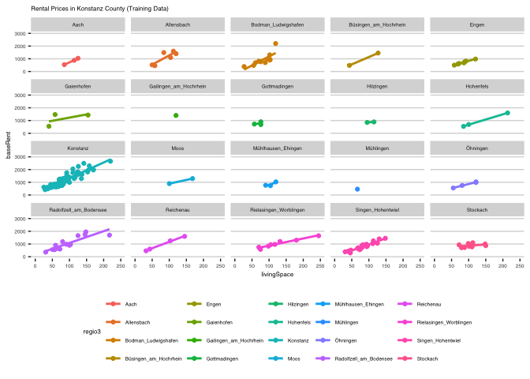

## Rents in Konstanz

The following cell loads the rent prices for the county (Landkreis) of
Konstanz. It has been processed from data provided by Immoscout24 /
Kaggle see
<https://www.kaggle.com/datasets/corrieaar/apartment-rental-offers-in-germany>
the data is from 2018 / 2019. Some preprocessing has been done in the
beginning of
<https://github.com/oduerr/da/blob/master/stan/kn_rent/KN_Immodata.R>

### Data Proprocessing

``` r
  lsg = FALSE
  KN_Kreis = read.csv2('https://raw.githubusercontent.com/oduerr/da/master/stan/kn_rent/KN_Kreis.csv')
  KN_Kreis$X = NULL
  sum(is.na(KN_Kreis$totalRent))#51
```

    ## [1] 51

``` r
  sum(is.na(KN_Kreis$baseRent))#0
```

    ## [1] 0

``` r
  (N = nrow(KN_Kreis)) #218
```

    ## [1] 218

### Overview (No pooling)

``` r
  library(ggplot2)
  library(magrittr)
  library(dplyr)
  KN_Kreis %>% 
    filter(training) %>% 
    ggplot(aes(x=livingSpace, y=baseRent)) +
    geom_point() + 
    geom_smooth(method='lm', formula= y~x) + 
    labs(subtitle = 'Rental Prices in Konstanz County (Training Data)') +
    ggthemes::theme_hc(base_size = 12) 
```

<!-- -->

We see that the rent is linear depended on the `livinigSpace`, but there
there is some considerable spread. Let’s have a look at the different
cities in the county.

``` r
KN_Kreis %>% 
  filter(training) %>% 
  ggplot(aes(x=livingSpace, y=baseRent, col=regio3)) +
  geom_point() + 
  geom_smooth(method='lm', formula= y~x, se=FALSE) + 
  labs(subtitle = 'Rental Prices in Konstanz County (Training Data)') +
  facet_wrap(~regio3) + 
  coord_cartesian(xlim = c(0, 250), ylim = c(0, 3000)) + 
  ggthemes::theme_hc(base_size = 6) 
```

<!-- -->
For the individual cities there is less spread. But some of them only
have one data point, therefore full pooling does not work and
hierarchical models come to shine.

### Preparing the data for hierachical modelling

Here we add a city identifier, $j=1,2,\ldots,J$ and split the data into
a training and test set.

``` r
  cities = sort(unique(KN_Kreis$regio3))
  J = length(cities)
  cities_numbers = data.frame(regio3 = cities, id = 1:J)
  KN_Kreis = KN_Kreis %>% right_join(cities_numbers, by='regio3')
  KN_train = KN_Kreis %>% filter(training)
  KN_test = KN_Kreis %>% filter(!training)
```

It’s always a good idea to scale your data before regression. For this
example not doing so will cause some divergent transitions. Since we are
not allowed to know anything about the testdata, we just use the
training data for scaling and prepare a list for stan.

``` r
x_mean = mean(KN_train$livingSpace)
x_sd = sd(KN_train$livingSpace)
y_mean = mean(KN_train$baseRent)
y_sd = sd(KN_train$baseRent) 

kn_stan_dat = list(
  N = nrow(KN_train),
  y = (KN_train$baseRent - y_mean)/y_sd,
  x = (KN_train$livingSpace - x_mean)/x_sd,
  #y = KN_train$baseRent,
  #x = KN_train$livingSpace,
  j = KN_train$id,
  
  N_t = nrow(KN_test),
  y_t = (KN_test$baseRent - y_mean)/y_sd,
  x_t = (KN_test$livingSpace - x_mean)/x_sd,
  #y_t = KN_test$baseRent,
  #x_t = KN_test$livingSpace,
  j_t = KN_test$id,
  J = J,
  
  y_t_unscaled = KN_test$baseRent
)
```

### Fitting the model in Stan

Definitiomn of the model.

``` r
library(cmdstanr)
```

    ## This is cmdstanr version 0.5.3

    ## - CmdStanR documentation and vignettes: mc-stan.org/cmdstanr

    ## - CmdStan path: /Users/oli/.cmdstan/cmdstan-2.32.0

    ## - CmdStan version: 2.32.0

    ## 
    ## A newer version of CmdStan is available. See ?install_cmdstan() to install it.
    ## To disable this check set option or environment variable CMDSTANR_NO_VER_CHECK=TRUE.

``` r
options(mc.cores = parallel::detectCores())
kn_s.model <- cmdstan_model('kn_hier.stan')
```

    ## Warning in '/var/folders/bk/0vv7sh9n43n3dm4fth1qw93r0000gq/T/RtmpN3fbyc/model-20df1c631b3.stan', line 3, column 2: Declaration
    ##     of arrays by placing brackets after a variable name is deprecated and
    ##     will be removed in Stan 2.33.0. Instead use the array keyword before the
    ##     type. This can be changed automatically using the auto-format flag to
    ##     stanc
    ## Warning in '/var/folders/bk/0vv7sh9n43n3dm4fth1qw93r0000gq/T/RtmpN3fbyc/model-20df1c631b3.stan', line 4, column 2: Declaration
    ##     of arrays by placing brackets after a variable name is deprecated and
    ##     will be removed in Stan 2.33.0. Instead use the array keyword before the
    ##     type. This can be changed automatically using the auto-format flag to
    ##     stanc
    ## Warning in '/var/folders/bk/0vv7sh9n43n3dm4fth1qw93r0000gq/T/RtmpN3fbyc/model-20df1c631b3.stan', line 7, column 2: Declaration
    ##     of arrays by placing brackets after a variable name is deprecated and
    ##     will be removed in Stan 2.33.0. Instead use the array keyword before the
    ##     type. This can be changed automatically using the auto-format flag to
    ##     stanc
    ## Warning in '/var/folders/bk/0vv7sh9n43n3dm4fth1qw93r0000gq/T/RtmpN3fbyc/model-20df1c631b3.stan', line 11, column 2: Declaration
    ##     of arrays by placing brackets after a variable name is deprecated and
    ##     will be removed in Stan 2.33.0. Instead use the array keyword before the
    ##     type. This can be changed automatically using the auto-format flag to
    ##     stanc
    ## Warning in '/var/folders/bk/0vv7sh9n43n3dm4fth1qw93r0000gq/T/RtmpN3fbyc/model-20df1c631b3.stan', line 12, column 2: Declaration
    ##     of arrays by placing brackets after a variable name is deprecated and
    ##     will be removed in Stan 2.33.0. Instead use the array keyword before the
    ##     type. This can be changed automatically using the auto-format flag to
    ##     stanc
    ## Warning in '/var/folders/bk/0vv7sh9n43n3dm4fth1qw93r0000gq/T/RtmpN3fbyc/model-20df1c631b3.stan', line 13, column 2: Declaration
    ##     of arrays by placing brackets after a variable name is d

    ## eprecated and
    ##     will be removed in Stan 2.33.0. Instead use the array keyword before the
    ##     type. This can be changed automatically using the auto-format flag to
    ##     stanc

    ## In file included from /var/folders/bk/0vv7sh9n43n3dm4fth1qw93r0000gq/T/RtmpN3fbyc/model-20df1c631b3.hpp:1:
    ## In file included from /Users/oli/.cmdstan/cmdstan-2.32.0/stan/src/stan/model/model_header.hpp:4:
    ## In file included from /Users/oli/.cmdstan/cmdstan-2.32.0/stan/lib/stan_math/stan/math.hpp:19:
    ## In file included from /Users/oli/.cmdstan/cmdstan-2.32.0/stan/lib/stan_math/stan/math/rev.hpp:10:
    ## In file included from /Users/oli/.cmdstan/cmdstan-2.32.0/stan/lib/stan_math/stan/math/rev/fun.hpp:198:
    ## In file included from /Users/oli/.cmdstan/cmdstan-2.32.0/stan/lib/stan_math/stan/math/prim/functor.hpp:15:
    ## In file included from /Users/oli/.cmdstan/cmdstan-2.32.0/stan/lib/stan_math/stan/math/prim/functor/integrate_ode_rk45.hpp:6:
    ## In file included from /Users/oli/.cmdstan/cmdstan-2.32.0/stan/lib/stan_math/stan/math/prim/functor/ode_rk45.hpp:9:
    ## In file included from /Users/oli/.cmdstan/cmdstan-2.32.0/stan/lib/stan_math/lib/boost_1.78.0/boost/numeric/odeint.hpp:76:
    ## In file included from /Users/oli/.cmdstan/cmdstan-2.32.0/stan/lib/stan_math/lib/boost_1.78.0/boost/numeric/odeint/integrate/observer_collection.hpp:23:
    ## In file included from /Users/oli/.cmdstan/cmdstan-2.32.0/stan/lib/stan_math/lib/boost_1.78.0/boost/function.hpp:30:
    ## In file included from /Users/oli/.cmdstan/cmdstan-2.32.0/stan/lib/stan_math/lib/boost_1.78.0/boost/function/detail/prologue.hpp:17:
    ## In file included from /Users/oli/.cmdstan/cmdstan-2.32.0/stan/lib/stan_math/lib/boost_1.78.0/boost/function/function_base.hpp:21:
    ## In file included from /Users/oli/.cmdstan/cmdstan-2.32.0/stan/lib/stan_math/lib/boost_1.78.0/boost/type_index.hpp:29:
    ## In file included from /Users/oli/.cmdstan/cmdstan-2.32.0/stan/lib/stan_math/lib/boost_1.78.0/boost/type_index/stl_type_index.hpp:47:
    ## /Users/oli/.cmdstan/cmdstan-2.32.0/stan/lib/stan_math/lib/boost_1.78.0/boost/container_hash/hash.hpp:132:33: warning: 'unary_function<const std::error_category *, unsigned long>' is deprecated [-Wdeprecated-declarations]
    ##         struct hash_base : std

    ## ::unary_function<T, std::size_t> {};
    ##                                 ^
    ## /Users/oli/.cmdstan/cmdstan-2.32.0/stan/lib/stan_math/lib/boost_1.78.0/boost/container_hash/hash.hpp:692:18: note: in instantiation of template class 'boost::hash_detail::hash_base<const std::error_category *>' requested here
    ##         : public boost::hash_detail::hash_base<T*>
    ##                  ^
    ## /Users/oli/.cmdstan/cmdstan-2.32.0/stan/lib/stan_math/lib/boost_1.78.0/boost/container_hash/hash.hpp:420:24: note: in instantiation of template class 'boost::hash<const std::error_category *>' requested here
    ##         boost::hash<T> hasher;
    ##                        ^
    ## /Users/oli/.cmdstan/cmdstan-2.32.0/stan/lib/stan_math/lib/boost_1.78.0/boost/container_hash/hash.hpp:551:9: note: in instantiation of function template specialization 'boost::hash_combine<const std::error_category *>' requested here
    ##         hash_combine(seed, &v.category());
    ##         ^

    ## /Library/Developer/CommandLineTools/SDKs/MacOSX.sdk/usr/include/c++/v1/__functional/unary_function.h:23:29: note: 'unary_function<const std::error_category *, unsigned long>' has been explicitly marked deprecated here
    ## struct _LIBCPP_TEMPLATE_VIS _LIBCPP_DEPRECATED_IN_CXX11 unary_function
    ##                             ^
    ## /Library/Developer/CommandLineTools/SDKs/MacOSX.sdk/usr/include/c++/v1/__config:825:41: note: expanded from macro '_LIBCPP_DEPRECATED_IN_CXX11'
    ## #    define _LIBCPP_DEPRECATED_IN_CXX11 _LIBCPP_DEPRECATED
    ##                                         ^
    ## /Library/Developer/CommandLineTools/SDKs/MacOSX.sdk/usr/include/c++/v1/__config:810:49: note: expanded from macro '_LIBCPP_DEPRECATED'
    ## #      define _LIBCPP_DEPRECATED __attribute__((deprecated))
    ##                                                 ^

    ## 1 warning generated.

``` r
kn_s = kn_s.model$sample(data=kn_stan_dat) 
```

    ## Chain 1 Rejecting initial value:

    ## Chain 1   Error evaluating the log probability at the initial value.

    ## Chain 1 Exception: exponential_lpdf: Random variable[1] is -1.60934, but must be nonnegative! (in '/var/folders/bk/0vv7sh9n43n3dm4fth1qw93r0000gq/T/RtmpN3fbyc/model-20df1c631b3.stan', line 29, column 2 to column 23)
    ## Chain 1 Exception: exponential_lpdf: Random variable[1] is -1.60934, but must be nonnegative! (in '/var/folders/bk/0vv7sh9n43n3dm4fth1qw93r0000gq/T/RtmpN3fbyc/model-20df1c631b3.stan', line 29, column 2 to column 23)

    ## Chain 1 Rejecting initial value:

    ## Chain 1   Error evaluating the log probability at the initial value.

    ## Chain 1 Exception: exponential_lpdf: Random variable[2] is -0.693031, but must be nonnegative! (in '/var/folders/bk/0vv7sh9n43n3dm4fth1qw93r0000gq/T/RtmpN3fbyc/model-20df1c631b3.stan', line 29, column 2 to column 23)
    ## Chain 1 Exception: exponential_lpdf: Random variable[2] is -0.693031, but must be nonnegative! (in '/var/folders/bk/0vv7sh9n43n3dm4fth1qw93r0000gq/T/RtmpN3fbyc/model-20df1c631b3.stan', line 29, column 2 to column 23)

    ## Chain 1 Informational Message: The current Metropolis proposal is about to be rejected because of the following issue:

    ## Chain 1 Exception: exponential_lpdf: Random variable[1] is -2.46133, but must be nonnegative! (in '/var/folders/bk/0vv7sh9n43n3dm4fth1qw93r0000gq/T/RtmpN3fbyc/model-20df1c631b3.stan', line 29, column 2 to column 23)

    ## Chain 1 If this warning occurs sporadically, such as for highly constrained variable types like covariance matrices, then the sampler is fine,

    ## Chain 1 but if this warning occurs often then your model may be either severely ill-conditioned or misspecified.

    ## Chain 1

    ## Chain 1 Informational Message: The current Metropolis proposal is about to be rejected because of the following issue:

    ## Chain 1 Exception: exponential_lpdf: Random variable[1] is -2.98761, but must be nonnegative! (in '/var/folders/bk/0vv7sh9n43n3dm4fth1qw93r0000gq/T/RtmpN3fbyc/model-20df1c631b3.stan', line 29, column 2 to column 23)

    ## Chain 1 If this warning occurs sporadically, such as for highly constrained variable types like covariance matrices, then the sampler is fine,

    ## Chain 1 but if this warning occurs often then your model may be either severely ill-conditioned or misspecified.

    ## Chain 1

    ## Chain 1 Informational Message: The current Metropolis proposal is about to be rejected because of the following issue:

    ## Chain 1 Exception: exponential_lpdf: Random variable[1] is -906.281, but must be nonnegative! (in '/var/folders/bk/0vv7sh9n43n3dm4fth1qw93r0000gq/T/RtmpN3fbyc/model-20df1c631b3.stan', line 29, column 2 to column 23)

    ## Chain 1 If this warning occurs sporadically, such as for highly constrained variable types like covariance matrices, then the sampler is fine,

    ## Chain 1 but if this warning occurs often then your model may be either severely ill-conditioned or misspecified.

    ## Chain 1

    ## Chain 1 Informational Message: The current Metropolis proposal is about to be rejected because of the following issue:

    ## Chain 1 Exception: exponential_lpdf: Random variable[1] is -23.0182, but must be nonnegative! (in '/var/folders/bk/0vv7sh9n43n3dm4fth1qw93r0000gq/T/RtmpN3fbyc/model-20df1c631b3.stan', line 29, column 2 to column 23)

    ## Chain 1 If this warning occurs sporadically, such as for highly constrained variable types like covariance matrices, then the sampler is fine,

    ## Chain 1 but if this warning occurs often then your model may be either severely ill-conditioned or misspecified.

    ## Chain 1

    ## Chain 1 Informational Message: The current Metropolis proposal is about to be rejected because of the following issue:

    ## Chain 1 Exception: exponential_lpdf: Random variable[1] is -2.20328, but must be nonnegative! (in '/var/folders/bk/0vv7sh9n43n3dm4fth1qw93r0000gq/T/RtmpN3fbyc/model-20df1c631b3.stan', line 29, column 2 to column 23)

    ## Chain 1 If this warning occurs sporadically, such as for highly constrained variable types like covariance matrices, then the sampler is fine,

    ## Chain 1 but if this warning occurs often then your model may be either severely ill-conditioned or misspecified.

    ## Chain 1

    ## Chain 1 Informational Message: The current Metropolis proposal is about to be rejected because of the following issue:

    ## Chain 1 Exception: exponential_lpdf: Random variable[1] is -0.230179, but must be nonnegative! (in '/var/folders/bk/0vv7sh9n43n3dm4fth1qw93r0000gq/T/RtmpN3fbyc/model-20df1c631b3.stan', line 29, column 2 to column 23)

    ## Chain 1 If this warning occurs sporadically, such as for highly constrained variable types like covariance matrices, then the sampler is fine,

    ## Chain 1 but if this warning occurs often then your model may be either severely ill-conditioned or misspecified.

    ## Chain 1

    ## Chain 1 Informational Message: The current Metropolis proposal is about to be rejected because of the following issue:

    ## Chain 1 Exception: exponential_lpdf: Random variable[1] is -0.1564, but must be nonnegative! (in '/var/folders/bk/0vv7sh9n43n3dm4fth1qw93r0000gq/T/RtmpN3fbyc/model-20df1c631b3.stan', line 29, column 2 to column 23)

    ## Chain 1 If this warning occurs sporadically, such as for highly constrained variable types like covariance matrices, then the sampler is fine,

    ## Chain 1 but if this warning occurs often then your model may be either severely ill-conditioned or misspecified.

    ## Chain 1

    ## Chain 1 Informational Message: The current Metropolis proposal is about to be rejected because of the following issue:

    ## Chain 1 Exception: exponential_lpdf: Random variable[2] is -0.00341733, but must be nonnegative! (in '/var/folders/bk/0vv7sh9n43n3dm4fth1qw93r0000gq/T/RtmpN3fbyc/model-20df1c631b3.stan', line 29, column 2 to column 23)

    ## Chain 1 If this warning occurs sporadically, such as for highly constrained variable types like covariance matrices, then the sampler is fine,

    ## Chain 1 but if this warning occurs often then your model may be either severely ill-conditioned or misspecified.

    ## Chain 1

    ## Chain 2 Rejecting initial value:

    ## Chain 2   Error evaluating the log probability at the initial value.

    ## Chain 2 Exception: exponential_lpdf: Random variable[2] is -0.563347, but must be nonnegative! (in '/var/folders/bk/0vv7sh9n43n3dm4fth1qw93r0000gq/T/RtmpN3fbyc/model-20df1c631b3.stan', line 29, column 2 to column 23)
    ## Chain 2 Exception: exponential_lpdf: Random variable[2] is -0.563347, but must be nonnegative! (in '/var/folders/bk/0vv7sh9n43n3dm4fth1qw93r0000gq/T/RtmpN3fbyc/model-20df1c631b3.stan', line 29, column 2 to column 23)

    ## Chain 2 Rejecting initial value:

    ## Chain 2   Error evaluating the log probability at the initial value.

    ## Chain 2 Exception: exponential_lpdf: Random variable[1] is -1.74833, but must be nonnegative! (in '/var/folders/bk/0vv7sh9n43n3dm4fth1qw93r0000gq/T/RtmpN3fbyc/model-20df1c631b3.stan', line 29, column 2 to column 23)
    ## Chain 2 Exception: exponential_lpdf: Random variable[1] is -1.74833, but must be nonnegative! (in '/var/folders/bk/0vv7sh9n43n3dm4fth1qw93r0000gq/T/RtmpN3fbyc/model-20df1c631b3.stan', line 29, column 2 to column 23)

    ## Chain 2 Rejecting initial value:

    ## Chain 2   Error evaluating the log probability at the initial value.

    ## Chain 2 Exception: exponential_lpdf: Random variable[1] is -0.620388, but must be nonnegative! (in '/var/folders/bk/0vv7sh9n43n3dm4fth1qw93r0000gq/T/RtmpN3fbyc/model-20df1c631b3.stan', line 29, column 2 to column 23)
    ## Chain 2 Exception: exponential_lpdf: Random variable[1] is -0.620388, but must be nonnegative! (in '/var/folders/bk/0vv7sh9n43n3dm4fth1qw93r0000gq/T/RtmpN3fbyc/model-20df1c631b3.stan', line 29, column 2 to column 23)

    ## Chain 2 Rejecting initial value:

    ## Chain 2   Error evaluating the log probability at the initial value.

    ## Chain 2 Exception: exponential_lpdf: Random variable[2] is -0.830589, but must be nonnegative! (in '/var/folders/bk/0vv7sh9n43n3dm4fth1qw93r0000gq/T/RtmpN3fbyc/model-20df1c631b3.stan', line 29, column 2 to column 23)
    ## Chain 2 Exception: exponential_lpdf: Random variable[2] is -0.830589, but must be nonnegative! (in '/var/folders/bk/0vv7sh9n43n3dm4fth1qw93r0000gq/T/RtmpN3fbyc/model-20df1c631b3.stan', line 29, column 2 to column 23)

    ## Chain 2 Rejecting initial value:

    ## Chain 2   Error evaluating the log probability at the initial value.

    ## Chain 2 Exception: exponential_lpdf: Random variable[2] is -0.817713, but must be nonnegative! (in '/var/folders/bk/0vv7sh9n43n3dm4fth1qw93r0000gq/T/RtmpN3fbyc/model-20df1c631b3.stan', line 29, column 2 to column 23)
    ## Chain 2 Exception: exponential_lpdf: Random variable[2] is -0.817713, but must be nonnegative! (in '/var/folders/bk/0vv7sh9n43n3dm4fth1qw93r0000gq/T/RtmpN3fbyc/model-20df1c631b3.stan', line 29, column 2 to column 23)

    ## Chain 2 Rejecting initial value:

    ## Chain 2   Error evaluating the log probability at the initial value.

    ## Chain 2 Exception: exponential_lpdf: Random variable[1] is -0.173015, but must be nonnegative! (in '/var/folders/bk/0vv7sh9n43n3dm4fth1qw93r0000gq/T/RtmpN3fbyc/model-20df1c631b3.stan', line 29, column 2 to column 23)
    ## Chain 2 Exception: exponential_lpdf: Random variable[1] is -0.173015, but must be nonnegative! (in '/var/folders/bk/0vv7sh9n43n3dm4fth1qw93r0000gq/T/RtmpN3fbyc/model-20df1c631b3.stan', line 29, column 2 to column 23)

    ## Chain 2 Rejecting initial value:

    ## Chain 2   Error evaluating the log probability at the initial value.

    ## Chain 2 Exception: exponential_lpdf: Random variable[2] is -0.956205, but must be nonnegative! (in '/var/folders/bk/0vv7sh9n43n3dm4fth1qw93r0000gq/T/RtmpN3fbyc/model-20df1c631b3.stan', line 29, column 2 to column 23)
    ## Chain 2 Exception: exponential_lpdf: Random variable[2] is -0.956205, but must be nonnegative! (in '/var/folders/bk/0vv7sh9n43n3dm4fth1qw93r0000gq/T/RtmpN3fbyc/model-20df1c631b3.stan', line 29, column 2 to column 23)

    ## Chain 2 Rejecting initial value:

    ## Chain 2   Error evaluating the log probability at the initial value.

    ## Chain 2 Exception: exponential_lpdf: Random variable[2] is -0.353493, but must be nonnegative! (in '/var/folders/bk/0vv7sh9n43n3dm4fth1qw93r0000gq/T/RtmpN3fbyc/model-20df1c631b3.stan', line 29, column 2 to column 23)
    ## Chain 2 Exception: exponential_lpdf: Random variable[2] is -0.353493, but must be nonnegative! (in '/var/folders/bk/0vv7sh9n43n3dm4fth1qw93r0000gq/T/RtmpN3fbyc/model-20df1c631b3.stan', line 29, column 2 to column 23)

    ## Chain 2 Rejecting initial value:

    ## Chain 2   Error evaluating the log probability at the initial value.

    ## Chain 2 Exception: exponential_lpdf: Random variable[2] is -0.924933, but must be nonnegative! (in '/var/folders/bk/0vv7sh9n43n3dm4fth1qw93r0000gq/T/RtmpN3fbyc/model-20df1c631b3.stan', line 29, column 2 to column 23)
    ## Chain 2 Exception: exponential_lpdf: Random variable[2] is -0.924933, but must be nonnegative! (in '/var/folders/bk/0vv7sh9n43n3dm4fth1qw93r0000gq/T/RtmpN3fbyc/model-20df1c631b3.stan', line 29, column 2 to column 23)

    ## Chain 2 Rejecting initial value:

    ## Chain 2   Error evaluating the log probability at the initial value.

    ## Chain 2 Exception: exponential_lpdf: Random variable[2] is -0.0501547, but must be nonnegative! (in '/var/folders/bk/0vv7sh9n43n3dm4fth1qw93r0000gq/T/RtmpN3fbyc/model-20df1c631b3.stan', line 29, column 2 to column 23)
    ## Chain 2 Exception: exponential_lpdf: Random variable[2] is -0.0501547, but must be nonnegative! (in '/var/folders/bk/0vv7sh9n43n3dm4fth1qw93r0000gq/T/RtmpN3fbyc/model-20df1c631b3.stan', line 29, column 2 to column 23)

    ## Chain 2 Rejecting initial value:

    ## Chain 2   Error evaluating the log probability at the initial value.

    ## Chain 2 Exception: exponential_lpdf: Random variable[2] is -0.266813, but must be nonnegative! (in '/var/folders/bk/0vv7sh9n43n3dm4fth1qw93r0000gq/T/RtmpN3fbyc/model-20df1c631b3.stan', line 29, column 2 to column 23)
    ## Chain 2 Exception: exponential_lpdf: Random variable[2] is -0.266813, but must be nonnegative! (in '/var/folders/bk/0vv7sh9n43n3dm4fth1qw93r0000gq/T/RtmpN3fbyc/model-20df1c631b3.stan', line 29, column 2 to column 23)

    ## Chain 2 Rejecting initial value:

    ## Chain 2   Error evaluating the log probability at the initial value.

    ## Chain 2 Exception: exponential_lpdf: Random variable[1] is -1.50296, but must be nonnegative! (in '/var/folders/bk/0vv7sh9n43n3dm4fth1qw93r0000gq/T/RtmpN3fbyc/model-20df1c631b3.stan', line 29, column 2 to column 23)
    ## Chain 2 Exception: exponential_lpdf: Random variable[1] is -1.50296, but must be nonnegative! (in '/var/folders/bk/0vv7sh9n43n3dm4fth1qw93r0000gq/T/RtmpN3fbyc/model-20df1c631b3.stan', line 29, column 2 to column 23)

    ## Chain 2 Informational Message: The current Metropolis proposal is about to be rejected because of the following issue:

    ## Chain 2 Exception: exponential_lpdf: Random variable[1] is -1.08886, but must be nonnegative! (in '/var/folders/bk/0vv7sh9n43n3dm4fth1qw93r0000gq/T/RtmpN3fbyc/model-20df1c631b3.stan', line 29, column 2 to column 23)

    ## Chain 2 If this warning occurs sporadically, such as for highly constrained variable types like covariance matrices, then the sampler is fine,

    ## Chain 2 but if this warning occurs often then your model may be either severely ill-conditioned or misspecified.

    ## Chain 2

    ## Chain 2 Informational Message: The current Metropolis proposal is about to be rejected because of the following issue:

    ## Chain 2 Exception: exponential_lpdf: Random variable[1] is -505.149, but must be nonnegative! (in '/var/folders/bk/0vv7sh9n43n3dm4fth1qw93r0000gq/T/RtmpN3fbyc/model-20df1c631b3.stan', line 29, column 2 to column 23)

    ## Chain 2 If this warning occurs sporadically, such as for highly constrained variable types like covariance matrices, then the sampler is fine,

    ## Chain 2 but if this warning occurs often then your model may be either severely ill-conditioned or misspecified.

    ## Chain 2

    ## Chain 2 Informational Message: The current Metropolis proposal is about to be rejected because of the following issue:

    ## Chain 2 Exception: exponential_lpdf: Random variable[1] is -9.84727, but must be nonnegative! (in '/var/folders/bk/0vv7sh9n43n3dm4fth1qw93r0000gq/T/RtmpN3fbyc/model-20df1c631b3.stan', line 29, column 2 to column 23)

    ## Chain 2 If this warning occurs sporadically, such as for highly constrained variable types like covariance matrices, then the sampler is fine,

    ## Chain 2 but if this warning occurs often then your model may be either severely ill-conditioned or misspecified.

    ## Chain 2

    ## Chain 2 Informational Message: The current Metropolis proposal is about to be rejected because of the following issue:

    ## Chain 2 Exception: exponential_lpdf: Random variable[2] is -0.272668, but must be nonnegative! (in '/var/folders/bk/0vv7sh9n43n3dm4fth1qw93r0000gq/T/RtmpN3fbyc/model-20df1c631b3.stan', line 29, column 2 to column 23)

    ## Chain 2 If this warning occurs sporadically, such as for highly constrained variable types like covariance matrices, then the sampler is fine,

    ## Chain 2 but if this warning occurs often then your model may be either severely ill-conditioned or misspecified.

    ## Chain 2

    ## Chain 3 Rejecting initial value:

    ## Chain 3   Error evaluating the log probability at the initial value.

    ## Chain 3 Exception: exponential_lpdf: Random variable[1] is -0.800802, but must be nonnegative! (in '/var/folders/bk/0vv7sh9n43n3dm4fth1qw93r0000gq/T/RtmpN3fbyc/model-20df1c631b3.stan', line 29, column 2 to column 23)
    ## Chain 3 Exception: exponential_lpdf: Random variable[1] is -0.800802, but must be nonnegative! (in '/var/folders/bk/0vv7sh9n43n3dm4fth1qw93r0000gq/T/RtmpN3fbyc/model-20df1c631b3.stan', line 29, column 2 to column 23)

    ## Chain 3 Rejecting initial value:

    ## Chain 3   Error evaluating the log probability at the initial value.

    ## Chain 3 Exception: exponential_lpdf: Random variable[1] is -1.3874, but must be nonnegative! (in '/var/folders/bk/0vv7sh9n43n3dm4fth1qw93r0000gq/T/RtmpN3fbyc/model-20df1c631b3.stan', line 29, column 2 to column 23)
    ## Chain 3 Exception: exponential_lpdf: Random variable[1] is -1.3874, but must be nonnegative! (in '/var/folders/bk/0vv7sh9n43n3dm4fth1qw93r0000gq/T/RtmpN3fbyc/model-20df1c631b3.stan', line 29, column 2 to column 23)

    ## Chain 3 Informational Message: The current Metropolis proposal is about to be rejected because of the following issue:

    ## Chain 3 Exception: exponential_lpdf: Random variable[1] is -0.289927, but must be nonnegative! (in '/var/folders/bk/0vv7sh9n43n3dm4fth1qw93r0000gq/T/RtmpN3fbyc/model-20df1c631b3.stan', line 29, column 2 to column 23)

    ## Chain 3 If this warning occurs sporadically, such as for highly constrained variable types like covariance matrices, then the sampler is fine,

    ## Chain 3 but if this warning occurs often then your model may be either severely ill-conditioned or misspecified.

    ## Chain 3

    ## Chain 3 Informational Message: The current Metropolis proposal is about to be rejected because of the following issue:

    ## Chain 3 Exception: exponential_lpdf: Random variable[1] is -13.9041, but must be nonnegative! (in '/var/folders/bk/0vv7sh9n43n3dm4fth1qw93r0000gq/T/RtmpN3fbyc/model-20df1c631b3.stan', line 29, column 2 to column 23)

    ## Chain 3 If this warning occurs sporadically, such as for highly constrained variable types like covariance matrices, then the sampler is fine,

    ## Chain 3 but if this warning occurs often then your model may be either severely ill-conditioned or misspecified.

    ## Chain 3

    ## Chain 4 Rejecting initial value:

    ## Chain 4   Error evaluating the log probability at the initial value.

    ## Chain 4 Exception: exponential_lpdf: Random variable[2] is -1.81455, but must be nonnegative! (in '/var/folders/bk/0vv7sh9n43n3dm4fth1qw93r0000gq/T/RtmpN3fbyc/model-20df1c631b3.stan', line 29, column 2 to column 23)
    ## Chain 4 Exception: exponential_lpdf: Random variable[2] is -1.81455, but must be nonnegative! (in '/var/folders/bk/0vv7sh9n43n3dm4fth1qw93r0000gq/T/RtmpN3fbyc/model-20df1c631b3.stan', line 29, column 2 to column 23)

    ## Chain 4 Rejecting initial value:

    ## Chain 4   Error evaluating the log probability at the initial value.

    ## Chain 4 Exception: exponential_lpdf: Random variable[2] is -0.738704, but must be nonnegative! (in '/var/folders/bk/0vv7sh9n43n3dm4fth1qw93r0000gq/T/RtmpN3fbyc/model-20df1c631b3.stan', line 29, column 2 to column 23)
    ## Chain 4 Exception: exponential_lpdf: Random variable[2] is -0.738704, but must be nonnegative! (in '/var/folders/bk/0vv7sh9n43n3dm4fth1qw93r0000gq/T/RtmpN3fbyc/model-20df1c631b3.stan', line 29, column 2 to column 23)

    ## Chain 4 Rejecting initial value:

    ## Chain 4   Error evaluating the log probability at the initial value.

    ## Chain 4 Exception: exponential_lpdf: Random variable[2] is -0.377633, but must be nonnegative! (in '/var/folders/bk/0vv7sh9n43n3dm4fth1qw93r0000gq/T/RtmpN3fbyc/model-20df1c631b3.stan', line 29, column 2 to column 23)
    ## Chain 4 Exception: exponential_lpdf: Random variable[2] is -0.377633, but must be nonnegative! (in '/var/folders/bk/0vv7sh9n43n3dm4fth1qw93r0000gq/T/RtmpN3fbyc/model-20df1c631b3.stan', line 29, column 2 to column 23)

    ## Chain 4 Informational Message: The current Metropolis proposal is about to be rejected because of the following issue:

    ## Chain 4 Exception: exponential_lpdf: Random variable[2] is -0.143829, but must be nonnegative! (in '/var/folders/bk/0vv7sh9n43n3dm4fth1qw93r0000gq/T/RtmpN3fbyc/model-20df1c631b3.stan', line 29, column 2 to column 23)

    ## Chain 4 If this warning occurs sporadically, such as for highly constrained variable types like covariance matrices, then the sampler is fine,

    ## Chain 4 but if this warning occurs often then your model may be either severely ill-conditioned or misspecified.

    ## Chain 4

    ## Chain 4 Informational Message: The current Metropolis proposal is about to be rejected because of the following issue:

    ## Chain 4 Exception: exponential_lpdf: Random variable[2] is -0.476651, but must be nonnegative! (in '/var/folders/bk/0vv7sh9n43n3dm4fth1qw93r0000gq/T/RtmpN3fbyc/model-20df1c631b3.stan', line 29, column 2 to column 23)

    ## Chain 4 If this warning occurs sporadically, such as for highly constrained variable types like covariance matrices, then the sampler is fine,

    ## Chain 4 but if this warning occurs often then your model may be either severely ill-conditioned or misspecified.

    ## Chain 4

    ## Chain 4 Informational Message: The current Metropolis proposal is about to be rejected because of the following issue:

    ## Chain 4 Exception: exponential_lpdf: Random variable[2] is -431.459, but must be nonnegative! (in '/var/folders/bk/0vv7sh9n43n3dm4fth1qw93r0000gq/T/RtmpN3fbyc/model-20df1c631b3.stan', line 29, column 2 to column 23)

    ## Chain 4 If this warning occurs sporadically, such as for highly constrained variable types like covariance matrices, then the sampler is fine,

    ## Chain 4 but if this warning occurs often then your model may be either severely ill-conditioned or misspecified.

    ## Chain 4

    ## Chain 4 Informational Message: The current Metropolis proposal is about to be rejected because of the following issue:

    ## Chain 4 Exception: exponential_lpdf: Random variable[2] is -11.9424, but must be nonnegative! (in '/var/folders/bk/0vv7sh9n43n3dm4fth1qw93r0000gq/T/RtmpN3fbyc/model-20df1c631b3.stan', line 29, column 2 to column 23)

    ## Chain 4 If this warning occurs sporadically, such as for highly constrained variable types like covariance matrices, then the sampler is fine,

    ## Chain 4 but if this warning occurs often then your model may be either severely ill-conditioned or misspecified.

    ## Chain 4

    ## Chain 4 Informational Message: The current Metropolis proposal is about to be rejected because of the following issue:

    ## Chain 4 Exception: exponential_lpdf: Random variable[2] is -0.100594, but must be nonnegative! (in '/var/folders/bk/0vv7sh9n43n3dm4fth1qw93r0000gq/T/RtmpN3fbyc/model-20df1c631b3.stan', line 29, column 2 to column 23)

    ## Chain 4 If this warning occurs sporadically, such as for highly constrained variable types like covariance matrices, then the sampler is fine,

    ## Chain 4 but if this warning occurs often then your model may be either severely ill-conditioned or misspecified.

    ## Chain 4

    ## Chain 4 Informational Message: The current Metropolis proposal is about to be rejected because of the following issue:

    ## Chain 4 Exception: exponential_lpdf: Random variable[2] is -0.032587, but must be nonnegative! (in '/var/folders/bk/0vv7sh9n43n3dm4fth1qw93r0000gq/T/RtmpN3fbyc/model-20df1c631b3.stan', line 29, column 2 to column 23)

    ## Chain 4 If this warning occurs sporadically, such as for highly constrained variable types like covariance matrices, then the sampler is fine,

    ## Chain 4 but if this warning occurs often then your model may be either severely ill-conditioned or misspecified.

    ## Chain 4

    ## Chain 1 Informational Message: The current Metropolis proposal is about to be rejected because of the following issue:

    ## Chain 1 Exception: exponential_lpdf: Random variable[2] is -0.0279553, but must be nonnegative! (in '/var/folders/bk/0vv7sh9n43n3dm4fth1qw93r0000gq/T/RtmpN3fbyc/model-20df1c631b3.stan', line 29, column 2 to column 23)

    ## Chain 1 If this warning occurs sporadically, such as for highly constrained variable types like covariance matrices, then the sampler is fine,

    ## Chain 1 but if this warning occurs often then your model may be either severely ill-conditioned or misspecified.

    ## Chain 1

    ## Warning: 4 of 4000 (0.0%) transitions ended with a divergence.
    ## See https://mc-stan.org/misc/warnings for details.

### Base costs

``` r
library(tidybayes)
library(bayesplot)
library(ggridges)
spread_draws(kn_s, u[i,j]) %>%
  filter(i == 1) %>% #looking at the intercept
  right_join(cities_numbers, by = c("j" = "id")) %>% 
  ggplot(aes(x=u, y=regio3)) + 
  geom_density_ridges() +
  labs(title = 'Base rent', 
       subtitle = 'Draws from posterior',
       x = 'Intercept [Scaled]') +
  theme_ridges()
```

<!-- -->

``` r
library(tidybayes)
library(bayesplot)
library(ggridges)
spread_draws(kn_s, u[i,j]) %>%
  filter(i == 2) %>% #looking at the scope
  right_join(cities_numbers, by = c("j" = "id")) %>% 
  ggplot(aes(x=u, y=regio3)) + 
  geom_density_ridges() +
  labs(title = 'Increase in rent with living space', 
       subtitle = 'Draws from posterior',
       x = 'Slope Euro/sqm [Scaled]') +
  theme_ridges()
```

<!-- -->

### Task 1 increase of rent in Konstanz city

Repaet the plot from a above using unscaled variable. You may focuss on
Konstanz only. Konstanz has the following id (variable j in the
posterior)

``` r
  cities_numbers %>% kableExtra::kable()
```

<table>
<thead>
<tr>
<th style="text-align:left;">
regio3
</th>
<th style="text-align:right;">
id
</th>
</tr>
</thead>
<tbody>
<tr>
<td style="text-align:left;">
Aach
</td>
<td style="text-align:right;">
1
</td>
</tr>
<tr>
<td style="text-align:left;">
Allensbach
</td>
<td style="text-align:right;">
2
</td>
</tr>
<tr>
<td style="text-align:left;">
Bodman_Ludwigshafen
</td>
<td style="text-align:right;">
3
</td>
</tr>
<tr>
<td style="text-align:left;">
Büsingen_am_Hochrhein
</td>
<td style="text-align:right;">
4
</td>
</tr>
<tr>
<td style="text-align:left;">
Engen
</td>
<td style="text-align:right;">
5
</td>
</tr>
<tr>
<td style="text-align:left;">
Gaienhofen
</td>
<td style="text-align:right;">
6
</td>
</tr>
<tr>
<td style="text-align:left;">
Gailingen_am_Hochrhein
</td>
<td style="text-align:right;">
7
</td>
</tr>
<tr>
<td style="text-align:left;">
Gottmadingen
</td>
<td style="text-align:right;">
8
</td>
</tr>
<tr>
<td style="text-align:left;">
Hilzingen
</td>
<td style="text-align:right;">
9
</td>
</tr>
<tr>
<td style="text-align:left;">
Hohenfels
</td>
<td style="text-align:right;">
10
</td>
</tr>
<tr>
<td style="text-align:left;">
Konstanz
</td>
<td style="text-align:right;">
11
</td>
</tr>
<tr>
<td style="text-align:left;">
Moos
</td>
<td style="text-align:right;">
12
</td>
</tr>
<tr>
<td style="text-align:left;">
Mühlhausen_Ehingen
</td>
<td style="text-align:right;">
13
</td>
</tr>
<tr>
<td style="text-align:left;">
Mühlingen
</td>
<td style="text-align:right;">
14
</td>
</tr>
<tr>
<td style="text-align:left;">
Öhningen
</td>
<td style="text-align:right;">
15
</td>
</tr>
<tr>
<td style="text-align:left;">
Radolfzell_am_Bodensee
</td>
<td style="text-align:right;">
16
</td>
</tr>
<tr>
<td style="text-align:left;">
Reichenau
</td>
<td style="text-align:right;">
17
</td>
</tr>
<tr>
<td style="text-align:left;">
Rielasingen_Worblingen
</td>
<td style="text-align:right;">
18
</td>
</tr>
<tr>
<td style="text-align:left;">
Singen_Hohentwiel
</td>
<td style="text-align:right;">
19
</td>
</tr>
<tr>
<td style="text-align:left;">
Stockach
</td>
<td style="text-align:right;">
20
</td>
</tr>
</tbody>
</table>
