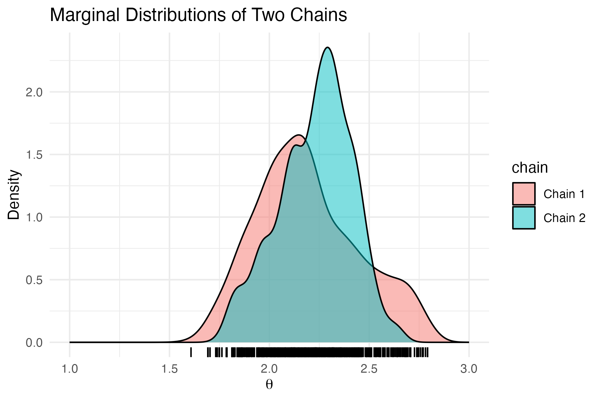
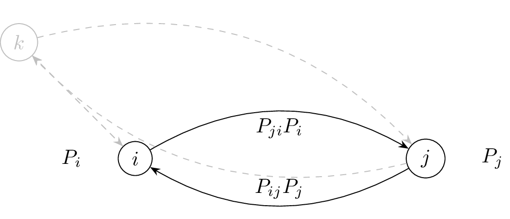

# Lecture Notes on MCMC
Oliver Dürr

In this lecture note, we will discuss the basics of Markov Chain Monte
Carlo (MCMC) methods. MCMC methods are a class of algorithms that are
used to sample from a probability distribution $p(\theta)$ such as the
posterior $p(\theta|D)$. While there are more advanced MCMC methods, we
will focus on the Metropolis-Hastings algorithm, which is a simple and
widely used MCMC algorithm and shows the principles of MCMC methods.

## A note on notation

In this lecture note, we will use the following notation:

- $\theta$ is a parameter of interest. This could be a scalar or a
  vector.
- $D$ is the data.
- $p(\theta)$ is the prior distribution of $\theta$ and
- $p(D|\theta)$ is the likelihood of the data given $\theta$.
- $p(\theta|D)$ is the posterior distribution of $\theta$ given the
  data.

### Using $p(\theta)$ instead of $p(\theta|D)$

Since the MCMC methods works with any probability distribution, we will
use $p(\theta)$ to denote the target distribution that we want to sample
from. In the context of Bayesian inference, $p(\theta)$ is the posterior
distribution $p(\theta|D)$, or, in the case of non date the prior
distribution $p(\theta)$.

### Densities vs. probabilities

While in general in the lecture we will use the terms “density” and
“probability” interchangeably. However, in the context of MCMC methods,
we will use the term “density” to refer to the probability density
function of a continuous distribution and “probability” to refer to the
probability mass function of a discrete distribution. In case the
destinction is crucial, we will use the terms $Pr(\cdot)$ for
probabilities and $p(\cdot)$ for densities.

## A high level overview of Markov Chains.

A Markov chain is a sequence of random variables
$\theta_1, \theta_2, \theta_3, \ldots$ which can be viewed as a time
series where the next value depends only on the current value (Markov
Property). In Figure @fig:two-chains: we show two Markov chains,
starting from different initial values. Note that after about 150 steps
both chains fluctuate around the same value. This is the *stationary
distribution* of the Markov chain.

<div id="fig-two-chains" fig-align="center">

[](https://github.com/oduerr/da/blob/master/lecture_notes/MCMC/SimpleMCMC.R)

Figure 1: Shown are two Markov chains for the scalar quantity
\$\theta\$. The chains start from different initial positions. After
about 150 time steps the chains fluctate around the same value.

</div>

In Figure @fig:two-chain-dist, we show a histogram of the values of the
two chains after from 250 steps onward. The histogram indicate that the
values of the chains are distributed around the same distribution is the
stationary distribution of the Markov chain.

<div id="two-chain-dist" fig-align="center">

[](https://github.com/oduerr/da/blob/master/lecture_notes/MCMC/SimpleMCMC.R)

The Histogram (actually density estimates) for of the two chains after
250 steps

</div>

<div>

> **Note**
>
> The key idea of MCMC methods is to construct a Markov chain that has a
> stationary distribution equal to the target distribution $p(\theta)$.
> Once the Markov chain has converged to the stationary distribution, we
> can use the samples from the chain to approximate the target
> distribution.

</div>

So how do we construct a Markov chain with a stationary distribution
equal to the target distribution $p(\theta)$? To do so, we draw insights
from statistical physics.

### Statistical physics and detailed balance

Consider a glass of water in which we add a drop of ink. The ink will
spread out in the water until it is uniformly distributed. This is an
example of a system that has reached equilibrium. Nearly every
statistical system reaches the equilibrium state. Exceptions are
periodic systems like a pendulum or a planet orbiting a star and systems
that get trapped in a local minimum.

## Detailed balance

For a Markov chain to be useful, it needs to convert of a stationary
distribution and the stationary distribution needs to be the target
distribution $p(\theta)$. The Metropolis-Hastings algorithm is a simple
MCMC algorithm that ensures that the Markov chain converges to the
desired stationary distribution. The Metropolis-Hastings algorithm is
based on the principle of detailed balance. Also almost all other MCMC
algorithms (such as Hamiltonian Monte Carlo, Slice Sampling, and Gibbs
Sampling) are based on the principle of detailed balance. So what is
detailed balance?

Remember the example with the king visiting the islands? The king will
visit the islands with a probability proportional to the number of
people on the island. This was an example of detailed balance. Now
consider N Kings, in order that the number of Kings on the islands have
reached a stationary distribution, at each time step as many Kings need
to move from one island to another as move in the opposite direction.
This is the principle of detailed balance and if it is fullfilled the
Markov chain has converge to the stationary distribution. The detailed
balance condition is (a bit slopy) given by:

$$
  P_{ij} N_j = P_{ji} N_i
$$

with $P_{ij}$ the probability of moving from island $i$ to island $j$
and $N_i$ the number of Kings on island $i$. Let’s divide both sides by
$N$

$$
 P_{ij}\underbrace{P_{j}}_{N_j/N} = P_{ji}\underbrace{P_{i}}_{N_j/N}
$$

Figure @ shows the detailed balance situation in a system with discrete
states. Note that the detailed balence is between two states $i$ and $j$
and that other states $k$ are not taken into account.

<div id="db" fig-align="center">

[](https://github.com/oduerr/da/blob/master/lecture_notes/MCMC/img_sources)

Illustration of the detailed balance condition in a Markov chain. The
transition probabilities \$P\_{ij}\$ and \$P\_{ji}\$ between states
\$j\$ and \$i\$ are shown, along with their respective stationary
probabilities \$P_i\$ and \$P_j\$. The light gray dashed arrows indicate
the presence of other states in the Markov chain, emphasizing that the
detailed balance condition is specifically applied between states \$i\$
and \$j\$

</div>

It’s quite illustrative a system with many particles. The detailed
balance condition the probability $P_{ij}P_j$ (fraction of
Kings/Particle) move from $j$ to $i$ is equal to the probability
$P_{ji}P_i$ (fraction of Kings/Particle) move from $i$ to $j$.

### Controling $P_{ij}$

Let’s choose $P_{ij}$ in our favor, so that in equilibrium the
distribution $P_i$ is the distribution we want. We can do this by
proposing a move from $i$ to $j$ with a probability $T_{ij}$ and then
accept the move with an acceptance probability $A_{ij}$. The cool idea
that physicists had in the 1950’s is to choose the acceptence
probability $A_{ij}$ as:

#### Metropolis-Hastings acceptance probability

$$
A_{ij} = \min (1, \frac{T_{ji}P_i}{T_{ij} P_j})
$$

Why is detailed balance fullfilled?


If we know move a particle according to the Metropolis Hastings
Acceptance rate. We start in state $\theta_0$ and propose a move to
$\theta^*$ with $T(\theta^*|\theta_0)$. We accept the new state with a
probability according to the MH Acceptance probability. If we repeat we
get the following chain of moves.

1.  **Initialize**: Start with an initial value $\theta_0$.
2.  **Propose**: Generate a candidate $\theta^*$ from a proposal
    distribution $T(\theta^* | \theta_t)$.
3.  **Calculate Acceptance Probability**: Compute the acceptance
    probability $$
    A_{ij} = \min \left(1, \frac{T(\theta_t | \theta^*) p(\theta^*)}{T(\theta^* | \theta_t) p(\theta_t)}\right)
    $$
4.  **Accept**: With probability $A_{ij}$, set
    $\theta_{t+1} = \theta^*$. Otherwise, set $\theta_{t+1} = \theta_t$.
5.  **Iterate**: Repeat steps 2-4 for a large number of iterations to
    ensure convergence to the stationary distribution.

<div>

> **Note**
>
> For the acceptance rate $p(\theta)$ is needed only up to a constant
> factor, this makes it ideal for Bayesian inference, where we just need
> $p(\theta|D) \propto p(D|\theta)p(\theta)$.

</div>

This process ensures that the Markov chain will converge to the target
distribution $p(\theta)$, allowing us to approximate the distribution
through the samples obtained from the chain. Let’s give it a try, we
assume symetric proposal distribution
$T(\theta^*|\theta) = T(\theta|\theta^*)$ and we want to sample from the
$p(\theta) \ propto x^2$.

``` r
# Initial values
set.seed(123)
Steps = 10000
plot_max = 500
thetas = rep(NA, Steps)

# Some target distribution (only up to a constant factor)
p = function(theta){
  return (dexp(theta, rate=1/10)*42)
}

theta = 60 #Initial value
for (t in 1:Steps) {
  theta_star = rnorm(1, theta, 15)  # Propose a new value
  A = min(1, p(theta_star)/p(theta)) #Acceptance probability
  # Accept or reject the new value
  if (runif(1) < A) { # Accept (typical trick)
    thetas[t] = theta_star
    theta = theta_star 
  } 
  thetas[t] = theta
}
plot(1:plot_max, thetas[1:plot_max], type = "l", xlab = "Steps", ylab = "Theta", main="Trace of the samples")
```


``` r
hist(thetas[200:Steps], main = "Density of the samples", freq=FALSE, 30)
```


