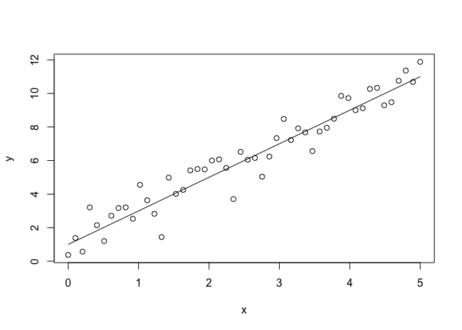

# Linear Regression (SGD)

This notebook shows how to do a simple linear regression using
s,tochastic gradient descent. We will just define the likelihood of the
linear regression model, the rest is done automatically.

``` r
set.seed(1)
x = seq(0,5, length.out = 50)
y = rnorm(50, mean = 2 * x + 1, sd = 1)
plot(x,y)
lines(x, 2 * x + 1, xlab = "x", ylab = "y")
```



## Definition of the likelihood

The negative log-likelihood of the linear regression model given the
data, can be calculated as follows:

``` r
nll <- function(params, x, y) {
  beta_0 <- params[1]
  beta_1 <- params[2]
  sigma <- params[3]
  y_hat <- beta_0 + beta_1 * x 
  nll <- -mean(dnorm(y, mean = y_hat, sd = sigma, log = TRUE))
  return(nll)
}
nll(c(0,1,1), x, y) #beta_0 = 0, beta_1 = 1, sigma = 1 ==> ~8.81
```

    [1] 8.810049

## Side Track Automatic Differentiation

Integration is hard, but differentiation became easy with computers…

``` r
library(numDeriv)
x2 = function(x) x^2
grad(x2, 2) #derivative of x^2 w.r.t x at x=2
```

    [1] 4

``` r
#(𝑥+𝑦)⋅𝑧
f = function(p) (p[1] + p[2]) * p[3]
grad(f, c(-2,5,-4)) #derivative of (x+y)*z w.r.t x,y,z at x=1, y=2, z=3
```

    [1] -4 -4  3

``` r
f = function(p) {
  res = 0
  for (i in 1:10){
    if (i %% 2 == 0)
      res = res + p[1] * i
    else
      res = res + p[2] * i
  }
  res = res + p[3]
  return(res)
}
grad(f, c(-2,5,-4)) #30 25  1
```

    [1] 30 25  1

## Calculation of the gradient

Note that it is possible to calculate the gradient of the negative
log-likelihood of a function using the `numDeriv` package. The gradient
is calculated as follows:

``` r
p = c(0,1,1)
grad_est <- grad(func = function(p) nll(p, x, y), p) #derivative of nll w.r.t p
grad_est
```

    [1]  -3.600448 -11.156105 -14.782220

## Doing gradient descent

Let us now do a simple gradient descent. We start with some initial
values for the parameters and then iteratively update the parameters in
the direction of the negative gradient.

``` r
p = c(1,1,1)
lr = 0.01
for (i in 1:1000) {
  if (i == 1 | i %% 100 == 0)
    print(c(i, p, nll(p, x, y)))
  grad_est <- grad(func = function(p) nll(p, x, y), x = p)
  p = p - lr * grad_est
}
```

    [1] 1.0000 1.0000 1.0000 1.0000 5.7096
    [1] 100.000000   1.260382   1.948605   1.012503   1.264351
    [1] 200.0000000   1.2239937   1.9607943   0.8421578   1.2267745
    [1] 300.0000000   1.1925877   1.9703901   0.8250877   1.2252470
    [1] 400.0000000   1.1700275   1.9772832   0.8236344   1.2246833
    [1] 500.0000000   1.1540792   1.9821561   0.8232895   1.2244027
    [1] 600.0000000   1.1428227   1.9855954   0.8231369   1.2242630
    [1] 700.0000000   1.1348814   1.9880218   0.8230619   1.2241935
    [1] 800.0000000   1.1292800   1.9897332   0.8230247   1.2241589
    [1] 900.0000000   1.1253295   1.9909403   0.8230062   1.2241417
    [1] 1000.0000000    1.1225434    1.9917915    0.8229969    1.2241331

``` r
print(p)
```

    [1] 1.1225202 1.9917986 0.8229969
