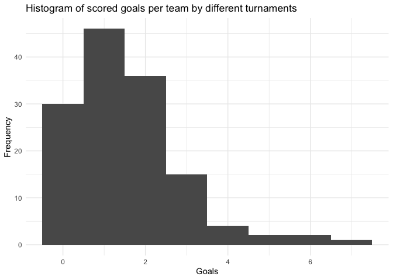

# Euro Data


To make predictions for the Euro 2024, we need to have data on the
performance of the teams in the past. For that we load the data using
the worldfootballR package. For the following:

- the Qualifying matches for the Euro 2024
- friendly matches from 2022 to 2024
- the 2022 World Cup
- the 2021 Euro Cup

The cleaned data includes results of all matches of teams taking part in
the Euro 2024.

## Loading the data

Loading of the data and saving it to a csv file.

``` r
library(worldfootballR)
df_euro_qual_24 <- fb_match_results(country = "", gender = "M", season_end_year = 2024, non_dom_league_url = 'https://fbref.com/en/comps/678/history/UEFA-Euro-Qualifying-Seasons')
df_friendlys_24 <- fb_match_results(country = "", gender = "M", season_end_year = 2024, non_dom_league_url='https://fbref.com/en/comps/218/history/Friendlies-M-Seasons')
df_friendlys_23 <- fb_match_results(country = "", gender = "M", season_end_year = 2023, non_dom_league_url='https://fbref.com/en/comps/218/history/Friendlies-M-Seasons')
df_friendlys_22 <- fb_match_results(country = "", gender = "M", season_end_year = 2022, non_dom_league_url='https://fbref.com/en/comps/218/history/Friendlies-M-Seasons')
df_wc_22 <- fb_match_results(country = "", gender = "M", season_end_year = 2022, non_dom_league_url='https://fbref.com/en/comps/1/history/World-Cup-Seasons')
df_euro_21 <- fb_match_results(country = "", gender = "M", season_end_year = 2021, tier = "", non_dom_league_url = "https://fbref.com/en/comps/676/history/European-Championship-Seasons")
nrow(df_euro_qual_24) + nrow(df_friendlys_24) + nrow(df_friendlys_23) + nrow(df_friendlys_22) + nrow(df_wc_22) + nrow(df_euro_21) #1062
games_raw = bind_rows(df_euro_qual_24, df_friendlys_24, df_friendlys_23, df_friendlys_22, df_wc_22, df_euro_21)
print(paste0("Loaded :, ", nrow(games_raw), " games"))
write.csv(games_raw, file = "all_games.csv", row.names = FALSE)
```

``` r
all_games = read.csv("all_games.csv")
print(paste0("Loaded : ", nrow(all_games), " games"))
```

    [1] "Loaded : 1062 games"

``` r
# Define the list of teams
# Define the list of teams that qualified for Euro 2024
teams <- c("Germany", "Scotland", "France", "Italy", "Spain", "England", "Hungary", "Switzerland", "Croatia", "Albania", "Poland", "Netherlands", "Slovenia", "Denmark", "Serbia", "Romania", "Ukraine", "Belgium", "Slovakia", "Türkiye", "Georgia", "Portugal", "Czechia", "Austria")

# Create a lookup table with all country names and their corresponding codes (if needed)
lookup <- data.frame(
  Code <- c("de", "sct", "fr", "it", "es", "eng", "hu", "ch", "hr", "al", "pl", "nl", "si", "dk", "rs", "ro", "ua", "be", "sk", "tr", "ge", "pt", "cz", "at"),
  Name = teams
)

# Function to extract and standardize country names
extract_country_names <- function(df) {
  df %>%
    rowwise() %>%
    mutate(
      Home = {
        home_parts <- strsplit(Home, " ")[[1]]
        home_name <- ifelse(home_parts[2] %in% lookup$Code, lookup$Name[lookup$Code == home_parts[2]], home_parts[1])
        home_name
      },
      Away = {
        away_parts <- strsplit(Away, " ")[[1]]
        away_name <- ifelse(away_parts[1] %in% lookup$Code, lookup$Name[lookup$Code == away_parts[1]], away_parts[2])
        away_name
      }
    ) %>%
    ungroup()
}

# Apply the function to extract and standardize country names
games_with_names <- extract_country_names(all_games)

# Function to filter rows based on the country names
filter_games <- function(df, teams) {
  df %>%
    filter(Home %in% teams & Away %in% teams)
}

# Apply the filter function
filtered_games <- filter_games(games_with_names, teams)

out = filtered_games %>% select(Home, HomeGoals, AwayGoals, Away, Date, Competition_Name, MatchURL)
write.csv(out , file = "games_before_euro24.csv", row.names = FALSE)
```

## Summary of the data

``` r
# Histogram of scored goals by different turnaments. 

filtered_games %>% 
  ggplot(aes(x = HomeGoals)) +
  geom_histogram(binwidth = 1) +
  geom_histogram(aes(x = AwayGoals), binwidth = 1) +
  labs(title = "Histogram of scored goals per team by different turnaments", x = "Goals", y = "Frequency") +
  theme_minimal()
```



Total number of games between the 24 teams taking part in the Euro 2024:
116

``` r
library(kableExtra)
kableExtra::kable(out, align = "rlrlrrrr", caption = "Games between teams taking part in the Euro 2024")
```

<div>

|        Home | HomeGoals | AwayGoals | Away        |       Date |                               Competition_Name |                                                                                        MatchURL |
|------------:|:----------|----------:|:------------|-----------:|-----------------------------------------------:|------------------------------------------------------------------------------------------------:|
|       Italy | 1         |         2 | England     | 2023-03-23 | UEFA European Football Championship Qualifying |          https://fbref.com/en/matches/64af7b32/Italy-England-March-23-2023-UEFA-Euro-Qualifying |
|      France | 4         |         0 | Netherlands | 2023-03-24 | UEFA European Football Championship Qualifying |     https://fbref.com/en/matches/cc045e88/France-Netherlands-March-24-2023-UEFA-Euro-Qualifying |
|     Czechia | 3         |         1 | Poland      | 2023-03-24 | UEFA European Football Championship Qualifying |         https://fbref.com/en/matches/f97c6552/Czechia-Poland-March-24-2023-UEFA-Euro-Qualifying |
|       Spain | 3         |         1 | Georgia     | 2023-11-19 | UEFA European Football Championship Qualifying |       https://fbref.com/en/matches/d0538cf2/Spain-Georgia-November-19-2023-UEFA-Euro-Qualifying |
|     Ukraine | 0         |         0 | Italy       | 2023-11-20 | UEFA European Football Championship Qualifying |       https://fbref.com/en/matches/18b09385/Ukraine-Italy-November-20-2023-UEFA-Euro-Qualifying |
|     Romania | 1         |         0 | Switzerland | 2023-11-21 | UEFA European Football Championship Qualifying | https://fbref.com/en/matches/c194a16f/Romania-Switzerland-November-21-2023-UEFA-Euro-Qualifying |
|     England | 2         |         0 | Ukraine     | 2023-03-26 | UEFA European Football Championship Qualifying |        https://fbref.com/en/matches/275ada90/England-Ukraine-March-26-2023-UEFA-Euro-Qualifying |
|      Poland | 1         |         0 | Albania     | 2023-03-27 | UEFA European Football Championship Qualifying |         https://fbref.com/en/matches/b3cfd5ef/Poland-Albania-March-27-2023-UEFA-Euro-Qualifying |
|    Scotland | 2         |         0 | Spain       | 2023-03-28 | UEFA European Football Championship Qualifying |         https://fbref.com/en/matches/1a041b62/Scotland-Spain-March-28-2023-UEFA-Euro-Qualifying |
|     Türkiye | 0         |         2 | Croatia     | 2023-03-28 | UEFA European Football Championship Qualifying |        https://fbref.com/en/matches/2ef3e16b/Turkiye-Croatia-March-28-2023-UEFA-Euro-Qualifying |
|     Belgium | 1         |         1 | Austria     | 2023-06-17 | UEFA European Football Championship Qualifying |         https://fbref.com/en/matches/cc0ef54c/Belgium-Austria-June-17-2023-UEFA-Euro-Qualifying |
|    Slovenia | 1         |         1 | Denmark     | 2023-06-19 | UEFA European Football Championship Qualifying |        https://fbref.com/en/matches/6856d2fd/Slovenia-Denmark-June-19-2023-UEFA-Euro-Qualifying |
| Switzerland | 2         |         2 | Romania     | 2023-06-19 | UEFA European Football Championship Qualifying |     https://fbref.com/en/matches/709c33c3/Switzerland-Romania-June-19-2023-UEFA-Euro-Qualifying |
|    Scotland | 2         |         0 | Georgia     | 2023-06-20 | UEFA European Football Championship Qualifying |        https://fbref.com/en/matches/efa49da3/Scotland-Georgia-June-20-2023-UEFA-Euro-Qualifying |
|      Serbia | 1         |         2 | Hungary     | 2023-09-07 | UEFA European Football Championship Qualifying |      https://fbref.com/en/matches/0c9ec616/Serbia-Hungary-September-7-2023-UEFA-Euro-Qualifying |
|     Czechia | 1         |         1 | Albania     | 2023-09-07 | UEFA European Football Championship Qualifying |     https://fbref.com/en/matches/248ee808/Czechia-Albania-September-7-2023-UEFA-Euro-Qualifying |
|     Georgia | 1         |         7 | Spain       | 2023-09-08 | UEFA European Football Championship Qualifying |       https://fbref.com/en/matches/5993cfc5/Georgia-Spain-September-8-2023-UEFA-Euro-Qualifying |
|    Slovakia | 0         |         1 | Portugal    | 2023-09-08 | UEFA European Football Championship Qualifying |   https://fbref.com/en/matches/ef6f2db5/Slovakia-Portugal-September-8-2023-UEFA-Euro-Qualifying |
|     Ukraine | 1         |         1 | England     | 2023-09-09 | UEFA European Football Championship Qualifying |     https://fbref.com/en/matches/a067451d/Ukraine-England-September-9-2023-UEFA-Euro-Qualifying |
|     Albania | 2         |         0 | Poland      | 2023-09-10 | UEFA European Football Championship Qualifying |     https://fbref.com/en/matches/95ef12bc/Albania-Poland-September-10-2023-UEFA-Euro-Qualifying |
|       Italy | 2         |         1 | Ukraine     | 2023-09-12 | UEFA European Football Championship Qualifying |      https://fbref.com/en/matches/9f83636b/Italy-Ukraine-September-12-2023-UEFA-Euro-Qualifying |
|     Albania | 3         |         0 | Czechia     | 2023-10-12 | UEFA European Football Championship Qualifying |      https://fbref.com/en/matches/38548416/Albania-Czechia-October-12-2023-UEFA-Euro-Qualifying |
|     Croatia | 0         |         1 | Türkiye     | 2023-10-12 | UEFA European Football Championship Qualifying |      https://fbref.com/en/matches/6e16ceb9/Croatia-Turkiye-October-12-2023-UEFA-Euro-Qualifying |
|       Spain | 2         |         0 | Scotland    | 2023-10-12 | UEFA European Football Championship Qualifying |       https://fbref.com/en/matches/816e3943/Spain-Scotland-October-12-2023-UEFA-Euro-Qualifying |
|    Portugal | 3         |         2 | Slovakia    | 2023-10-13 | UEFA European Football Championship Qualifying |    https://fbref.com/en/matches/92c4cc7b/Portugal-Slovakia-October-13-2023-UEFA-Euro-Qualifying |
| Netherlands | 1         |         2 | France      | 2023-10-13 | UEFA European Football Championship Qualifying |   https://fbref.com/en/matches/7853b270/Netherlands-France-October-13-2023-UEFA-Euro-Qualifying |
|     Austria | 2         |         3 | Belgium     | 2023-10-13 | UEFA European Football Championship Qualifying |      https://fbref.com/en/matches/d5babe70/Austria-Belgium-October-13-2023-UEFA-Euro-Qualifying |
|     Hungary | 2         |         1 | Serbia      | 2023-10-14 | UEFA European Football Championship Qualifying |       https://fbref.com/en/matches/68e53e40/Hungary-Serbia-October-14-2023-UEFA-Euro-Qualifying |
|     England | 3         |         1 | Italy       | 2023-10-17 | UEFA European Football Championship Qualifying |        https://fbref.com/en/matches/8f7bca34/England-Italy-October-17-2023-UEFA-Euro-Qualifying |
|     Georgia | 2         |         2 | Scotland    | 2023-11-16 | UEFA European Football Championship Qualifying |    https://fbref.com/en/matches/90d1aa63/Georgia-Scotland-November-16-2023-UEFA-Euro-Qualifying |
|     Denmark | 2         |         1 | Slovenia    | 2023-11-17 | UEFA European Football Championship Qualifying |    https://fbref.com/en/matches/2fdf5275/Denmark-Slovenia-November-17-2023-UEFA-Euro-Qualifying |
|      Poland | 1         |         1 | Czechia     | 2023-11-17 | UEFA European Football Championship Qualifying |      https://fbref.com/en/matches/7ff58ed5/Poland-Czechia-November-17-2023-UEFA-Euro-Qualifying |
|     Hungary | 1         |         0 | Türkiye     | 2024-03-22 |                   International Friendlies (M) |                https://fbref.com/en/matches/cf63dd6f/Hungary-Turkiye-March-22-2024-Friendlies-M |
| Netherlands | 4         |         0 | Scotland    | 2024-03-22 |                   International Friendlies (M) |           https://fbref.com/en/matches/d5f13317/Netherlands-Scotland-March-22-2024-Friendlies-M |
|    Slovakia | 0         |         2 | Austria     | 2024-03-23 |                   International Friendlies (M) |               https://fbref.com/en/matches/d3121ff5/Slovakia-Austria-March-23-2024-Friendlies-M |
|     Denmark | 0         |         0 | Switzerland | 2024-03-23 |                   International Friendlies (M) |            https://fbref.com/en/matches/0467b4d2/Denmark-Switzerland-March-23-2024-Friendlies-M |
|      France | 0         |         2 | Germany     | 2024-03-23 |                   International Friendlies (M) |                 https://fbref.com/en/matches/f1e299ee/France-Germany-March-23-2024-Friendlies-M |
|     England | 2         |         2 | Belgium     | 2024-03-26 |                   International Friendlies (M) |                https://fbref.com/en/matches/5cac400a/England-Belgium-March-26-2024-Friendlies-M |
|     Germany | 2         |         1 | Netherlands | 2024-03-26 |                   International Friendlies (M) |            https://fbref.com/en/matches/176d9d40/Germany-Netherlands-March-26-2024-Friendlies-M |
|     Austria | 6         |         1 | Türkiye     | 2024-03-26 |                   International Friendlies (M) |                https://fbref.com/en/matches/21d76e8f/Austria-Turkiye-March-26-2024-Friendlies-M |
|    Slovenia | 2         |         0 | Portugal    | 2024-03-26 |                   International Friendlies (M) |              https://fbref.com/en/matches/fc9ef120/Slovenia-Portugal-March-26-2024-Friendlies-M |
|     Germany | 0         |         0 | Ukraine     | 2024-06-03 |                   International Friendlies (M) |                  https://fbref.com/en/matches/2e552e57/Germany-Ukraine-June-3-2024-Friendlies-M |
|     Austria | 2         |         1 | Serbia      | 2024-06-04 |                   International Friendlies (M) |                   https://fbref.com/en/matches/d63a44dc/Austria-Serbia-June-4-2024-Friendlies-M |
|       Italy | 0         |         0 | Türkiye     | 2024-06-04 |                   International Friendlies (M) |                    https://fbref.com/en/matches/95d471df/Italy-Turkiye-June-4-2024-Friendlies-M |
|      Poland | 3         |         1 | Ukraine     | 2024-06-07 |                   International Friendlies (M) |                   https://fbref.com/en/matches/38d89fad/Poland-Ukraine-June-7-2024-Friendlies-M |
|    Portugal | 1         |         2 | Croatia     | 2024-06-08 |                   International Friendlies (M) |                 https://fbref.com/en/matches/f2d309b2/Portugal-Croatia-June-8-2024-Friendlies-M |
| Switzerland | 1         |         1 | Austria     | 2024-06-08 |                   International Friendlies (M) |              https://fbref.com/en/matches/abc613a8/Switzerland-Austria-June-8-2024-Friendlies-M |
|      Poland | 2         |         1 | Türkiye     | 2024-06-10 |                   International Friendlies (M) |                  https://fbref.com/en/matches/14878bbf/Poland-Turkiye-June-10-2024-Friendlies-M |
|     Germany | 2         |         3 | Belgium     | 2023-03-28 |                   International Friendlies (M) |                https://fbref.com/en/matches/f8d00054/Germany-Belgium-March-28-2023-Friendlies-M |
|     Germany | 3         |         3 | Ukraine     | 2023-06-12 |                   International Friendlies (M) |                 https://fbref.com/en/matches/c5e94f95/Germany-Ukraine-June-12-2023-Friendlies-M |
|      Poland | 1         |         0 | Germany     | 2023-06-16 |                   International Friendlies (M) |                  https://fbref.com/en/matches/7fbaa0be/Poland-Germany-June-16-2023-Friendlies-M |
|     Hungary | 1         |         1 | Czechia     | 2023-09-10 |                   International Friendlies (M) |            https://fbref.com/en/matches/0c690a8f/Hungary-Czechia-September-10-2023-Friendlies-M |
|    Scotland | 1         |         3 | England     | 2023-09-12 |                   International Friendlies (M) |           https://fbref.com/en/matches/1461ddd6/Scotland-England-September-12-2023-Friendlies-M |
|     Germany | 2         |         1 | France      | 2023-09-12 |                   International Friendlies (M) |             https://fbref.com/en/matches/1a3bf09a/Germany-France-September-12-2023-Friendlies-M |
|      France | 4         |         1 | Scotland    | 2023-10-17 |                   International Friendlies (M) |              https://fbref.com/en/matches/49c3cf63/France-Scotland-October-17-2023-Friendlies-M |
|     Belgium | 1         |         0 | Serbia      | 2023-11-15 |                   International Friendlies (M) |              https://fbref.com/en/matches/c4e365f3/Belgium-Serbia-November-15-2023-Friendlies-M |
|     Germany | 2         |         3 | Türkiye     | 2023-11-18 |                   International Friendlies (M) |             https://fbref.com/en/matches/ed1f140d/Germany-Turkiye-November-18-2023-Friendlies-M |
|     Austria | 2         |         0 | Germany     | 2023-11-21 |                   International Friendlies (M) |             https://fbref.com/en/matches/755a7437/Austria-Germany-November-21-2023-Friendlies-M |
|     Hungary | 0         |         1 | Serbia      | 2022-03-24 |                   International Friendlies (M) |                 https://fbref.com/en/matches/d8e02c5c/Hungary-Serbia-March-24-2022-Friendlies-M |
|    Scotland | 1         |         1 | Poland      | 2022-03-24 |                   International Friendlies (M) |                https://fbref.com/en/matches/527784ab/Scotland-Poland-March-24-2022-Friendlies-M |
|     Croatia | 1         |         1 | Slovenia    | 2022-03-26 |                   International Friendlies (M) |               https://fbref.com/en/matches/cde56311/Croatia-Slovenia-March-26-2022-Friendlies-M |
|     England | 2         |         1 | Switzerland | 2022-03-26 |                   International Friendlies (M) |            https://fbref.com/en/matches/3a98668d/England-Switzerland-March-26-2022-Friendlies-M |
|       Spain | 2         |         1 | Albania     | 2022-03-26 |                   International Friendlies (M) |                  https://fbref.com/en/matches/2e427819/Spain-Albania-March-26-2022-Friendlies-M |
| Netherlands | 4         |         2 | Denmark     | 2022-03-26 |                   International Friendlies (M) |            https://fbref.com/en/matches/4073d8ce/Netherlands-Denmark-March-26-2022-Friendlies-M |
|     Albania | 0         |         0 | Georgia     | 2022-03-29 |                   International Friendlies (M) |                https://fbref.com/en/matches/79fa024e/Albania-Georgia-March-29-2022-Friendlies-M |
|     Denmark | 3         |         0 | Serbia      | 2022-03-29 |                   International Friendlies (M) |                 https://fbref.com/en/matches/cfd42a80/Denmark-Serbia-March-29-2022-Friendlies-M |
|     Austria | 2         |         2 | Scotland    | 2022-03-29 |                   International Friendlies (M) |               https://fbref.com/en/matches/4586ab10/Austria-Scotland-March-29-2022-Friendlies-M |
| Netherlands | 1         |         1 | Germany     | 2022-03-29 |                   International Friendlies (M) |            https://fbref.com/en/matches/897dd6ae/Netherlands-Germany-March-29-2022-Friendlies-M |
|     Türkiye | 2         |         3 | Italy       | 2022-03-29 |                   International Friendlies (M) |                  https://fbref.com/en/matches/cbb8e2ff/Turkiye-Italy-March-29-2022-Friendlies-M |
|     Türkiye | 2         |         1 | Scotland    | 2022-11-16 |                   International Friendlies (M) |            https://fbref.com/en/matches/e1c97481/Turkiye-Scotland-November-16-2022-Friendlies-M |
|     Albania | 1         |         3 | Italy       | 2022-11-16 |                   International Friendlies (M) |               https://fbref.com/en/matches/c69404b2/Albania-Italy-November-16-2022-Friendlies-M |
|     Romania | 1         |         2 | Slovenia    | 2022-11-17 |                   International Friendlies (M) |            https://fbref.com/en/matches/096227ea/Romania-Slovenia-November-17-2022-Friendlies-M |
|     Türkiye | 2         |         1 | Czechia     | 2022-11-19 |                   International Friendlies (M) |             https://fbref.com/en/matches/1c4fed81/Turkiye-Czechia-November-19-2022-Friendlies-M |
|     Austria | 2         |         0 | Italy       | 2022-11-20 |                   International Friendlies (M) |               https://fbref.com/en/matches/9d7b2713/Austria-Italy-November-20-2022-Friendlies-M |
|      France | 2         |         1 | Denmark     | 2022-11-26 |                                 FIFA World Cup |                 https://fbref.com/en/matches/6ff09149/France-Denmark-November-26-2022-World-Cup |
|       Spain | 1         |         1 | Germany     | 2022-11-27 |                                 FIFA World Cup |                  https://fbref.com/en/matches/9397f79c/Spain-Germany-November-27-2022-World-Cup |
|     Croatia | 0         |         0 | Belgium     | 2022-12-01 |                                 FIFA World Cup |                 https://fbref.com/en/matches/ea7139a8/Croatia-Belgium-December-1-2022-World-Cup |
|      Serbia | 2         |         3 | Switzerland | 2022-12-02 |                                 FIFA World Cup |              https://fbref.com/en/matches/cef4945f/Serbia-Switzerland-December-2-2022-World-Cup |
|      France | 3         |         1 | Poland      | 2022-12-04 |                                 FIFA World Cup |                   https://fbref.com/en/matches/430fc603/France-Poland-December-4-2022-World-Cup |
|    Portugal | 6         |         1 | Switzerland | 2022-12-06 |                                 FIFA World Cup |            https://fbref.com/en/matches/799eb586/Portugal-Switzerland-December-6-2022-World-Cup |
|     England | 1         |         2 | France      | 2022-12-10 |                                 FIFA World Cup |                 https://fbref.com/en/matches/6d4b58f5/England-France-December-10-2022-World-Cup |
|     Türkiye | 0         |         3 | Italy       | 2021-06-11 |            UEFA European Football Championship |          https://fbref.com/en/matches/95a9ebd1/Turkiye-Italy-June-11-2021-European-Championship |
|     England | 1         |         0 | Croatia     | 2021-06-13 |            UEFA European Football Championship |        https://fbref.com/en/matches/764c27dc/England-Croatia-June-13-2021-European-Championship |
| Netherlands | 3         |         2 | Ukraine     | 2021-06-13 |            UEFA European Football Championship |    https://fbref.com/en/matches/0e9919a5/Netherlands-Ukraine-June-13-2021-European-Championship |
|    Scotland | 0         |         2 | Czechia     | 2021-06-14 |            UEFA European Football Championship |       https://fbref.com/en/matches/6599f4ab/Scotland-Czechia-June-14-2021-European-Championship |
|      Poland | 1         |         2 | Slovakia    | 2021-06-14 |            UEFA European Football Championship |        https://fbref.com/en/matches/d35ad7a8/Poland-Slovakia-June-14-2021-European-Championship |
|     Hungary | 0         |         3 | Portugal    | 2021-06-15 |            UEFA European Football Championship |       https://fbref.com/en/matches/ba500d70/Hungary-Portugal-June-15-2021-European-Championship |
|      France | 1         |         0 | Germany     | 2021-06-15 |            UEFA European Football Championship |         https://fbref.com/en/matches/95d34c87/France-Germany-June-15-2021-European-Championship |
|       Italy | 3         |         0 | Switzerland | 2021-06-16 |            UEFA European Football Championship |      https://fbref.com/en/matches/caa84313/Italy-Switzerland-June-16-2021-European-Championship |
|     Denmark | 1         |         2 | Belgium     | 2021-06-17 |            UEFA European Football Championship |        https://fbref.com/en/matches/25bb1fa2/Denmark-Belgium-June-17-2021-European-Championship |
| Netherlands | 2         |         0 | Austria     | 2021-06-17 |            UEFA European Football Championship |    https://fbref.com/en/matches/f3d39a29/Netherlands-Austria-June-17-2021-European-Championship |
|     Croatia | 1         |         1 | Czechia     | 2021-06-18 |            UEFA European Football Championship |        https://fbref.com/en/matches/1e930db9/Croatia-Czechia-June-18-2021-European-Championship |
|     England | 0         |         0 | Scotland    | 2021-06-18 |            UEFA European Football Championship |       https://fbref.com/en/matches/027b11df/England-Scotland-June-18-2021-European-Championship |
|     Hungary | 1         |         1 | France      | 2021-06-19 |            UEFA European Football Championship |         https://fbref.com/en/matches/988198ba/Hungary-France-June-19-2021-European-Championship |
|    Portugal | 2         |         4 | Germany     | 2021-06-19 |            UEFA European Football Championship |       https://fbref.com/en/matches/e33c4403/Portugal-Germany-June-19-2021-European-Championship |
|       Spain | 1         |         1 | Poland      | 2021-06-19 |            UEFA European Football Championship |           https://fbref.com/en/matches/14874531/Spain-Poland-June-19-2021-European-Championship |
| Switzerland | 3         |         1 | Türkiye     | 2021-06-20 |            UEFA European Football Championship |    https://fbref.com/en/matches/fa85a731/Switzerland-Turkiye-June-20-2021-European-Championship |
|     Ukraine | 0         |         1 | Austria     | 2021-06-21 |            UEFA European Football Championship |        https://fbref.com/en/matches/7ed46abd/Ukraine-Austria-June-21-2021-European-Championship |
|     Croatia | 3         |         1 | Scotland    | 2021-06-22 |            UEFA European Football Championship |       https://fbref.com/en/matches/0305e42c/Croatia-Scotland-June-22-2021-European-Championship |
|     Czechia | 0         |         1 | England     | 2021-06-22 |            UEFA European Football Championship |        https://fbref.com/en/matches/20b1972b/Czechia-England-June-22-2021-European-Championship |
|    Slovakia | 0         |         5 | Spain       | 2021-06-23 |            UEFA European Football Championship |         https://fbref.com/en/matches/7b46b857/Slovakia-Spain-June-23-2021-European-Championship |
|    Portugal | 2         |         2 | France      | 2021-06-23 |            UEFA European Football Championship |        https://fbref.com/en/matches/5a7e53d8/Portugal-France-June-23-2021-European-Championship |
|     Germany | 2         |         2 | Hungary     | 2021-06-23 |            UEFA European Football Championship |        https://fbref.com/en/matches/a4888546/Germany-Hungary-June-23-2021-European-Championship |
|       Italy | 2         |         1 | Austria     | 2021-06-26 |            UEFA European Football Championship |          https://fbref.com/en/matches/c2b13049/Italy-Austria-June-26-2021-European-Championship |
| Netherlands | 0         |         2 | Czechia     | 2021-06-27 |            UEFA European Football Championship |    https://fbref.com/en/matches/437cb418/Netherlands-Czechia-June-27-2021-European-Championship |
|     Belgium | 1         |         0 | Portugal    | 2021-06-27 |            UEFA European Football Championship |       https://fbref.com/en/matches/ad36a434/Belgium-Portugal-June-27-2021-European-Championship |
|     Croatia | 3         |         5 | Spain       | 2021-06-28 |            UEFA European Football Championship |          https://fbref.com/en/matches/799efcfc/Croatia-Spain-June-28-2021-European-Championship |
|      France | 3         |         3 | Switzerland | 2021-06-28 |            UEFA European Football Championship |     https://fbref.com/en/matches/2c7de26e/France-Switzerland-June-28-2021-European-Championship |
|     England | 2         |         0 | Germany     | 2021-06-29 |            UEFA European Football Championship |        https://fbref.com/en/matches/415ff832/England-Germany-June-29-2021-European-Championship |
| Switzerland | 1         |         1 | Spain       | 2021-07-02 |            UEFA European Football Championship |       https://fbref.com/en/matches/18c4e831/Switzerland-Spain-July-2-2021-European-Championship |
|     Belgium | 1         |         2 | Italy       | 2021-07-02 |            UEFA European Football Championship |           https://fbref.com/en/matches/35a9c7dc/Belgium-Italy-July-2-2021-European-Championship |
|     Czechia | 1         |         2 | Denmark     | 2021-07-03 |            UEFA European Football Championship |         https://fbref.com/en/matches/1a1e61fe/Czechia-Denmark-July-3-2021-European-Championship |
|     Ukraine | 0         |         4 | England     | 2021-07-03 |            UEFA European Football Championship |         https://fbref.com/en/matches/8589d5c5/Ukraine-England-July-3-2021-European-Championship |
|       Italy | 1         |         1 | Spain       | 2021-07-06 |            UEFA European Football Championship |             https://fbref.com/en/matches/997fefb3/Italy-Spain-July-6-2021-European-Championship |
|     England | 2         |         1 | Denmark     | 2021-07-07 |            UEFA European Football Championship |         https://fbref.com/en/matches/3c9e014a/England-Denmark-July-7-2021-European-Championship |
|       Italy | 1         |         1 | England     | 2021-07-11 |            UEFA European Football Championship |          https://fbref.com/en/matches/56228480/Italy-England-July-11-2021-European-Championship |

Games between teams taking part in the Euro 2024

</div>
