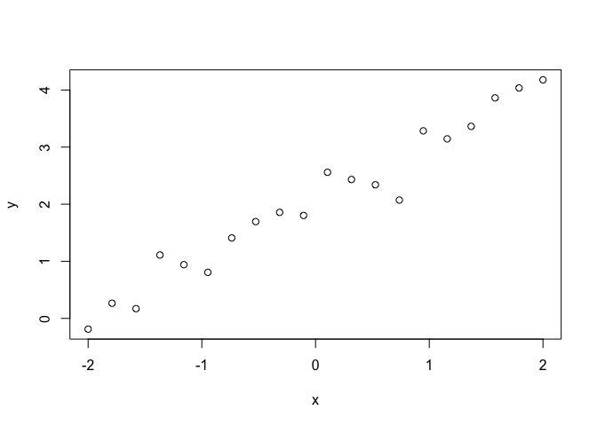
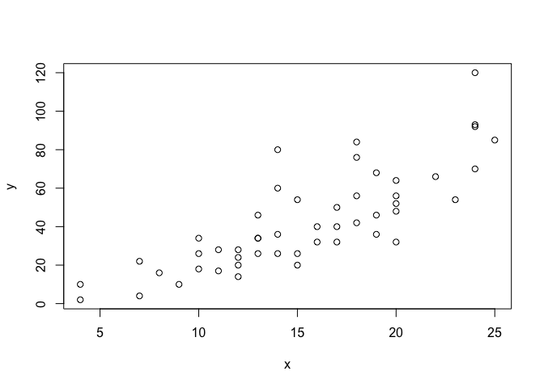
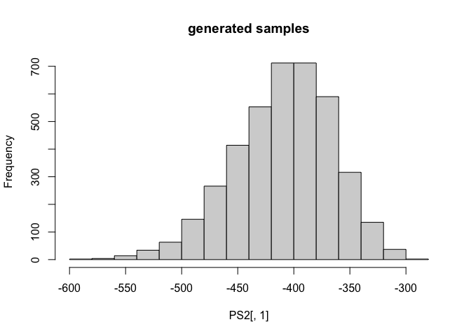
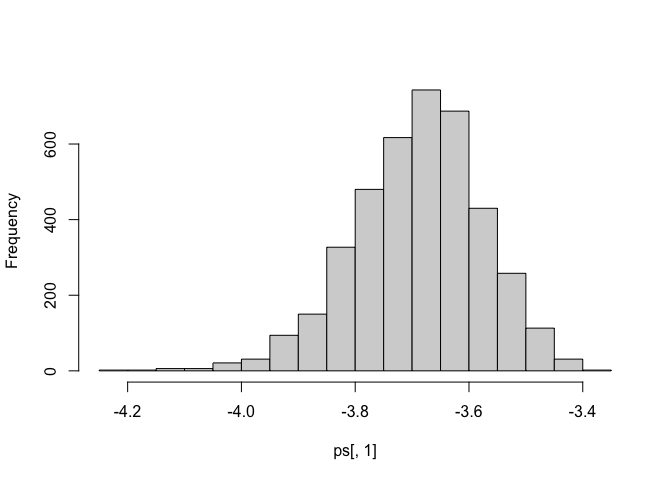

-   [Understanding NLL and LOO](#understanding-nll-and-loo)
    -   [The quantity we like to estimate
        (elpd)](#the-quantity-we-like-to-estimate-elpd)
    -   [Estimating elpd](#estimating-elpd)
    -   [Random Data](#random-data)
    -   [Theoretical value](#theoretical-value)
    -   [Fitting with stan](#fitting-with-stan)
    -   [Estimating the elpd](#estimating-the-elpd)
    -   [Comparison with example from statistical
        rethinking](#comparison-with-example-from-statistical-rethinking)
    -   [Manual calculation of the
        WAIC](#manual-calculation-of-the-waic)
    -   [Using generated quantities \[currently not
        working\]](#using-generated-quantities-currently-not-working)

**Status: generated quantities not working**

## Understanding NLL and LOO

Some notes for the evaluation of the performance of a Bayesian
probabilistic prediction. We follow the paper \[1\] “Practical Bayesian
model evaluation using leave-one-out cross-validation and WAIC” from Aki
Vehtari, Andrew Gelman, Jonah Gabry <https://arxiv.org/abs/1507.04544>
and statistical rethinking. We apply the method first on a syntactical
example and then on the `car` example given in statistical rethinking.

### The quantity we like to estimate (elpd)

All valid and applicable measures are variants of the log scoring rule
of the posterior predicted distribution.[^1] In the regression setting,
the additional question remains at which points
 this quantity
should be evaluated. In \[1\] the quantity `elpd` the *expected log
pointwise predictive density for a new dataset* is therefore defined as:

![
  elpd := \\sum\_{i=1}^{N} E\_{y \\sim p_t(y)}\\left\[\\log(p(y\|x_i,D))\\right\]  
](https://latex.codecogs.com/png.latex?%0A%20%20elpd%20%3A%3D%20%5Csum_%7Bi%3D1%7D%5E%7BN%7D%20E_%7By%20%5Csim%20p_t%28y%29%7D%5Cleft%5B%5Clog%28p%28y%7Cx_i%2CD%29%29%5Cright%5D%20%20%0A "
  elpd := \sum_{i=1}^{N} E_{y \sim p_t(y)}\left[\log(p(y|x_i,D))\right]  
")

This quantity requires integrating over
") the
true data generating process DGP for a given
. Which we usually
of course don’t have. Before detailing how to estimate the quantity, we
note that different transformations exists.

-   elpd the higher the better

-   Deviance
    
    the lower the better (see AIC and WAIC later)

-   NLL
    
    the lower the better and further not depending on the number of data
    points . Since we
    are so used to the NLL, we also include it in the comparison,
    although this name is not 100% correct.

### Estimating elpd

#### Overfitting on the training data (and correcting it)

A biased estimate this is using the training set.

)  
")

This the log pointwise predictive density (lppd) in statistical
rethinking and lpd in \[1\]. This quantity of course underestimates the
elpd since it is shows overfitting and depends on the number of
parameters of the model. A crude approximation is to subtract number of
parameters  (or add it
when talking about deviance). This gives rise to the Akaike Information
Criteriom AIC criterion:


")

A better approximation is use the widely applicable information
criterion WAIC


")

The quantity

is the effective number of parameters, which can be calculated based on
the variance of the log-probability
)")
of the

posterior samples for the training data.

) 
")

#### Using a testset

The first approximation which can be done, is to evaluate the
expectation at a **test set** at the single points
.

) = -N \cdot \mathit{NLL}
")

A special case of such a test set is leave-one-out crossvalidation, loo.

) 
")

The  in

indicates that the training has been done without the data point
. For loo effective
methods such as Pareto smoothed importance sampling PSIS and are
provided in the r-package `loo`.

### Random Data

We simulate some data, so that we know the DGP.

``` r
N = 20
SD = 0.3
A = 1
B = 2
gen_data = function(){
  x = seq(-2,2,length.out = N)
  y = rnorm(N,A*x+B, sd=SD)  
  return (data.frame(x=x,y=y))
}
set.seed(1)
dat = gen_data()
x=dat$x
y=dat$y
plot(x,y)
```

<!-- -->

### Theoretical value

In principle we know that the data is distributed normally with constant
spread SD. In this case the elpd can be evaluated at a single data point
and would be

![
\\mathit{elpd} = \\sum\_{i=1}^{N} E\_{y \\sim p(y\|x_i)}\\left\[\\log(p(y\|x_i,D))\\right\] = N \\cdot \\int\_{-\\infty}^{+\\infty} \\log(N(y\|0,0.3)) \\cdot N(y\|0, 0.3) \\; dy
](https://latex.codecogs.com/png.latex?%0A%5Cmathit%7Belpd%7D%20%3D%20%5Csum_%7Bi%3D1%7D%5E%7BN%7D%20E_%7By%20%5Csim%20p%28y%7Cx_i%29%7D%5Cleft%5B%5Clog%28p%28y%7Cx_i%2CD%29%29%5Cright%5D%20%3D%20N%20%5Ccdot%20%5Cint_%7B-%5Cinfty%7D%5E%7B%2B%5Cinfty%7D%20%5Clog%28N%28y%7C0%2C0.3%29%29%20%5Ccdot%20N%28y%7C0%2C%200.3%29%20%5C%3B%20dy%0A "
\mathit{elpd} = \sum_{i=1}^{N} E_{y \sim p(y|x_i)}\left[\log(p(y|x_i,D))\right] = N \cdot \int_{-\infty}^{+\infty} \log(N(y|0,0.3)) \cdot N(y|0, 0.3) \; dy
")

``` r
  # Numerical Integration
  f = function(x) dnorm(x, sd=SD)*dnorm(x, sd=SD, log=TRUE)
  N*integrate(f, -10,10)$value
```

    ## [1] -4.299315

``` r
  (elpd.theo = N*integrate(f, -Inf,Inf)$value)
```

    ## [1] -4.299315

``` r
  (nll.theo = -elpd.theo/N)
```

    ## [1] 0.2149657

``` r
  #integrate(f, -Inf,Inf) not working
```

### Fitting with stan

a\) Fit the and check the results

``` r
stan_code = "
data{
  int<lower=0> N;
  vector[N] y;
  vector[N] x;
}

parameters{
  real a; 
  real b;
  real<lower=0> sigma;
}

model{
  //y ~ normal(mu, sigma);
  y ~ normal(a * x + b, sigma);
  a ~ normal(3, 10); 
  b ~ normal(0, 10);
  sigma ~ normal(0,10);
}

generated quantities {
  vector[N] log_lik;
  for (n in 1:N){
    log_lik[n] = normal_lpdf(y[n] | a * x + b, sigma);
  }
}
"
```

``` r
  library(rstan)
```

    ## Loading required package: StanHeaders

    ## Loading required package: ggplot2

    ## rstan (Version 2.21.2, GitRev: 2e1f913d3ca3)

    ## For execution on a local, multicore CPU with excess RAM we recommend calling
    ## options(mc.cores = parallel::detectCores()).
    ## To avoid recompilation of unchanged Stan programs, we recommend calling
    ## rstan_options(auto_write = TRUE)

``` r
  #fit = stan(file = 'lr.stan', data=list(N=length(y),y=y,x=x))
  fit = stan(model_code = stan_code, data=list(N=length(y),y=y,x=x))
```

    ## Trying to compile a simple C file

``` r
  print(fit, pars = c('a','b','sigma'))
```

    ## Inference for Stan model: 4614cffb6d34f3aa3de29f4967990bc9.
    ## 4 chains, each with iter=2000; warmup=1000; thin=1; 
    ## post-warmup draws per chain=1000, total post-warmup draws=4000.
    ## 
    ##       mean se_mean   sd 2.5%  25%  50%  75% 97.5% n_eff Rhat
    ## a     1.03       0 0.06 0.92 1.00 1.03 1.07  1.14  2814    1
    ## b     2.06       0 0.07 1.92 2.01 2.05 2.10  2.19  3240    1
    ## sigma 0.30       0 0.06 0.21 0.26 0.29 0.33  0.43  2193    1
    ## 
    ## Samples were drawn using NUTS(diag_e) at Sun May 29 13:09:06 2022.
    ## For each parameter, n_eff is a crude measure of effective sample size,
    ## and Rhat is the potential scale reduction factor on split chains (at 
    ## convergence, Rhat=1).

### Estimating the elpd

The package `loo` provides advances estimates of the `elpd`. For that a
matrix of the log-likelihood needs to be provided. The dimensions are: S
by N, where S is the size of the posterior sample (with all chains
merged) and N is the number of data points. We calculate the
log-likelihood `ps` as follows.

``` r
  library(loo)
```

    ## This is loo version 2.4.1

    ## - Online documentation and vignettes at mc-stan.org/loo

    ## - As of v2.0.0 loo defaults to 1 core but we recommend using as many as possible. Use the 'cores' argument or set options(mc.cores = NUM_CORES) for an entire session.

``` r
  calc_ps = function () {
    a_sam = rstan::extract(fit, 'a')[[1]]
    b_sam = rstan::extract(fit, 'b')[[1]]
    s_sam = rstan::extract(fit, 'sigma')[[1]]
    samples = length(a_sam)
    ps = matrix(NA, nrow = samples, ncol=N)
    for (i in (1:samples)){ #Number of MC-Samples
      for (j in (1:length(x))){ #Number of Parameters
        ps[i,j] = dnorm(y[j],a_sam[i] * x[j] + b_sam[i], s_sam[i], log=TRUE)
      }
    }
    return (ps)
  }
  ps = calc_ps()
  dim(ps)
```

    ## [1] 4000   20

Creating of summary statistics.

``` r
  make_df = function(ps, show_theo = FALSE){
    (elpd.train = N*mean(ps)) 
    res = loo::loo(ps)
    (elpd.loo = res$elpd_loo)
    (p.loo = res$estimates['p_loo',1])
    res = loo::waic(ps)$estimates
    (elpd.waic = res['elpd_waic',1])
    (p.waic = res['p_waic',1])
    df = data.frame(
        loo_psis = c(elpd.loo, -elpd.loo/N, p.loo),
        waic = c(elpd.waic, -elpd.waic/N, p.waic),
        training = c(elpd.train, -elpd.train/N, NA),
        theoretical = c(elpd.theo, elpd.theo/N, 3L)
        )
    if (show_theo == FALSE) {df$theoretical = NULL}
    return (df)
  }
  df = make_df(ps, show_theo = TRUE)
```

    ## Warning: Relative effective sample sizes ('r_eff' argument) not specified.
    ## For models fit with MCMC, the reported PSIS effective sample sizes and 
    ## MCSE estimates will be over-optimistic.

    ## Warning: Some Pareto k diagnostic values are too high. See help('pareto-k-diagnostic') for details.

    ## Warning: Accessing elpd_loo using '$' is deprecated and will be removed in
    ## a future release. Please extract the elpd_loo estimate from the 'estimates'
    ## component instead.

    ## Warning: 
    ## 2 (10.0%) p_waic estimates greater than 0.4. We recommend trying loo instead.

``` r
  row.names(df) = c('elpd', 'NLL', 'p')
  print(df)
```

    ##        loo_psis       waic   training theoretical
    ## elpd -5.6200752 -5.3446694 -3.5367643  -4.2993146
    ## NLL   0.2810038  0.2672335  0.1768382  -0.2149657
    ## p     3.3381844  3.0627786         NA   3.0000000

``` r
  elpd.theo
```

    ## [1] -4.299315

``` r
  library("kableExtra")
  kableExtra::kable(round(df,2))
```

<table>
<thead>
<tr>
<th style="text-align:left;">
</th>
<th style="text-align:right;">
loo_psis
</th>
<th style="text-align:right;">
waic
</th>
<th style="text-align:right;">
training
</th>
<th style="text-align:right;">
theoretical
</th>
</tr>
</thead>
<tbody>
<tr>
<td style="text-align:left;">
elpd
</td>
<td style="text-align:right;">
-5.62
</td>
<td style="text-align:right;">
-5.34
</td>
<td style="text-align:right;">
-3.54
</td>
<td style="text-align:right;">
-4.30
</td>
</tr>
<tr>
<td style="text-align:left;">
NLL
</td>
<td style="text-align:right;">
0.28
</td>
<td style="text-align:right;">
0.27
</td>
<td style="text-align:right;">
0.18
</td>
<td style="text-align:right;">
-0.21
</td>
</tr>
<tr>
<td style="text-align:left;">
p
</td>
<td style="text-align:right;">
3.34
</td>
<td style="text-align:right;">
3.06
</td>
<td style="text-align:right;">
NA
</td>
<td style="text-align:right;">
3.00
</td>
</tr>
</tbody>
</table>

``` r
  round(df,2)
```

    ##      loo_psis  waic training theoretical
    ## elpd    -5.62 -5.34    -3.54       -4.30
    ## NLL      0.28  0.27     0.18       -0.21
    ## p        3.34  3.06       NA        3.00

Note that we cannot approach the theoretical value. However, both
methods provide us with error estimates.

``` r
loo::loo(ps)
```

    ## Warning: Relative effective sample sizes ('r_eff' argument) not specified.
    ## For models fit with MCMC, the reported PSIS effective sample sizes and 
    ## MCSE estimates will be over-optimistic.

    ## Warning: Some Pareto k diagnostic values are too high. See help('pareto-k-diagnostic') for details.

    ## 
    ## Computed from 4000 by 20 log-likelihood matrix
    ## 
    ##          Estimate  SE
    ## elpd_loo     -5.6 4.6
    ## p_loo         3.3 1.7
    ## looic        11.2 9.2
    ## ------
    ## Monte Carlo SE of elpd_loo is NA.
    ## 
    ## Pareto k diagnostic values:
    ##                          Count Pct.    Min. n_eff
    ## (-Inf, 0.5]   (good)     19    95.0%   1670      
    ##  (0.5, 0.7]   (ok)        0     0.0%   <NA>      
    ##    (0.7, 1]   (bad)       1     5.0%   147       
    ##    (1, Inf)   (very bad)  0     0.0%   <NA>      
    ## See help('pareto-k-diagnostic') for details.

``` r
loo::waic(ps)
```

    ## Warning: 
    ## 2 (10.0%) p_waic estimates greater than 0.4. We recommend trying loo instead.

    ## 
    ## Computed from 4000 by 20 log-likelihood matrix
    ## 
    ##           Estimate  SE
    ## elpd_waic     -5.3 4.4
    ## p_waic         3.1 1.5
    ## waic          10.7 8.7
    ## 
    ## 2 (10.0%) p_waic estimates greater than 0.4. We recommend trying loo instead.

### Comparison with example from statistical rethinking

In the book (page 222, R Code 7.19) they use the following example:

``` r
  x = cars$speed
  y = cars$dist
  N = length(y)
  plot(x,y)
```

<!-- -->

``` r
library(rstan)
fit = stan(model_code = stan_code, data=list(N=length(y),y=y,x=x))
```

``` r
print(fit, pars = c('a','b','sigma'))
```

    ## Inference for Stan model: 4614cffb6d34f3aa3de29f4967990bc9.
    ## 4 chains, each with iter=2000; warmup=1000; thin=1; 
    ## post-warmup draws per chain=1000, total post-warmup draws=4000.
    ## 
    ##         mean se_mean   sd   2.5%    25%    50%   75% 97.5% n_eff Rhat
    ## a       3.61    0.01 0.36   2.91   3.37   3.62  3.85  4.29  1502    1
    ## b     -11.97    0.15 5.67 -22.61 -15.81 -12.13 -8.22 -0.45  1508    1
    ## sigma  15.41    0.04 1.53  12.76  14.36  15.26 16.38 18.64  1709    1
    ## 
    ## Samples were drawn using NUTS(diag_e) at Sun May 29 13:09:08 2022.
    ## For each parameter, n_eff is a crude measure of effective sample size,
    ## and Rhat is the potential scale reduction factor on split chains (at 
    ## convergence, Rhat=1).

``` r
  ps = calc_ps()
  df = make_df(ps)
```

    ## Warning: Relative effective sample sizes ('r_eff' argument) not specified.
    ## For models fit with MCMC, the reported PSIS effective sample sizes and 
    ## MCSE estimates will be over-optimistic.

    ## Warning: Accessing elpd_loo using '$' is deprecated and will be removed in
    ## a future release. Please extract the elpd_loo estimate from the 'estimates'
    ## component instead.

    ## Warning: 
    ## 2 (4.0%) p_waic estimates greater than 0.4. We recommend trying loo instead.

``` r
  row.names(df) = c('elpd', 'NLL', 'p')
  library("kableExtra")
  kableExtra::kable(round(df,4))
```

<table>
<thead>
<tr>
<th style="text-align:left;">
</th>
<th style="text-align:right;">
loo_psis
</th>
<th style="text-align:right;">
waic
</th>
<th style="text-align:right;">
training
</th>
</tr>
</thead>
<tbody>
<tr>
<td style="text-align:left;">
elpd
</td>
<td style="text-align:right;">
-209.9962
</td>
<td style="text-align:right;">
-209.9685
</td>
<td style="text-align:right;">
-208.2370
</td>
</tr>
<tr>
<td style="text-align:left;">
NLL
</td>
<td style="text-align:right;">
4.1999
</td>
<td style="text-align:right;">
4.1994
</td>
<td style="text-align:right;">
4.1647
</td>
</tr>
<tr>
<td style="text-align:left;">
p
</td>
<td style="text-align:right;">
3.2030
</td>
<td style="text-align:right;">
3.1753
</td>
<td style="text-align:right;">
NA
</td>
</tr>
</tbody>
</table>

### Manual calculation of the WAIC

The elpd estimate can be calculated by summing up the posterior
variances of the different MCMC samples.

``` r
  (p.waic.manual = sum(apply(ps, 2, var))) #p.waid
```

    ## [1] 3.175308

``` r
  df[3,2]
```

    ## [1] 3.175308

``` r
  elpd.train = df['elpd','training']
  elpd.train -  p.waic.manual #
```

    ## [1] -211.4123

``` r
  -2*(elpd.train -  p.waic.manual) #423.1854 in book 423.
```

    ## [1] 422.8247

Discussion: The effective number of parameters, is like in the `loo`
routine. However, the lppd is probably calculated slightly different in
`loo` compared to the approach in statistical rethinking and done in the
manual approach.

### Using generated quantities \[currently not working\]

As an alternative, it should be possible to use the generated samples.

``` r
samples = rstan::extract(fit)
PS2 = extract_log_lik(fit)
loo::loo(PS2)
```

    ## Warning: Relative effective sample sizes ('r_eff' argument) not specified.
    ## For models fit with MCMC, the reported PSIS effective sample sizes and 
    ## MCSE estimates will be over-optimistic.

    ## Warning: Some Pareto k diagnostic values are too high. See help('pareto-k-diagnostic') for details.

    ## 
    ## Computed from 4000 by 50 log-likelihood matrix
    ## 
    ##          Estimate     SE
    ## elpd_loo -18889.8 1292.6
    ## p_loo      6851.4  955.8
    ## looic     37779.5 2585.2
    ## ------
    ## Monte Carlo SE of elpd_loo is NA.
    ## 
    ## Pareto k diagnostic values:
    ##                          Count Pct.    Min. n_eff
    ## (-Inf, 0.5]   (good)      0      0.0%  <NA>      
    ##  (0.5, 0.7]   (ok)        0      0.0%  <NA>      
    ##    (0.7, 1]   (bad)       0      0.0%  <NA>      
    ##    (1, Inf)   (very bad) 50    100.0%  1         
    ## See help('pareto-k-diagnostic') for details.

``` r
loo::loo(fit)
```

    ## Warning: Some Pareto k diagnostic values are too high. See help('pareto-k-diagnostic') for details.

    ## 
    ## Computed from 4000 by 50 log-likelihood matrix
    ## 
    ##          Estimate     SE
    ## elpd_loo -18893.0 1294.5
    ## p_loo      6854.7  957.7
    ## looic     37786.1 2588.9
    ## ------
    ## Monte Carlo SE of elpd_loo is NA.
    ## 
    ## Pareto k diagnostic values:
    ##                          Count Pct.    Min. n_eff
    ## (-Inf, 0.5]   (good)      0      0.0%  <NA>      
    ##  (0.5, 0.7]   (ok)        0      0.0%  <NA>      
    ##    (0.7, 1]   (bad)       0      0.0%  <NA>      
    ##    (1, Inf)   (very bad) 50    100.0%  0         
    ## See help('pareto-k-diagnostic') for details.

``` r
loo::waic(PS2)
```

    ## Warning: 
    ## 50 (100.0%) p_waic estimates greater than 0.4. We recommend trying loo instead.

    ## 
    ## Computed from 4000 by 50 log-likelihood matrix
    ## 
    ##           Estimate      SE
    ## elpd_waic -57941.1 18506.2
    ## p_waic     45902.7 18194.6
    ## waic      115882.1 37012.3
    ## 
    ## 50 (100.0%) p_waic estimates greater than 0.4. We recommend trying loo instead.

``` r
dim(PS2)
```

    ## [1] 4000   50

The problem is that the generated samples have different values.

``` r
hist(PS2[,1], main = 'generated samples')
```

<!-- -->

``` r
hist(ps[,1], main = '')
```

<!-- -->

[^1]: Other proper scoring rules are also possible. In some communities
    the CPRS is preferred over the NLL.
