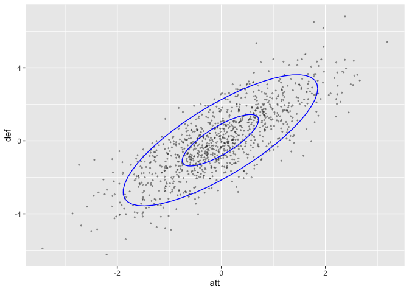
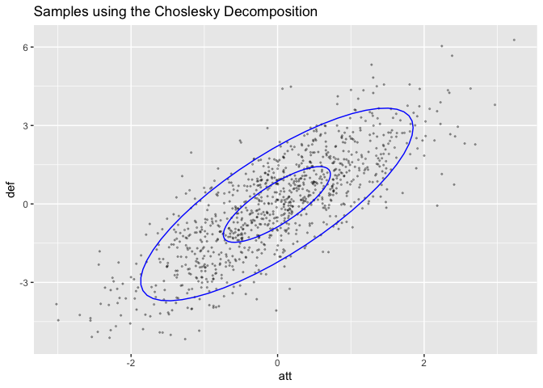
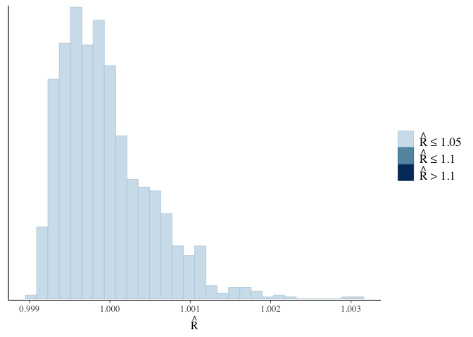
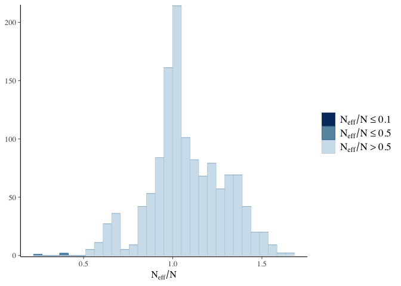
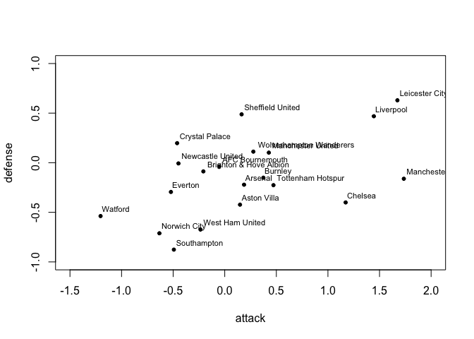

# Correlated Hierarchical Model

This notebook introduces correlated hierarchical models by modelling the
results of the English premier league. See
<https://github.com/oduerr/da/blob/master/stan/football/Hierarchical.md>
for details on the dataset and references to the data set.

## Data preparation

We first load the data:

``` r
lsg = FALSE #Set to FALSE before submitting
require(rstan)
```

    ## Loading required package: rstan

    ## Loading required package: StanHeaders

    ## Loading required package: ggplot2

    ## rstan (Version 2.21.8, GitRev: 2e1f913d3ca3)

    ## For execution on a local, multicore CPU with excess RAM we recommend calling
    ## options(mc.cores = parallel::detectCores()).
    ## To avoid recompilation of unchanged Stan programs, we recommend calling
    ## rstan_options(auto_write = TRUE)

``` r
set.seed(1) #set seed 
options(mc.cores = parallel::detectCores())
data = read.csv('https://raw.githubusercontent.com/MaggieLieu/STAN_tutorials/master/Hierarchical/premiereleague.csv',col.names = c('Home','score1', 'score2', 'Away'), stringsAsFactors = FALSE)

ng = nrow(data)
cat('we have G =', ng, 'games \n')
```

    ## we have G = 328 games

``` r
nt = length(unique(data$Home))
cat('We have T = ', nt, 'teams \n')
```

    ## We have T =  20 teams

``` r
teams = unique(data$Home)
ht = unlist(sapply(1:ng, function(g) which(teams == data$Home[g])))
at = unlist(sapply(1:ng, function(g) which(teams == data$Away[g])))

np=200
ngob = ng-np #number of games to fit
my_data = list(
  nt = nt, 
  ng = ngob,
  ht = ht[1:ngob], 
  at = at[1:ngob], 
  s1 = data$score1[1:ngob],
  s2 = data$score2[1:ngob],
  np = np,
  htnew = ht[(ngob+1):ng],
  atnew = at[(ngob+1):ng]
)
cat('We use my_data$np = ', my_data$ng, 'games for training and my_data$np =', my_data$np ,' for testing \n')
```

    ## We use my_data$np =  128 games for training and my_data$np = 200  for testing

# Correlated Hierarchical Model

Football (soccer) is an ideal example to get a hand on hierarchical
models with correlated priors. For a introduction using intercept and
slope models see,
e.g. <https://mc-stan.org/docs/2_29/stan-users-guide/multivariate-hierarchical-priors.html>

## Multivariate Priors

Let’s start to understand multivariate priors, by telling the data
generating story. We start to describe how the prior is generated.
Without seeing any games, the attack and defence ability of a team $j$
is sampled from a multivariate normal MVN with the covariance matrix
$\Sigma$ .

$$
 \begin{bmatrix}att_j \\ def_j \end{bmatrix} \sim N(0,\Sigma) = N (\begin{bmatrix}0 \\ 0 \end{bmatrix} ,\begin{bmatrix} \sigma^2_{\tt{att}} & cov(att,def) \\ cov(att,def) & \sigma^2_{\tt{def}} \end{bmatrix} 
$$

Averaged over all teams in the league, the attack abilities sum up to
zero (at least for a huge league). The same is true for the defence
abilities. Note that this is a desired property since we other wise
would have to enforce that the abilities sum up to zero (as we needed to
do in
<https://github.com/oduerr/da/blob/master/stan/football/Hierarchical.md>).
To describe this model have 3 parameters: the spread of the defense and
attack abilities $\sigma_\tt{att} \ge 0$ and $\sigma_\tt{def} \ge 0$ and
the covariance $cov(\tt{att}, \tt{def})\in [-\infty, \infty]$ between
both quantities. A more interpretable quantity then the covariance is
the correlation $\rho_{1,2}=cor(\tt{att},\tt{def})\in[-1,1]$, which can
be calculated via
$cov(\tt{att}, \tt{def}) = cor(\tt{att},\tt{def}) \sigma_\tt{att} \sigma_\tt{def}$.
In principle, we can construct the covariance matrix from the
correlation matrix $\rho$ as follows ($\rho$ is the matrix in the
middle) :

$$ \Sigma = \begin{bmatrix} \sigma_{\tt{att}} & 0 \\ 0 & \sigma_{\tt{def}} \end{bmatrix} \cdot \begin{bmatrix} 1 & \rho_{1,2} \\ \rho_{1,2} & 1 \end{bmatrix} \cdot \begin{bmatrix} \sigma_{\tt{att}} & 0 \\ 0 & \sigma_{\tt{def}} \end{bmatrix}
$$

This matrix multiplication can be done in stan as follows

``` stan
diag_matrix(sigma) * rho * diag_matrix(sigma)
```

or in a single command

``` stan
quad_form_diag(rho, sigma)
```

where `quad_form_diag` is a performant implementation of the three
matrix multiplication. We could take the following stan code to sample,
from a multivariate Gaussian:

``` stan
data {
  int<lower=0> K;
  vector[K] sigma;
  matrix[K,K] rho;
  int<lower=0> J;
}
transformed data{
  vector[K] mu = rep_vector(0, K);
}
generated quantities {
  matrix[J,2] samples;
  matrix[K, K] Sigma;
  Sigma = quad_form_diag(rho, sigma);
  for (j in 1:J) {
    samples[j] = multi_normal_rng(mu, Sigma)';
  }
}
```

Let’s test it. To be less depended on fluctuations, we choose a large
league with $J=200$ teams, i.e. we sample 200 draws and set
$\sigma_{\tt att}$=1.0 and $\sigma_{\tt def}=2.0$ and the correlation to
$cor({\tt att}, {\tt def})=0.8$.

``` r
  sigma = c(1,2)
  rho = matrix(c(1,0.8,0.8,1), ncol=2)
  dat = list(J=200, sigma=sigma, rho=rho, K=2, nrow=2)
  #STAN Code
  #s_rstan = rstan::sampling(model_1, data=dat, algorithm="Fixed_param", chain=1, iter=1)  
  #mvsamples = rstan::extract(s_rstan, 'samples')$samples[1,,]
  #colnames(mvsamples) = c('att', 'def')
  
  #CMDRSTAN
  library(cmdstanr)
```

    ## This is cmdstanr version 0.5.3

    ## - CmdStanR documentation and vignettes: mc-stan.org/cmdstanr

    ## - CmdStan path: /Users/oli/.cmdstan/cmdstan-2.32.0

    ## - CmdStan version: 2.32.0

    ## 
    ## A newer version of CmdStan is available. See ?install_cmdstan() to install it.
    ## To disable this check set option or environment variable CMDSTANR_NO_VER_CHECK=TRUE.

``` r
  library(tidyverse)
```

    ## ── Attaching core tidyverse packages ──────────────────────── tidyverse 2.0.0 ──
    ## ✔ dplyr     1.1.1     ✔ readr     2.1.4
    ## ✔ forcats   1.0.0     ✔ stringr   1.5.0
    ## ✔ lubridate 1.9.2     ✔ tibble    3.2.1
    ## ✔ purrr     1.0.1     ✔ tidyr     1.3.0

    ## ── Conflicts ────────────────────────────────────────── tidyverse_conflicts() ──
    ## ✖ tidyr::extract() masks rstan::extract()
    ## ✖ dplyr::filter()  masks stats::filter()
    ## ✖ dplyr::lag()     masks stats::lag()
    ## ℹ Use the conflicted package (<http://conflicted.r-lib.org/>) to force all conflicts to become errors

``` r
  mod <- cmdstan_model("correlated_samples_fixed.stan")
  fit <- mod$sample(data = dat,chains = 1,iter_warmup = 0,
                    iter_sampling = 1, seed =1, fixed_param = TRUE)
  s = tidybayes::spread_draws(fit, samples[j,i]) 
  mvsamples = s %>% pivot_wider(names_from = 'i', values_from = 'samples') %>% select(c('1','2'))
```

    ## Adding missing grouping variables: `j`

``` r
  colnames(mvsamples) = c('j', 'att', 'def')
  mvsamples = mvsamples[,-1]
  sd(mvsamples$att) #Should be 1
  sd(mvsamples$def) #Should be 2
  cor(mvsamples$att, mvsamples$def) #should be 0.8
```

``` r
library(magrittr)
```

    ## 
    ## Attaching package: 'magrittr'

    ## The following object is masked from 'package:purrr':
    ## 
    ##     set_names

    ## The following object is masked from 'package:tidyr':
    ## 
    ##     extract

    ## The following object is masked from 'package:rstan':
    ## 
    ##     extract

``` r
library(ggplot2)
ggplot(mvsamples, aes(x=att, y=def)) +
  geom_point(size=0.5) + 
  stat_ellipse(col='blue', level = 0.9) + 
  stat_ellipse(col='blue', level = 0.3) +
  ggtitle('Prior Distribution 200 Teams')
```

<!-- -->

### Cholesky Decomposition

Sampling from a correlated MVN $N(0, \Sigma)$ is quite time consuming.
Especially for repeated draws this can be done much faster and elegantly
via the Cholesky decomposition:

$$
 \begin{bmatrix}att_j \\ def_j \end{bmatrix} = \begin{bmatrix} \sigma_{\tt{att}} & 0 \\ 0 & \sigma_{\tt{def}} \end{bmatrix} \cdot L' \cdot Z
\quad \quad (2)
$$

Where $Z$ is a 2 x J matrix with elements from $N(0,1)$ and $L'$ the
transposed Cholesky decomposition matrix $L$ of the **correlation**
matrix $\rho$. This decomposition is great, since we can give more
intuitively priors for the **correlation** (between two variables) and
**spread** (of the single variable, for example the attack abilities for
all teams) compared to the covariance matrix.

#### Checking the Cholesky Decomposition (base R)

Let’s check decomposition eq. (2) first, before we continue. Say
$\sigma_{\tt att}$=1.0 and $\sigma_{\tt def}=2.0$ and the correlation is
$cor({\tt att}, {\tt def})=0.8$.

``` r
set.seed(42)
J = 200 #teams
(S = matrix(c(1,0,0,2), nrow=2))
```

    ##      [,1] [,2]
    ## [1,]    1    0
    ## [2,]    0    2

``` r
(L = chol(rho)) #Cholesky of Correlation
```

    ##      [,1] [,2]
    ## [1,]    1  0.8
    ## [2,]    0  0.6

``` r
t(L) %*% L
```

    ##      [,1] [,2]
    ## [1,]  1.0  0.8
    ## [2,]  0.8  1.0

``` r
Z = matrix(rnorm(2*J), nrow = 2)
samples = S %*% t(L) %*% Z
#plot(samples[1,], samples[2,], xlab='att', ylab='def', main='Random draws from hyperprior (20 Teams)')
cor(t(samples)) #0.7971283 should be 0.8
```

    ##           [,1]      [,2]
    ## [1,] 1.0000000 0.7701806
    ## [2,] 0.7701806 1.0000000

``` r
sd(samples[1,]) #1.007653 should be 1
```

    ## [1] 0.9530527

``` r
sd(samples[2,]) #2.008362 should be 2
```

    ## [1] 1.811628

``` r
samples = t(samples)
colnames(samples) = c('att', 'def')
data.frame(samples) %>% 
  ggplot(aes(x=att, y=def)) +
  geom_point(size=0.5) + 
  stat_ellipse(col='blue', level = 0.9) + 
  stat_ellipse(col='blue', level = 0.3) +
    labs(title = 'Samples using the Choslesky Decomposition')
```

<!-- -->

We see that the samples are indeed from a MVG.

In stan the equation (2) can be coded as:

``` stan
//sigma a vector holding the variances
//L Cholesky decomposition
//Z ~ N(0,1)
diag_pre_multiply(sigma, L) * Z
```

## Coding the strength of the teams

We just saw that the Cholesky Decomposition allows to transform
independend standard Gaussian to a correlated MVG. Before seeing any
data the attack and defense abilities of each team can be constructed as
follows. First, two random variables are drawn from a Gaussian. Then
these two parameters are transformed to a MVG using the Cholesky
Decomposition and $\sigma_{\tt att}$ and $\sigma_{\tt def}$. The later
transformation is the same for all teams. The abilities of the
individual teams can be described by two variables for all teams that
makes a matrix $A_z$ with dimension $(2,J)$, with $J$ the number of
teams.

### Summing up

We have the following parameters:

For all teams in common (hyperparameters):

- `L_u=L'` the Cholesky Decomposition of the correlation matrix (unit
  diagonal) which stores the attack and defense correlation. For the two
  dimensional case in football this is one variable.
- `sigma_u` which corresponds to the spread, here two variables
  $\sigma_{\tt att}$ and $\sigma_{\tt def}$.
- `home` the home advantage

For all teams individually (Parameters):

- The matrix `A_z` with dimension $(2,J)$ which describes the strength
  of the teams in an uncorrelated space.

### Setting priors

The model is constructed such that $A_z \sim N(0,1)$. We set both
$\sigma_{\tt att} \sim {\tt exponential(1.0)}$ and
$\sigma_{\tt def} \sim {\tt exponential(1.0)}$.

How to set the correlation coefficient? In principle, we could argue
that there should be a positive correlation, good teams are better in
defense and attack. However, its quite convenient to use a standard
prior for correlation. This is the `LKJcorr` prior which produces a
correlation from nearly uniform for parameter value 1 to centered around
zero for larger parameter values.

The rest stays the same as before.

``` r
#cfit_stan = stan(file = 'hier_model_cor.stan', data = my_data)
library(cmdstanr)
options(mc.cores = parallel::detectCores())
kn_s.model <- cmdstan_model('hier_model_cor.stan')
cfit = kn_s.model$sample(data=my_data) 
```

    ## Chain 2 Informational Message: The current Metropolis proposal is about to be rejected because of the following issue:

    ## Chain 2 Exception: poisson_lpmf: Rate parameter[1] is nan, but must be nonnegative! (in '/var/folders/bk/0vv7sh9n43n3dm4fth1qw93r0000gq/T/RtmpjWnsHi/model-16b8b56f8905d.stan', line 44, column 4 to column 25)

    ## Chain 2 If this warning occurs sporadically, such as for highly constrained variable types like covariance matrices, then the sampler is fine,

    ## Chain 2 but if this warning occurs often then your model may be either severely ill-conditioned or misspecified.

    ## Chain 2

#### Checking the fit (seem to be OK)

``` r
#rstan::check_divergences(cfit)
#rstan::check_treedepth(cfit)
cfit
```

    ## Warning: NAs introduced by coercion

    ## Warning: NAs introduced by coercion

    ##    variable    mean  median   sd  mad      q5     q95 rhat ess_bulk ess_tail
    ##  lp__       -236.12 -235.89 6.20 6.02 -246.72 -226.52 1.01     1105     1794
    ##  L_u[1,1]      1.00    1.00 0.00 0.00    1.00    1.00   NA       NA       NA
    ##  L_u[2,1]      0.61    0.66 0.28 0.25    0.06    0.95 1.00     2469     2550
    ##  L_u[1,2]      0.00    0.00 0.00 0.00    0.00    0.00   NA       NA       NA
    ##  L_u[2,2]      0.72    0.75 0.20 0.22    0.33    0.99 1.00     2557     2550
    ##  sigma_u[1]    0.36    0.35 0.09 0.08    0.23    0.51 1.00     1846     2815
    ##  sigma_u[2]    0.23    0.22 0.09 0.09    0.08    0.38 1.00     1645     1390
    ##  home          0.28    0.28 0.09 0.09    0.12    0.43 1.00     4134     3123
    ##  A_z[1,1]     -0.26   -0.27 0.61 0.60   -1.32    0.70 1.00     4304     2821
    ##  A_z[2,1]     -0.67   -0.69 0.85 0.81   -2.05    0.78 1.00     6264     2624
    ## 
    ##  # showing 10 of 1272 rows (change via 'max_rows' argument or 'cmdstanr_max_rows' option)

``` r
bayesplot::mcmc_rhat_hist(bayesplot::rhat(cfit))
```

    ## Warning: Dropped 2 NAs from 'new_rhat(rhat)'.

    ## `stat_bin()` using `bins = 30`. Pick better value with `binwidth`.

<!-- -->

``` r
bayesplot::mcmc_neff_hist(bayesplot::neff_ratio(cfit))
```

    ## Warning: Dropped 2 NAs from 'new_neff_ratio(ratio)'.

    ## `stat_bin()` using `bins = 30`. Pick better value with `binwidth`.

<!-- -->

### Posterior correlation

Determining of the posterior correlations. We use the fact that the
Cholesky decomposition of a correlation matrix $R$ is a lower triangular
matrix $L$ such that $LL' = R$, where $L'$ is the transpose of $L$.

``` r
L_u = cfit %>% tidybayes::gather_draws(L_u[i,j])

#Extracting the matrix values
matrix_df <- L_u %>%
  group_by(i, j) %>%
  summarise(average_value = mean(.value), .groups = "drop") %>%
  pivot_wider(names_from = j, values_from = average_value)
L_u <- as.matrix(matrix_df[, -1])
L_u
```

    ##              1         2
    ## [1,] 1.0000000 0.0000000
    ## [2,] 0.6077543 0.7156786

``` r
L_u %*% t(L_u) 
```

    ##           [,1]      [,2]
    ## [1,] 1.0000000 0.6077543
    ## [2,] 0.6077543 0.8815612

### Posterior Attack / Defence Strength

There seems quite a correlation between the attack and defense
capabilities of the individual teams. Let’s have a look at the
posteriors for the individual teams.

``` r
#A = rstan::extract(cfit, 'A_z')$A_z #4000    2   20
#attack = colMeans(A)[1,1:20]
#defense = colMeans(A)[2,1:20]
d = cfit %>% tidybayes::gather_draws(A_z[i,j]) %>% 
  group_by(i, j) %>%
  summarise(average_value = mean(.value), .groups = "drop") 
A = xtabs(average_value ~ i + j, data = d)

plot(A[1,],A[2,], pch=20, xlim=c(-1.5,2.0), ylim=c(-1,1), xlab='Attack', ylab='Defence', main='Mean values of the Posterior')
text(A[1,],A[2,], labels=teams, cex=0.7, adj=c(-0.05,-0.8) )
```

<!-- -->

For predictive performance see:
<https://github.com/oduerr/da/blob/master/stan/football/performance_w_nll.png>

### 
