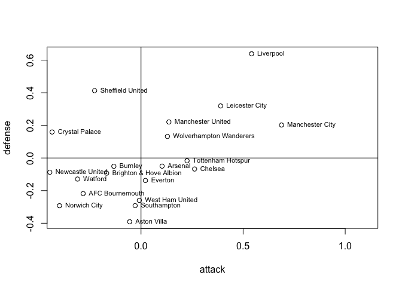
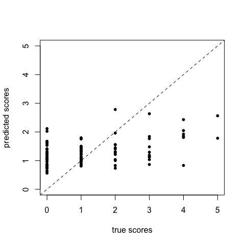
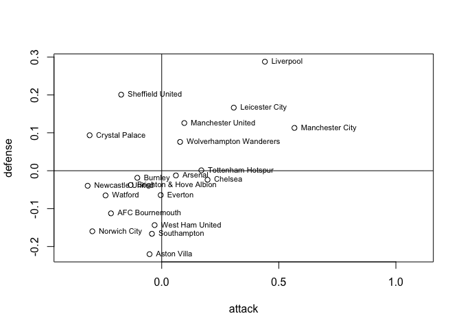

# Excercise:

This notebook compares a non-hierarchical model and a hierarchical model
to predict the scores of English premier league matches.

### Background

This notebook is a tutorial on Hierarchical modelling using Stan which
is adopted from
<https://github.com/MaggieLieu/STAN_tutorials/blob/master/Hierarchical/Hierarchical.Rmd>.
The model is also described in the paper:
<https://discovery.ucl.ac.uk/id/eprint/16040/1/16040.pdf>

Modifications include:

-   Removing of the pooled model

-   Removing the fixed prior for home advantage (which has a std of
    about 1e-4)

    -   However this seems to require that as in the paper we need to
        use a sum-to-zero constraint for the defense and offense. This
        makes sense intuitively, since the teams play against each other
        and therefore these capabilities are relative to each other. For
        more information on this see the paper above and the references
        therein.

``` r
lsg = FALSE #Set to FALSE before submitting
require(rstan)
```

    ## Loading required package: rstan

    ## Loading required package: StanHeaders

    ## Loading required package: ggplot2

    ## rstan (Version 2.21.2, GitRev: 2e1f913d3ca3)

    ## For execution on a local, multicore CPU with excess RAM we recommend calling
    ## options(mc.cores = parallel::detectCores()).
    ## To avoid recompilation of unchanged Stan programs, we recommend calling
    ## rstan_options(auto_write = TRUE)

``` r
set.seed(1) #set seed 
```

### Reading the data

First we read in the data

``` r
data = read.csv('https://raw.githubusercontent.com/MaggieLieu/STAN_tutorials/master/Hierarchical/premiereleague.csv',col.names = c('Home','score1', 'score2', 'Away'), stringsAsFactors = FALSE)
```

``` r
head(data)
```

    ##                Home score1 score2                   Away
    ## 1   West Ham United      0      5        Manchester City
    ## 2           Burnley      3      0            Southampton
    ## 3    Crystal Palace      0      0                Everton
    ## 4           Watford      0      3 Brighton & Hove Albion
    ## 5   AFC Bournemouth      1      1       Sheffield United
    ## 6 Tottenham Hotspur      3      1            Aston Villa

``` r
ng = nrow(data)
cat('we have G =', ng, 'games \n')
```

    ## we have G = 328 games

``` r
nt = length(unique(data$Home))
cat('We have T = ', nt, 'teams \n')
```

    ## We have T =  20 teams

### Data Preparation

Now convert team names for each match into numbers (for the lookup)

``` r
teams = unique(data$Home)
ht = unlist(sapply(1:ng, function(g) which(teams == data$Home[g])))
at = unlist(sapply(1:ng, function(g) which(teams == data$Away[g])))
```

``` r
# we will save the last np games to predict
np=200
ngob = ng-np #number of games to fit
my_data = list(
  nt = nt, 
  ng = ngob,
  ht = ht[1:ngob], 
  at = at[1:ngob], 
  s1 = data$score1[1:ngob],
  s2 = data$score2[1:ngob],
  np = np,
  htnew = ht[(ngob+1):ng],
  atnew = at[(ngob+1):ng]
)
```

### **Traditional (non-hierachical) method**

We will assume that the goals scored come from a poisson distribution

-   s1 \~ Poisson(theta_g1) \#game g score by home team

-   s2 \~ Poisson(theta_g2) \#game g score by away team

Assuming a log-linear random effect model

-   log(theta_g1) = home + att_ht + def_at

-   log(theta_g2) = att_at + def_ht

Where home is a constant for the advantage for the team hosting the game
att and def are the attack and defense abilities of the teams where the
indices at,ht correspond to the t=1-20 teams.

``` r
nhfit = stan(file = 'non_hier_model.stan', data = my_data)
```

    ## Trying to compile a simple C file

#### Plot the predicted scores of the last 5 matches

``` r
nhparams = extract(nhfit)
pred_scores = c(colMeans(nhparams$s1new),colMeans(nhparams$s2new))
true_scores = c(data$score1[(ngob+1):ng],data$score2[(ngob+1):ng] )
plot(true_scores, pred_scores, xlim=c(0,5), ylim=c(0,5), pch=20, ylab='predicted scores', xlab='true scores')
abline(a=0,  b=1, lty='dashed')
```

<!-- -->

``` r
sqrt(mean((pred_scores - true_scores)^2))
```

    ## [1] 1.203124

``` r
cor(pred_scores, true_scores)
```

    ## [1] 0.3181429

#### Defense / Attack Non-Hierachical

We can also look at the attack/defense of the teams:

``` r
attack = colMeans(nhparams$att)
defense = colMeans(nhparams$def)
plot(attack,defense,xlim=c(-0.4,1.1))
abline(h=0)
abline(v=0)
text(attack,defense, labels=teams, cex=0.7, pos=4)
```

<!-- -->

Home Advantage

``` r
home_adv = extract(nhfit)$home
hist(home_adv, 100, freq = FALSE, main=paste0("Home Adv, mean: ", round(mean(home_adv),2)))
lines(density(home_adv))
```

# Hierarchical model

In a hierarchical model, the parameters of interest, in our case the
attack and defense ability are drawn from the population distribution.

-   att\[t\] \~ normal(mu_att, tau_att)

-   def\[t\] \~ normal(mu_def, tau_def)

Instead we define priors on the population, known as the hyperpriors.

``` r
hfit = stan(file = 'hier_model.stan', data = my_data)
```

    ## Trying to compile a simple C file

    ## Warning: There were 102 divergent transitions after warmup. See
    ## http://mc-stan.org/misc/warnings.html#divergent-transitions-after-warmup
    ## to find out why this is a problem and how to eliminate them.

    ## Warning: Examine the pairs() plot to diagnose sampling problems

    ## Warning: Bulk Effective Samples Size (ESS) is too low, indicating posterior means and medians may be unreliable.
    ## Running the chains for more iterations may help. See
    ## http://mc-stan.org/misc/warnings.html#bulk-ess

    ## Warning: Tail Effective Samples Size (ESS) is too low, indicating posterior variances and tail quantiles may be unreliable.
    ## Running the chains for more iterations may help. See
    ## http://mc-stan.org/misc/warnings.html#tail-ess

## Prediction of Hierarchical Model

``` r
hparams = extract(hfit)
pred_scores = c(colMeans(hparams$s1new),colMeans(hparams$s2new))
pred_errors = c(sapply(1:np, function(x) sd(hparams$s1new[,x])),sapply(1:np, function(x) sd(hparams$s1new[,x])))
true_scores = c(data$score1[(ngob+1):ng],data$score2[(ngob+1):ng] )
plot(true_scores, pred_scores, xlim=c(0,5), ylim=c(0,5), pch=20, ylab='predicted scores', xlab='true scores')
abline(a=0,  b=1, lty='dashed')
arrows(true_scores, pred_scores+pred_errors, true_scores, pred_scores-pred_errors, length = 0.05, angle = 90, code = 3, rgb(0,0,0,0.3))
```

<!-- -->

``` r
sqrt(mean((pred_scores - true_scores)^2))
```

    ## [1] 1.109485

``` r
cor(pred_scores, true_scores)
```

    ## [1] 0.3396617

``` r
attack = colMeans(hparams$att)
attacksd = sapply(1:nt, function(x) sd(hparams$att[,x]))
defense = colMeans(hparams$def)
defensesd = sapply(1:nt, function(x) sd(hparams$def[,x]))

plot(attack,defense, xlim=c(-0.4,1), ylim=c(-0.45,0.3), pch=20)
arrows(attack-attacksd, defense, attack+attacksd, defense, code=3, angle = 90, length = 0.04, col=rgb(0,0,0,0.2))
arrows(attack, defense-defensesd, attack, defense+defensesd, code=3, angle = 90, length = 0.04,col=rgb(0,0,0,0.2))
#abline(h=0)
#abline(v=0)
text(attack,defense, labels=teams, cex=0.7, adj=c(-0.05,-0.8) )
```

<!-- -->

``` r
mean(attack)
```

    ## [1] 1.626303e-18

``` r
mean(defense)
```

    ## [1] 1.072005e-18

#### Home Advantage h-model

``` r
home_adv = extract(hfit)$home
hist(home_adv, 100, freq = FALSE, main=paste0("Home Adv, mean: ", round(mean(home_adv),2)))
lines(density(home_adv))
```
