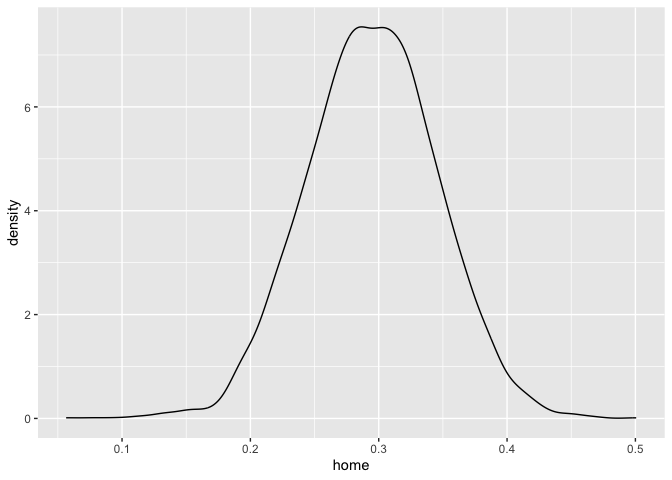
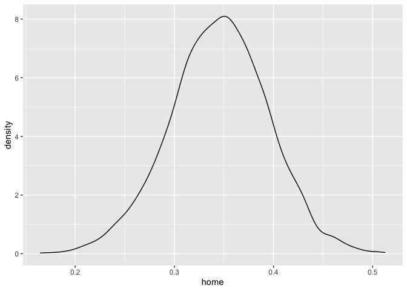

# Excercise:

This notebook compares a non-hierarchical model and a hierarchical model
to predict the scores of English premier league matches.

## Your tasks

Step through the notebook and try to understand it.

### Background

This notebook is a tutorial on Hierarchical modelling using Stan which
is adopted from
<https://github.com/MaggieLieu/STAN_tutorials/blob/master/Hierarchical/Hierarchical.Rmd>.
The model is also described in the paper:
<https://discovery.ucl.ac.uk/id/eprint/16040/1/16040.pdf>

Modifications include:

- Removing of the pooled model

- Removing the fixed prior for home advantage (which has a std of about
  1e-4)

  - Nevertheless, it appears necessary, as mentioned in the paper, to
    implement a sum-to-zero restriction for both the defense and
    offense. This stems from the fact that teams compete against one
    another, making these abilities dependent on each other. For further
    details, please refer to the aforementioned paper and its associated
    references.

``` r
lsg = TRUE #Set to FALSE before submitting
#require(rstan)
#set.seed(1) #set seed 
library(cmdstanr)
```

    ## This is cmdstanr version 0.5.3

    ## - CmdStanR documentation and vignettes: mc-stan.org/cmdstanr

    ## - CmdStan path: /Users/oli/.cmdstan/cmdstan-2.32.0

    ## - CmdStan version: 2.32.0

    ## 
    ## A newer version of CmdStan is available. See ?install_cmdstan() to install it.
    ## To disable this check set option or environment variable CMDSTANR_NO_VER_CHECK=TRUE.

``` r
options(mc.cores = parallel::detectCores())
```

### Reading the data

First we read in the data

``` r
data = read.csv('https://raw.githubusercontent.com/MaggieLieu/STAN_tutorials/master/Hierarchical/premiereleague.csv',col.names = c('Home','score1', 'score2', 'Away'), stringsAsFactors = FALSE)
```

``` r
head(data)
```

    ##                Home score1 score2                   Away
    ## 1   West Ham United      0      5        Manchester City
    ## 2           Burnley      3      0            Southampton
    ## 3    Crystal Palace      0      0                Everton
    ## 4           Watford      0      3 Brighton & Hove Albion
    ## 5   AFC Bournemouth      1      1       Sheffield United
    ## 6 Tottenham Hotspur      3      1            Aston Villa

``` r
ng = nrow(data)
cat('we have G =', ng, 'games \n')
```

    ## we have G = 328 games

``` r
nt = length(unique(data$Home))
cat('We have T = ', nt, 'teams \n')
```

    ## We have T =  20 teams

### Data Preparation

Now convert team names for each match into numbers (for the lookup)

``` r
teams = unique(data$Home)
ht = unlist(sapply(1:ng, function(g) which(teams == data$Home[g])))
at = unlist(sapply(1:ng, function(g) which(teams == data$Away[g])))
```

``` r
# we will save the last np games to predict
np=50
ngob = ng-np #number of games to fit
my_data = list(
  nt = nt, 
  ng = ngob,
  ht = ht[1:ngob], 
  at = at[1:ngob], 
  s1 = data$score1[1:ngob],
  s2 = data$score2[1:ngob],
  np = np,
  htnew = ht[(ngob+1):ng],
  atnew = at[(ngob+1):ng]
)
```

### Traditional (non-hierachical) method

We will assume that the goals scored come from a poisson distribution

- s1 ~ Poisson(theta_g1) \#game g score by home team

- s2 ~ Poisson(theta_g2) \#game g score by away team

Assuming a log-linear random effect model

- log(theta_g1) = home + att_ht + def_at

- log(theta_g2) = att_at + def_ht

Where home is a constant for the advantage for the team hosting the game
att and def are the attack and defense abilities of the teams where the
indices at,ht correspond to the t=1-20 teams.

``` r
nhmodel <- cmdstan_model('non_hier_model.stan')
nhfit = nhmodel$sample(data = my_data)
#nhfit_stan = stan(file = 'non_hier_model.stan', data = my_data)
```

#### Non-Hierarchical model predicted scores of the unseen

``` r
library(tidyverse)
```

    ## ── Attaching core tidyverse packages ──────────────────────── tidyverse 2.0.0 ──
    ## ✔ dplyr     1.1.1     ✔ readr     2.1.4
    ## ✔ forcats   1.0.0     ✔ stringr   1.5.0
    ## ✔ ggplot2   3.4.2     ✔ tibble    3.2.1
    ## ✔ lubridate 1.9.2     ✔ tidyr     1.3.0
    ## ✔ purrr     1.0.1     
    ## ── Conflicts ────────────────────────────────────────── tidyverse_conflicts() ──
    ## ✖ dplyr::filter() masks stats::filter()
    ## ✖ dplyr::lag()    masks stats::lag()
    ## ℹ Use the conflicted package (<http://conflicted.r-lib.org/>) to force all conflicts to become errors

``` r
s1new = nhfit$draws(format = "df", 's1new') %>% select(-.chain, -.iteration, -.draw)
```

    ## Warning: Dropping 'draws_df' class as required metadata was removed.

``` r
s2new = nhfit$draws(format = "df", 's2new') %>% select(-.chain, -.iteration, -.draw)
```

    ## Warning: Dropping 'draws_df' class as required metadata was removed.

``` r
pred_scores = c(colMeans(s1new),colMeans(s2new))
true_scores = c(data$score1[(ngob+1):ng],data$score2[(ngob+1):ng] )
plot(true_scores, pred_scores, xlim=c(0,5), ylim=c(0,5), pch=20, ylab='predicted scores', xlab='true scores')
abline(a=0,  b=1, lty='dashed')
```

<!-- -->

``` r
sqrt(mean((pred_scores - true_scores)^2))
```

    ## [1] 1.188414

``` r
cor(pred_scores, true_scores)
```

    ## [1] 0.4451246

``` r
get_score = function(s1new, s2new, data){
  s1_pred_score = round(colMeans(s1new),0)
  s2_pred_score = round(colMeans(s2new),0)
  points = 0
  for (i in 1:length(s1_pred_score)){
      pred_scorediff = s1_pred_score - s2_pred_score
      if (s1_pred_score[i] == data$score1[ngob+i]
          && s2_pred_score[i] == data$score2[ngob+i]){
        points = points + 3
      } else {
        if (s1_pred_score[i] == s2_pred_score[i]){ #Call it a draw
          if (data$score1[ngob+i] == data$score2[ngob+i]) {
            points = points + 1
          }
        } else {#No draw
           if(sign(pred_scorediff[i]) == sign(data$score1[ngob+i] - data$score2[ngob+i])){
             points = points + 1
           }
        }
      } 
  }
  return (points)
}
get_score(s1new, s2new, data)
```

    ## [1] 36

#### Defense / Attack Non-Hierachical

We can also look at the attack/defense of the teams:

``` r
attack = nhfit$draws(format = "df", 'att') %>% 
  select(-.chain, -.iteration, -.draw) %>% colMeans()
```

    ## Warning: Dropping 'draws_df' class as required metadata was removed.

``` r
defense = nhfit$draws(format = "df", 'def') %>% 
  select(-.chain, -.iteration, -.draw) %>% colMeans()
```

    ## Warning: Dropping 'draws_df' class as required metadata was removed.

``` r
plot(attack,defense,xlim=c(-0.4,1.1))
abline(h=0)
abline(v=0)
text(attack,defense, labels=teams, cex=0.7, pos=4)
```

<!-- -->

### Your Excercise / Determine the home advantage

``` r
library(tidybayes)
#home_adv = rstan::extract(nhfit)$home
#hist(home_adv, 100, freq = FALSE, main=paste0("Home Adv, mean: ", round(mean(home_adv),2)))
#lines(density(home_adv))

tidy_draws(nhfit) %>% 
  select(home) %>% 
  ggplot(aes(x=home)) + geom_density() 
```

<!-- -->

# Hierarchical model

In a hierarchical model, the parameters of interest, in our case the
attack and defense ability are drawn from the population distribution.

- att\[t\] ~ normal(mu_att, tau_att)

- def\[t\] ~ normal(mu_def, tau_def)

Instead we define priors on the population, known as the hyperpriors.

``` r
hmodel <- cmdstan_model('hier_model.stan')
hfit = hmodel$sample(data = my_data)
```

    ## Chain 1 Informational Message: The current Metropolis proposal is about to be rejected because of the following issue:

    ## Chain 1 Exception: normal_lpdf: Scale parameter is 0, but must be positive! (in '/var/folders/bk/0vv7sh9n43n3dm4fth1qw93r0000gq/T/RtmpKn80RT/model-129085df4aed4.stan', line 46, column 0 to column 30)

    ## Chain 1 If this warning occurs sporadically, such as for highly constrained variable types like covariance matrices, then the sampler is fine,

    ## Chain 1 but if this warning occurs often then your model may be either severely ill-conditioned or misspecified.

    ## Chain 1

    ## Chain 2 Informational Message: The current Metropolis proposal is about to be rejected because of the following issue:

    ## Chain 2 Exception: normal_lpdf: Scale parameter is 0, but must be positive! (in '/var/folders/bk/0vv7sh9n43n3dm4fth1qw93r0000gq/T/RtmpKn80RT/model-129085df4aed4.stan', line 46, column 0 to column 30)

    ## Chain 2 If this warning occurs sporadically, such as for highly constrained variable types like covariance matrices, then the sampler is fine,

    ## Chain 2 but if this warning occurs often then your model may be either severely ill-conditioned or misspecified.

    ## Chain 2

    ## Chain 3 Informational Message: The current Metropolis proposal is about to be rejected because of the following issue:

    ## Chain 3 Exception: normal_lpdf: Scale parameter is 0, but must be positive! (in '/var/folders/bk/0vv7sh9n43n3dm4fth1qw93r0000gq/T/RtmpKn80RT/model-129085df4aed4.stan', line 46, column 0 to column 30)

    ## Chain 3 If this warning occurs sporadically, such as for highly constrained variable types like covariance matrices, then the sampler is fine,

    ## Chain 3 but if this warning occurs often then your model may be either severely ill-conditioned or misspecified.

    ## Chain 3

    ## Chain 4 Informational Message: The current Metropolis proposal is about to be rejected because of the following issue:

    ## Chain 4 Exception: normal_lpdf: Scale parameter is 0, but must be positive! (in '/var/folders/bk/0vv7sh9n43n3dm4fth1qw93r0000gq/T/RtmpKn80RT/model-129085df4aed4.stan', line 46, column 0 to column 30)

    ## Chain 4 If this warning occurs sporadically, such as for highly constrained variable types like covariance matrices, then the sampler is fine,

    ## Chain 4 but if this warning occurs often then your model may be either severely ill-conditioned or misspecified.

    ## Chain 4

    ## Warning: 24 of 4000 (1.0%) transitions ended with a divergence.
    ## See https://mc-stan.org/misc/warnings for details.

``` r
#hfit = stan(file = 'hier_model.stan', data = my_data)
```

## Checking the chain

``` r
hfit 
```

    ##    variable    mean  median   sd  mad      q5     q95 rhat ess_bulk ess_tail
    ##  lp__       -450.68 -450.88 6.11 5.51 -460.21 -441.15 1.01      537      357
    ##  home          0.35    0.35 0.05 0.05    0.26    0.43 1.00     5136     2706
    ##  att_raw[1]   -0.03   -0.03 0.15 0.14   -0.27    0.21 1.00     3639     1113
    ##  att_raw[2]   -0.10   -0.10 0.15 0.15   -0.35    0.14 1.00     6279     2827
    ##  att_raw[3]   -0.31   -0.30 0.16 0.16   -0.59   -0.04 1.00     3081     1102
    ##  att_raw[4]   -0.24   -0.23 0.16 0.16   -0.51    0.01 1.00     3326     2085
    ##  att_raw[5]   -0.22   -0.21 0.15 0.15   -0.47    0.03 1.00     6148     3161
    ##  att_raw[6]    0.17    0.17 0.14 0.13   -0.06    0.39 1.00     4979     2505
    ##  att_raw[7]    0.31    0.31 0.13 0.13    0.09    0.52 1.00     5810     3241
    ##  att_raw[8]   -0.32   -0.31 0.16 0.16   -0.59   -0.05 1.00     6402     2934
    ## 
    ##  # showing 10 of 1118 rows (change via 'max_rows' argument or 'cmdstanr_max_rows' option)

## Prediction of Hierarchical Model

``` r
s1new = hfit$draws(format = "df", 's1new') %>% select(-.chain, -.iteration, -.draw)
```

    ## Warning: Dropping 'draws_df' class as required metadata was removed.

``` r
s2new = hfit$draws(format = "df", 's2new') %>% select(-.chain, -.iteration, -.draw)
```

    ## Warning: Dropping 'draws_df' class as required metadata was removed.

``` r
pred_scores = c(colMeans(s1new),colMeans(s2new))
true_scores = c(data$score1[(ngob+1):ng],data$score2[(ngob+1):ng] )
plot(true_scores, pred_scores, xlim=c(0,5), ylim=c(0,5), pch=20, ylab='predicted scores', xlab='true scores')
abline(a=0,  b=1, lty='dashed')
```

<!-- -->

``` r
sqrt(mean((pred_scores - true_scores)^2))
```

    ## [1] 1.176457

``` r
cor(pred_scores, true_scores)
```

    ## [1] 0.4835969

``` r
 get_score(s1new, s2new, data)
```

    ## [1] 31

### Mean attack and dense abilities

``` r
attack = hfit$draws(format = "df", 'att') %>% 
  select(-.chain, -.iteration, -.draw) %>% colMeans()
```

    ## Warning: Dropping 'draws_df' class as required metadata was removed.

``` r
defense = hfit$draws(format = "df", 'def') %>% 
  select(-.chain, -.iteration, -.draw) %>% colMeans()
```

    ## Warning: Dropping 'draws_df' class as required metadata was removed.

``` r
plot(attack,defense,xlim=c(-0.4,1.1))
abline(h=0)
abline(v=0)
text(attack,defense, labels=teams, cex=0.7, pos=4)
```

<!-- -->

#### Home Advantage h-model

``` r
tidy_draws(hfit) %>% 
  select(home) %>% 
  ggplot(aes(x=home)) + geom_density() 
```

<!-- -->
