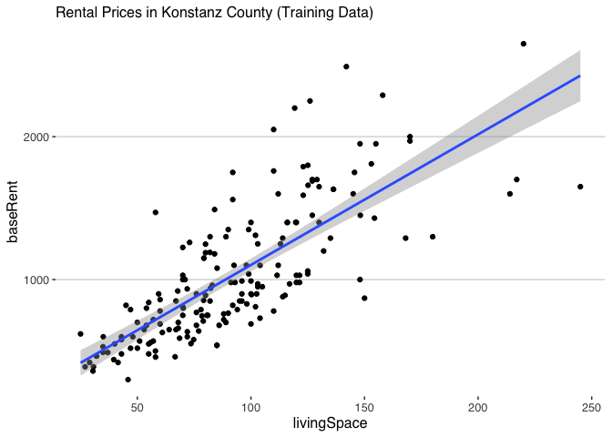
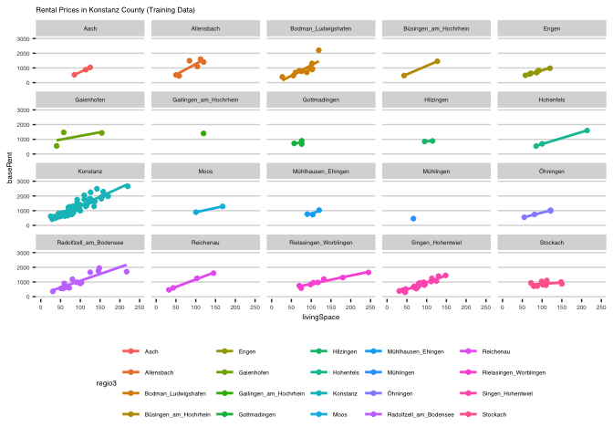
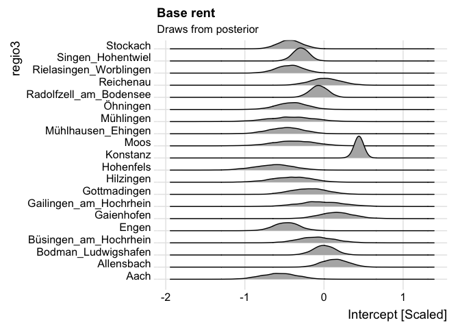
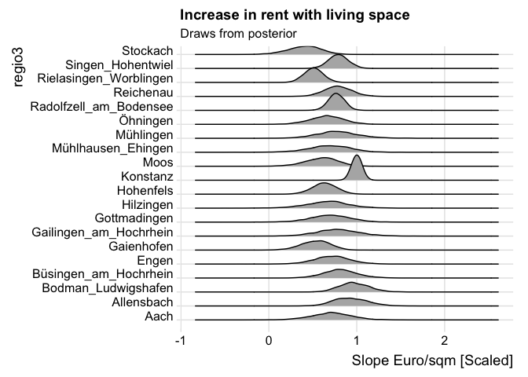
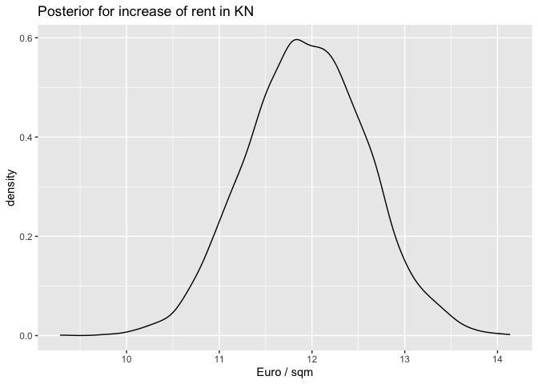

## Rents in Konstanz

The following cell loads the rent prices for the county (Landkreis) of
Konstanz. It has been processed from data provided by Immoscout24 /
Kaggle see
<https://www.kaggle.com/datasets/corrieaar/apartment-rental-offers-in-germany>
the data is from 2018 / 2019. Some preprocessing has been done in the
beginning of
<https://github.com/oduerr/da/blob/master/stan/kn_rent/KN_Immodata.R>

### Data Proprocessing

``` r
  KN_Kreis = read.csv2('https://raw.githubusercontent.com/oduerr/da/master/stan/kn_rent/KN_Kreis.csv')
  KN_Kreis$X = NULL
  sum(is.na(KN_Kreis$totalRent))#51
```

    ## [1] 51

``` r
  sum(is.na(KN_Kreis$baseRent))#0
```

    ## [1] 0

``` r
  (N = nrow(KN_Kreis)) #218
```

    ## [1] 218

### Overview (No pooling)

``` r
  library(ggplot2)
  library(magrittr)
  library(dplyr)
  KN_Kreis %>% 
    filter(training) %>% 
    ggplot(aes(x=livingSpace, y=baseRent)) +
    geom_point() + 
    geom_smooth(method='lm', formula= y~x) + 
    labs(subtitle = 'Rental Prices in Konstanz County (Training Data)') +
    ggthemes::theme_hc(base_size = 12) 
```

<!-- -->

We see that the rent is linear depended on the `livinigSpace`, but there
there is some considerable spread. Let’s have a look at the different
cities in the county.

``` r
KN_Kreis %>% 
  filter(training) %>% 
  ggplot(aes(x=livingSpace, y=baseRent, col=regio3)) +
  geom_point() + 
  geom_smooth(method='lm', formula= y~x, se=FALSE) + 
  labs(subtitle = 'Rental Prices in Konstanz County (Training Data)') +
  facet_wrap(~regio3) + 
  coord_cartesian(xlim = c(0, 250), ylim = c(0, 3000)) + 
  ggthemes::theme_hc(base_size = 6) 
```

<!-- --> For the
individual cities there is less spread. But some of them only have one
data point, therefore full pooling does not work and hierarchical models
come to shine.

### Preparing the data for hierachical modelling

Here we add a city identifier, *j* = 1, 2, …, *J* and split the data
into a training and test set.

``` r
  cities = sort(unique(KN_Kreis$regio3))
  J = length(cities)
  cities_numbers = data.frame(regio3 = cities, id = 1:J)
  KN_Kreis = KN_Kreis %>% right_join(cities_numbers, by='regio3')
  KN_train = KN_Kreis %>% filter(training)
  KN_test = KN_Kreis %>% filter(!training)
```

It’s always a good idea to scale your data before regression. For this
example not doing so will cause divergent transitions. Since we are not
allowed to know anything about the testdata, we just use the training
data for scaling and prepare a list for stan.

``` r
x_mean = mean(KN_train$livingSpace)
x_sd = sd(KN_train$livingSpace)
y_mean = mean(KN_train$baseRent)
y_sd = sd(KN_train$baseRent) 

kn_stan_dat = list(
  N = nrow(KN_train),
  y = (KN_train$baseRent - y_mean)/y_sd,
  x = (KN_train$livingSpace - x_mean)/x_sd,
  y = KN_train$baseRent,
  x = KN_train$livingSpace,
  j = KN_train$id,
  
  N_t = nrow(KN_test),
  y_t = (KN_test$baseRent - y_mean)/y_sd,
  x_t = (KN_test$livingSpace - x_mean)/x_sd,
  y_t = KN_test$baseRent,
  x_t = KN_test$livingSpace,
  j_t = KN_test$id,
  J = J,
  
  y_t_unscaled = KN_test$baseRent
)
```

### Fitting the model in Stan

Definitiomn of the model.

``` stan
data {
  int<lower=1> N;            //number of observations (in training)
  real y[N];                 //outcomes (in training)
  real x[N];                 //x (living space)
  // grouping factors
  int<lower=1> J;                   //number of subjects
  int<lower=1,upper=J> j[N];        //subject id
  
  //Test data
  int<lower=1> N_t; 
  real y_t[N_t];   
  real x_t[N_t];   
  int<lower=1,upper=J> j_t[N_t];
}

parameters {
  real<lower=0> sigma_e;               // residual std
  matrix[2,J] u;                       // City level intercept (1) and slope (2)
  vector[2] pu;                        // County level intercept and slope (mean)
  vector[2] ps;                        // County level intercept and slope (sd)
}

model {
  real mu; 
  //Hyperprior
  //Spread to the means
  pu ~ normal(0, 1);    //Intercept and slope mean
  //Uncertainty the means
  ps ~ exponential(1.);
  //prior 
  u[1,] ~ normal(pu[1],ps[1]);  //Intercept for the individual cities
  u[2,] ~ normal(pu[2],ps[2]);  //Slope for the individual cities
  //priors
  sigma_e ~ exponential(1.);        // prior for residual standard deviation
 
  //likelihood
  for (i in 1:N){
    mu = u[1,j[i]] + (u[2,j[i]])*x[i];
    y[i] ~ normal(mu, sigma_e);
  }
}

generated quantities {
  vector[N] log_lik;
  vector[N_t] log_lik_t;
  vector[N_t] y_t_pred;
  
  for (n in 1:N){
    log_lik[n] = normal_lpdf(y[n] |   u[1,j[n]] + ( u[2,j[n]])*x[n], sigma_e);
  }
  
  for (n in 1:N_t){
    log_lik_t[n] = normal_lpdf(y_t[n] | u[1,j[n]] + (u[2,j[n]])*x[n], sigma_e);
    y_t_pred[n] = normal_rng( u[1,j[n]] + (u[2,j[n]])*x[n], sigma_e);
  }
}
```

``` r
options(mc.cores = parallel::detectCores())
library(rstan)
#kn_m = stan_model(file = 'kn_hier.stan')
kn_s = sampling(kn_m, data=kn_stan_dat) 
```

    ## Warning: There were 2 divergent transitions after warmup. See
    ## http://mc-stan.org/misc/warnings.html#divergent-transitions-after-warmup
    ## to find out why this is a problem and how to eliminate them.

    ## Warning: Examine the pairs() plot to diagnose sampling problems

### Base costs

``` r
library(tidybayes)
library(bayesplot)
library(ggridges)
spread_draws(kn_s, u[i,j]) %>%
  filter(i == 1) %>% #looking at the intercept
  right_join(cities_numbers, by = c("j" = "id")) %>% 
  ggplot(aes(x=u, y=regio3)) + 
  geom_density_ridges() +
  labs(title = 'Base rent', 
       subtitle = 'Draws from posterior',
       x = 'Intercept [Scaled]') +
  theme_ridges()
```

<!-- -->

``` r
library(tidybayes)
library(bayesplot)
library(ggridges)
spread_draws(kn_s, u[i,j]) %>%
  filter(i == 2) %>% #looking at the scope
  right_join(cities_numbers, by = c("j" = "id")) %>% 
  ggplot(aes(x=u, y=regio3)) + 
  geom_density_ridges() +
  labs(title = 'Increase in rent with living space', 
       subtitle = 'Draws from posterior',
       x = 'Slope Euro/sqm [Scaled]') +
  theme_ridges()
```

<!-- -->

### Task 1 increase of rent in Konstanz city

Repaet the plot from a above using unscaled variable. You may focuss on
Konstanz only. Konstanz has the following id (variable j in the
posterior)

``` r
  cities_numbers %>% kableExtra::kable()
```

<table>
<thead>
<tr>
<th style="text-align:left;">
regio3
</th>
<th style="text-align:right;">
id
</th>
</tr>
</thead>
<tbody>
<tr>
<td style="text-align:left;">
Aach
</td>
<td style="text-align:right;">
1
</td>
</tr>
<tr>
<td style="text-align:left;">
Allensbach
</td>
<td style="text-align:right;">
2
</td>
</tr>
<tr>
<td style="text-align:left;">
Bodman_Ludwigshafen
</td>
<td style="text-align:right;">
3
</td>
</tr>
<tr>
<td style="text-align:left;">
Büsingen_am_Hochrhein
</td>
<td style="text-align:right;">
4
</td>
</tr>
<tr>
<td style="text-align:left;">
Engen
</td>
<td style="text-align:right;">
5
</td>
</tr>
<tr>
<td style="text-align:left;">
Gaienhofen
</td>
<td style="text-align:right;">
6
</td>
</tr>
<tr>
<td style="text-align:left;">
Gailingen_am_Hochrhein
</td>
<td style="text-align:right;">
7
</td>
</tr>
<tr>
<td style="text-align:left;">
Gottmadingen
</td>
<td style="text-align:right;">
8
</td>
</tr>
<tr>
<td style="text-align:left;">
Hilzingen
</td>
<td style="text-align:right;">
9
</td>
</tr>
<tr>
<td style="text-align:left;">
Hohenfels
</td>
<td style="text-align:right;">
10
</td>
</tr>
<tr>
<td style="text-align:left;">
Konstanz
</td>
<td style="text-align:right;">
11
</td>
</tr>
<tr>
<td style="text-align:left;">
Moos
</td>
<td style="text-align:right;">
12
</td>
</tr>
<tr>
<td style="text-align:left;">
Mühlhausen_Ehingen
</td>
<td style="text-align:right;">
13
</td>
</tr>
<tr>
<td style="text-align:left;">
Mühlingen
</td>
<td style="text-align:right;">
14
</td>
</tr>
<tr>
<td style="text-align:left;">
Öhningen
</td>
<td style="text-align:right;">
15
</td>
</tr>
<tr>
<td style="text-align:left;">
Radolfzell_am_Bodensee
</td>
<td style="text-align:right;">
16
</td>
</tr>
<tr>
<td style="text-align:left;">
Reichenau
</td>
<td style="text-align:right;">
17
</td>
</tr>
<tr>
<td style="text-align:left;">
Rielasingen_Worblingen
</td>
<td style="text-align:right;">
18
</td>
</tr>
<tr>
<td style="text-align:left;">
Singen_Hohentwiel
</td>
<td style="text-align:right;">
19
</td>
</tr>
<tr>
<td style="text-align:left;">
Stockach
</td>
<td style="text-align:right;">
20
</td>
</tr>
</tbody>
</table>

``` r
  slope_kn_scaled = spread_draws(kn_s, u[i,j]) %>%
   filter(i == 2) %>%  filter(j == 11) 
  slope_kn_scaled_unscaled = y_sd / x_sd * slope_kn_scaled 
  ggplot(slope_kn_scaled_unscaled) + 
    geom_density(aes(x=u)) +
    xlab('Euro / sqm') + 
    labs(title = 'Posterior for increase of rent in KN')
```

<!-- -->

``` r
  quantile(slope_kn_scaled_unscaled$u, c(0.05,0.5,0.95))
```

    ##       5%      50%      95% 
    ## 10.90616 11.94331 12.93510
