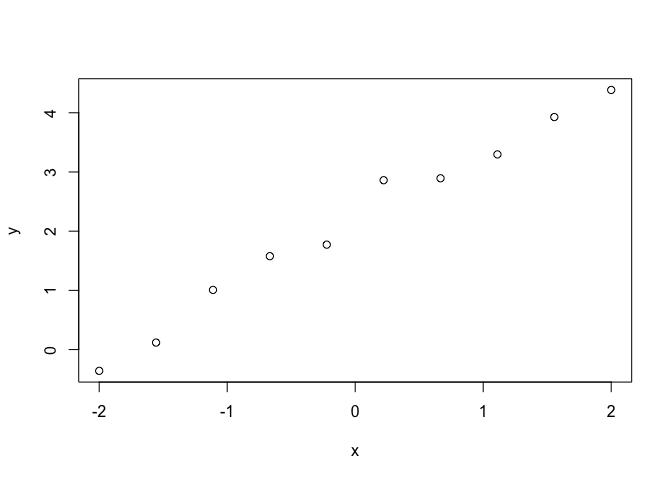
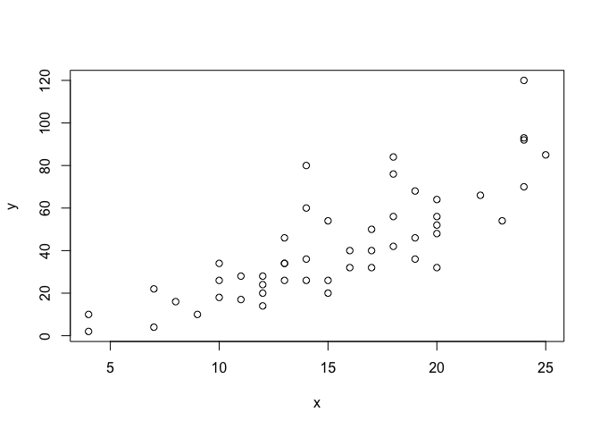

**Currently under construction**

Understanding NLL and LOO
-------------------------

Some notes for the evaluation of the performance of a probabilistic
prediction. All valid and applicable measures are variants of the
negative log likelihood NLL. In the Bayesian context often a quantity
known under the name log predictive probability `lppd` is used. In the
regression setting, the question remains at which points
*x*<sub>*i*</sub> this quantity shall be evaluated. In
<a href="https://arxiv.org/abs/1507.04544" class="uri">https://arxiv.org/abs/1507.04544</a>
the quantity `elpd` the *expected log pointwise predictive density for a
new dataset* is thus defined as:

$$
  \\mathit{elpd} = \\sum\_{i=1}^{N} E\_{y \\sim p(y\|x\_i)}\\left\[\\log(p(y\|x\_i,D))\\right\]  
$$
This quantity requires integrating over the data generating process
*p*(*y*\|*x*<sub>*i*</sub>) for a given *x*<sub>*i*</sub>. The first
approximation which can be done, is to evaluate the expectation at a
test set at the single points *y*<sub>*i*</sub>.

$$
  \\mathit{elpd.test} = \\hat{\\mathit{elpd}}= \\sum\_{i=1}^{N} \\log(p(y\_i\|x\_i,D)) = -N \\cdot \\mathit{NLL}
$$
It is thus *N* times the usual NLL.

### Random Data

Some Data for linear regression:

``` r
N = 50
SD = 0.3
A = 1
B = 2
gen_data = function(){
  x = seq(-2,2,length.out = N)
  y = rnorm(N,A*x+B, sd=SD)  
  return (data.frame(x=x,y=y))
}
set.seed(1)
dat = gen_data()
x=dat$x
y=dat$y
plot(x,y)
```



### Theoretical value

In principle we know that the data is distributed normally with constant
spread SD. In this case the elpd would be.

*e**l**p**d* = *N* ⋅ ∫<sub> − ∞</sub><sup> + ∞</sup>log (*N*(*y*\|0, 0.3)) ⋅ *N*(*y*\|0, 0.3) *d**y*

``` r
  # Numerical Integration
  f = function(x) dnorm(x, sd=SD)*log(dnorm(x, sd=SD))
  integrate(f, -1,1)
  integrate(f, -2,2)
  integrate(f, -4,4)
  (elpd.theo = N*integrate(f, -4,4)$value)
  (nll.theo = -integrate(f, -4,4)$value)
  #integrate(f, -Inf,Inf) not working
  
  # Sampling
  d = rnorm(1e6, mean=0,sd=0.3)
  (elpd.samp = N*mean(log(dnorm(d, mean=0, sd=0.3))))
```

### Taking spread of y into account

Caption: ‘The NLL evaluated from sampling of the data generating
process. Note there is quite spread’

### Fitting with stan

1.  Fit the and check the results

``` r
  library(rstan)
  fit = stan(file = 'lr.stan', data=list(N=length(y),y=y,x=x))
  print(fit, pars = c('a','b','sigma'))
```

### Estimating the elpd

The package `loo` provides advances estimates of the `elpd`. For that a
matrix of the log-likelihood needs to be provided. The dimensions are: S
by N, where S is the size of the posterior sample (with all chains
merged) and N is the number of data points. We caluculate the
log-likelihood `ps` as follows.

``` r
  library(loo)
```

    ## Warning: package 'loo' was built under R version 3.5.2

    ## This is loo version 2.2.0

    ## - Online documentation and vignettes at mc-stan.org/loo

    ## - As of v2.0.0 loo defaults to 1 core but we recommend using as many as possible. Use the 'cores' argument or set options(mc.cores = NUM_CORES) for an entire session.

    ## 
    ## Attaching package: 'loo'

    ## The following object is masked from 'package:rstan':
    ## 
    ##     loo

``` r
  calc_ps = function () {
    a_sam = rstan::extract(fit, 'a')[[1]]
    b_sam = rstan::extract(fit, 'b')[[1]]
    s_sam = rstan::extract(fit, 'sigma')[[1]]
    samples = length(a_sam)
    ps = matrix(NA, nrow = samples, ncol=N)
    for (i in (1:samples)){
      for (j in (1:length(x))){
        ps[i,j] = dnorm(y[j],a_sam[i] * x[j] + b_sam[i], s_sam[i], log=TRUE)
      }
    }
    return (ps)
  }
  ps = calc_ps()
```

Creating of summary statistics.

``` r
  make_df = function(ps){
    (elpd.train = N*mean(ps)) 
    res = loo::loo(ps)
    (elpd.loo = res$elpd_loo)
    (p.loo = res$estimates['p_loo',1])
    res = loo::waic(ps)$estimates
    (elpd.waic = res['elpd_waic',1])
    (p.waic = res['p_waic',1])
    
    df = data.frame(
        loo = c(elpd.loo, -elpd.loo/N, p.loo),
        waic = c(elpd.waic, -elpd.waic/N, p.waic),
        training = c(elpd.train, -elpd.train/N, NA)
        )
    return(df)
  }
  ps = calc_ps()
  df = make_df(ps)
```

    ## Warning: Relative effective sample sizes ('r_eff' argument) not specified.
    ## For models fit with MCMC, the reported PSIS effective sample sizes and 
    ## MCSE estimates will be over-optimistic.

    ## Warning: Accessing elpd_loo using '$' is deprecated and will be removed in
    ## a future release. Please extract the elpd_loo estimate from the 'estimates'
    ## component instead.

    ## Warning: 
    ## 1 (2.0%) p_waic estimates greater than 0.4. We recommend trying loo instead.

``` r
  row.names(df) = c('elpd', 'NLL', 'p')
  print(df)
```

    ##              loo       waic    training
    ## elpd -4.21719908 -4.1904100 -2.61371600
    ## NLL   0.08434398  0.0838082  0.05227432
    ## p     2.96634012  2.9395510          NA

``` r
  elpd.theo
```

    ## [1] -10.74829

``` r
  library("kableExtra")
```

    ## Warning: package 'kableExtra' was built under R version 3.5.2

``` r
  kableExtra::kable(df)
```

<table>
<thead>
<tr>
<th style="text-align:left;">
</th>
<th style="text-align:right;">
loo
</th>
<th style="text-align:right;">
waic
</th>
<th style="text-align:right;">
training
</th>
</tr>
</thead>
<tbody>
<tr>
<td style="text-align:left;">
elpd
</td>
<td style="text-align:right;">
-4.217199
</td>
<td style="text-align:right;">
-4.1904100
</td>
<td style="text-align:right;">
-2.6137160
</td>
</tr>
<tr>
<td style="text-align:left;">
NLL
</td>
<td style="text-align:right;">
0.084344
</td>
<td style="text-align:right;">
0.0838082
</td>
<td style="text-align:right;">
0.0522743
</td>
</tr>
<tr>
<td style="text-align:left;">
p
</td>
<td style="text-align:right;">
2.966340
</td>
<td style="text-align:right;">
2.9395510
</td>
<td style="text-align:right;">
NA
</td>
</tr>
</tbody>
</table>

### Comparison with example from statistical rethinking

In the book (page 222, R Code 7.19) they use the following example:

``` r
  x = cars$speed
  y = cars$dist
  N = length(y)
  #x =  c(-2.,-0.66666, 0.666, 2.)
  #y = c(-6.25027354, -2.50213382, -6.07525495,  7.92081243)
  plot(x,y)
```



``` r
library(rstan)
fit = stan(file = 'lr.stan', data=list(N=length(y),y=y,x=x))
print(fit, pars = c('a','b','sigma'))
```

``` r
  ps = calc_ps()
  df = make_df(ps)
```

    ## Warning: Relative effective sample sizes ('r_eff' argument) not specified.
    ## For models fit with MCMC, the reported PSIS effective sample sizes and 
    ## MCSE estimates will be over-optimistic.

    ## Warning: Some Pareto k diagnostic values are slightly high. See help('pareto-k-diagnostic') for details.

    ## Warning: Accessing elpd_loo using '$' is deprecated and will be removed in
    ## a future release. Please extract the elpd_loo estimate from the 'estimates'
    ## component instead.

    ## Warning: 
    ## 2 (4.0%) p_waic estimates greater than 0.4. We recommend trying loo instead.

``` r
  row.names(df) = c('elpd', 'NLL', 'p')
  library("kableExtra")
  kableExtra::kable(df)
```

<table>
<thead>
<tr>
<th style="text-align:left;">
</th>
<th style="text-align:right;">
loo
</th>
<th style="text-align:right;">
waic
</th>
<th style="text-align:right;">
training
</th>
</tr>
</thead>
<tbody>
<tr>
<td style="text-align:left;">
elpd
</td>
<td style="text-align:right;">
-210.121586
</td>
<td style="text-align:right;">
-210.062221
</td>
<td style="text-align:right;">
-208.252882
</td>
</tr>
<tr>
<td style="text-align:left;">
NLL
</td>
<td style="text-align:right;">
4.202432
</td>
<td style="text-align:right;">
4.201244
</td>
<td style="text-align:right;">
4.165058
</td>
</tr>
<tr>
<td style="text-align:left;">
p
</td>
<td style="text-align:right;">
3.373714
</td>
<td style="text-align:right;">
3.314350
</td>
<td style="text-align:right;">
NA
</td>
</tr>
</tbody>
</table>

### Manual calculation of the WAIC

The elpd estimate can be calculated by summing up the posterior
variances of the different MCMC samples.

``` r
  (p.waic.manual = sum(apply(ps, 2, var))) #p.waid
```

    ## [1] 3.31435

``` r
  elpd.train = df['elpd','training']
  elpd.train -  p.waic.manual #
```

    ## [1] -211.5672

``` r
  -2*(elpd.train -  p.waic.manual) #422.85 in book 423.
```

    ## [1] 423.1345

Discussion: The effective number of parameters, is like in the `loo`
routine. However, the WAIC is probably calculated slightly different in
`loo` compared to the approach in statistical rethinking and done in the
manual approach.
