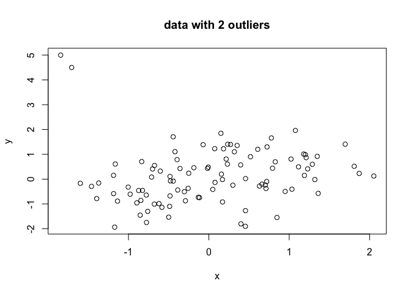

## Robust Regression

Use the following code to create some data, including two outlieres:

``` r
######## Creating Data #####
s <- matrix(c(1, .6, 
              .6, 1), 
            nrow = 2, ncol = 2)
set.seed(3)
#Data w/o outliers
d = data.frame(MASS::mvrnorm(n = 100, mu = c(0,0), Sigma = s))
colnames(d) = c('y','x')
#sorting
idx = sort(d$x, index.return = TRUE)$ix
d = d[idx,1:2]
o <- d
o[c(1:2), 1] <- c(5, 4.5)
dat = list(
  N = nrow(o),
  x = o$x,
  y = o$y
)
plot(y ~ x, dat, main='data with 2 outliers')
```

<!-- -->

1)  Fit a linear model to the data, using the following Stan code.

``` r
stan_code = "data{
  int<lower=0> N;
  vector[N] y;
  vector[N] x;
}

parameters{
  real a; 
  real b;
  real<lower=0> sigma;
}

model{
  //y ~ normal(mu, sigma);
  y ~ normal(a * x + b, sigma);
  a ~ normal(0, 10); 
  b ~ normal(0, 10); 
  sigma ~ normal(0,10);
}"
```

``` r
  library(rstan)
  gauss.mod = stan_model(model_code = stan_code)
  gauss.sample = sampling(gauss.mod, data=dat)
```

2)  Plot the data and include *E*(*y*\|*x*) = *ā* ⋅ *x* + *b̄* , where
    *ā* and *b̄* are the respective posterior means. Include the maximum
    likelihood solution for both the data with and without outliers (you
    can use `lm` for the maximum likelihood solution).

3)  Robust regression: Modify the stan code above to output a
    t-distribution instead of a Gaussian. See
    e.g. <https://mc-stan.org/docs/2_18/functions-reference/student-t-distribution.html>
    how to parametrize a t-distribution. Ensure that the parameter is
    *ν* ≥ 1. Plot *E*(*y*\|*x*) = *ā* ⋅ *x* + *b̄* together with the
    maximum likelihood solutions from above.
