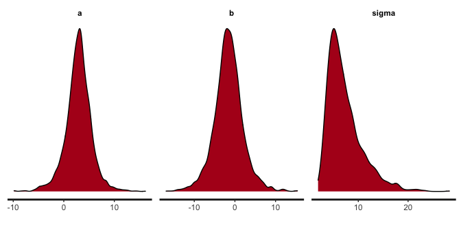
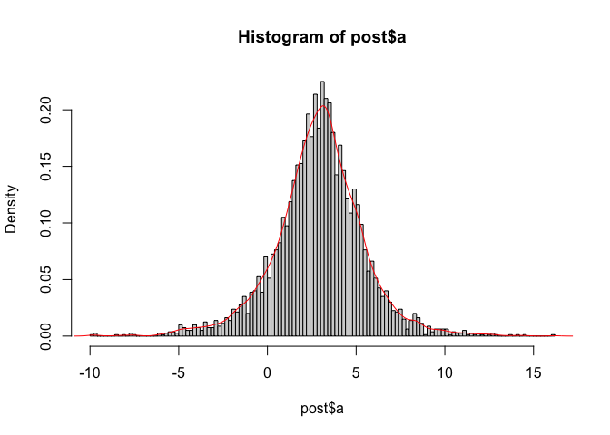

## MCMC with Stan / Simple diagnostics

In the following some notes on Stan. You might find the following
resources sheets helpful.

### Other Cheat Sheets

-   <http://www.sumsar.net/files/posts/2017-bayesian-tutorial-exercises/stan_cheat_sheet2.12.pdf>
-   <https://github.com/sieste/Stan_cheatsheet>

### Data

Some Data for linear regression

``` r
N = 4
x = c(-2.,-0.66666, 0.666, 2.)
y = c(-6.25027354, -2.50213382, -6.07525495,  7.92081243)
data = list(N=N, x=x, y=y)
```

### Getting samples from the posterior

There are currently (2022) two interfaces to stan from R. RStan
(<https://mc-stan.org/users/interfaces/rstan>) which is a bit slower and
does not use the latest stan compiler and rcmdstan
(<https://mc-stan.org/cmdstanr/articles/cmdstanr.html>).

#### The technical steps

There are 3 steps:

1.  Defining the model
2.  Compiling the model. In this step C code is generated.
3.  Running the simulation / sampling from the posterior
4.  Extracting the samples from the posterior

#### Definition

To define a model, you can add a string or create a `.stan` file.
Another option is to use a `Stan` markdown chunk and
`output.var=my_model` to the name of the model. Code completion and
highlighting is working for files and code chunks.

``` r
stan_code = "data{
  int<lower=0> N;
  vector[N] y;
  vector[N] x;
}

parameters{
  real a; //Instead of using e.g. half Gaussian
  real b;
  real<lower=0> sigma;
}

model{
  //y ~ normal(mu, sigma);
  y ~ normal(a * x + b, sigma);
  a ~ normal(3, 10); 
  b ~ normal(0, 10); 
  sigma ~ normal(0,10);
}"
```

#### Compiling

Compiling works with:

-   Compiling rstan `stan_model(model_code = stan_code)` or
    `stan_model(file='mymodel.stan')`
-   Compiling cmdstan `cmdstan_model(file_stan)`

##### Compiling with rstan

``` r
  library(rstan)
```

    ## Loading required package: StanHeaders

    ## Loading required package: ggplot2

    ## rstan (Version 2.21.2, GitRev: 2e1f913d3ca3)

    ## For execution on a local, multicore CPU with excess RAM we recommend calling
    ## options(mc.cores = parallel::detectCores()).
    ## To avoid recompilation of unchanged Stan programs, we recommend calling
    ## rstan_options(auto_write = TRUE)

``` r
  m_rstan = stan_model(model_code = stan_code)
```

    ## Trying to compile a simple C file

#### Compiling with rcmdstan

There is no possibility to use a string for cmd_stan. There is a
convenience function `rethinking::cmdstanr_model_write`. TODO make
oduerr utils and provide the file.

``` r
  library(cmdstanr)
```

    ## Warning: package 'cmdstanr' was built under R version 4.3.0

    ## This is cmdstanr version 0.5.2

    ## - CmdStanR documentation and vignettes: mc-stan.org/cmdstanr

    ## - CmdStan path: /Users/oli/.cmdstan/cmdstan-2.29.2

    ## - CmdStan version: 2.29.2

``` r
  file_stan <- tempfile(fileext=".stan")
  fileConn <- file(file_stan)
  writeLines(stan_code, fileConn)
  close(fileConn)
  m_rcmdstan <- cmdstan_model(file_stan)
```

#### Sampling / running the chains

For rstan: `sampling(m_rstan, data=data)` For cmdstan:
`mod$sample(data = data_file, seed=123)`

``` r
  s_rcmdstan = m_rcmdstan$sample(data = data)
```

    ## Warning: 2 of 4000 (0.0%) transitions ended with a divergence.
    ## See https://mc-stan.org/misc/warnings for details.

``` r
  s_rstan = sampling(m_rstan, data=data)  
```

#### Diagnostics of the chains

The package bayesplot can handle both interfaces

``` r
#traceplot(s_rstan, 'a')
bayesplot::mcmc_trace(s_rstan)
```

<!-- -->

``` r
#bayesplot::mcmc_trace(s_rcmdstan$draws()) #similar result
s_rstan
```

    ## Inference for Stan model: 4bc92a844d593bcbe180a8a2fc11ffa0.
    ## 4 chains, each with iter=2000; warmup=1000; thin=1; 
    ## post-warmup draws per chain=1000, total post-warmup draws=4000.
    ## 
    ##        mean se_mean   sd   2.5%   25%   50%   75% 97.5% n_eff Rhat
    ## a      2.90    0.06 2.55  -2.66  1.56  2.98  4.34  8.06  1895    1
    ## b     -1.59    0.08 3.56  -8.87 -3.60 -1.61  0.43  6.00  2137    1
    ## sigma  7.27    0.10 3.48   2.93  4.80  6.38  8.86 16.32  1286    1
    ## lp__  -7.97    0.05 1.47 -11.71 -8.70 -7.59 -6.87 -6.19  1006    1
    ## 
    ## Samples were drawn using NUTS(diag_e) at Mon May 23 22:55:35 2022.
    ## For each parameter, n_eff is a crude measure of effective sample size,
    ## and Rhat is the potential scale reduction factor on split chains (at 
    ## convergence, Rhat=1).

``` r
# Rhat close to one and n_eff lager than half the number of draws; look fine
```

Key Numbers

-   `Rhat` is something like the ratio of variation between the chains
    to withing the chains
-   `n_eff` number of effective samples taking the autocorrelation into
    account (in cmd_stan the output is ess_bulk and ess_tail)

### Posteriors (of the parameters)

Getting the samples can be done as

-   Rstan `extract(s_rstan)`

-   cmdstan `s_rcmdstan$draws()`

Another handy package is tidybayes which can handle the output of
`rstan` and `rcmdstan`

``` r
library(tidybayes)
head(spread_draws(s_rcmdstan, c(a,b))) #Non-tidy a and b in one row
```

    ## # A tibble: 6 × 5
    ##   .chain .iteration .draw     a      b
    ##    <int>      <int> <int> <dbl>  <dbl>
    ## 1      1          1     1 5.98  -3.74 
    ## 2      1          2     2 1.70   2.59 
    ## 3      1          3     3 0.707 -1.52 
    ## 4      1          4     4 2.05   0.906
    ## 5      1          5     5 2.63   0.292
    ## 6      1          6     6 1.20  -2.59

``` r
head(gather_draws(s_rstan, c(a,b))) #The ggplot like syntax
```

    ## # A tibble: 6 × 5
    ## # Groups:   .variable [1]
    ##   .chain .iteration .draw .variable .value
    ##    <int>      <int> <int> <chr>      <dbl>
    ## 1      1          1     1 a           5.68
    ## 2      1          2     2 a           3.81
    ## 3      1          3     3 a           1.03
    ## 4      1          4     4 a           5.78
    ## 5      1          5     5 a           5.03
    ## 6      1          6     6 a           5.32

``` r
#spread_draws(model_weight_sex, a[sex]) for multilevel models
```

#### Stan functions

``` r
  #plot(samples)
  #samples = extract(s_rstan)
  stan_dens(s_rstan)
```

<!-- -->

``` r
  #Note that these are marginals!
```

#### “Manually” visualize the posterior

We extract samples from the posterior via `extract` (in some
installation the wrong extract function is taken in that case use
`rstan::extract` to use the right one). Visualize the posterior
distribution of *a* from the samples.

``` r
# Extract samples
post = rstan::extract(s_rstan)
T = length(post$a)
hist(post$a,100, freq=F)
lines(density(post$a),col='red')  
```

<!-- -->

### Posterior Predictive Plots

#### Task: Use the samples to create the following posterior predictive plots

Some background first: posterior predictive distribution:
*p*(*y*\|*x*,*D*) = ∫*p*(*y*\|*x*,*θ*)*p*(*θ*\|*D*) *d**θ*
Instead of integration, we sample in two turns

-   *θ*<sub>*i*</sub> ∼ *p*(*θ*\|*D*)
-   *y*<sub>*i**x*</sub> ∼ *p*(*y*\|*x*,*θ*<sub>*i*</sub>) \#We do this
    for many x in practice

#### Creation of the posterior predictive samples by hand

You can either do this part, or use stan to create the posterior
predictive samples *y*<sub>*i**x*</sub> from the samples
*θ*<sub>*i*</sub> by hand.

Tip: Create two matrices `yix` and `muix` from the posterior samples of
*a*, *b*, *σ* with dimension (rows = number of posterior samples and
cols = number of x positions).

``` r
xs = -10:15 # The x-range 17 values from -1 to 15
M = length(xs) 
yix = matrix(nrow=T, ncol = M) #Matrix from samples (number of posterior draws vs number of xs)
muix = matrix(nrow=T, ncol = M) #Matrix from mu (number of posterior draws vs number of xs)
for (i in 1:T){ #Samples from the posterior
  a = post$a[i] #Corresponds to samples from theta
  b = post$b[i]
  sigma = post$sigma[i]
  for (j in 1:M){ #Different values of X
    mu = a * xs[j] + b
    muix[i,j] = a * xs[j] + b
    yix[i,j] = rnorm(1, mu, sigma) # Single number drawn
  }
}

if (FALSE){
  plot(x, y, xlim=c(-10,15), ylim=c(-25,25), ylab='mu=a*x+b')
  for (i in 1:100){
    lines(xs, muix[i,],lwd=0.25,col='blue')
  }
  
  plot(x, y, xlim=c(-10,15), ylim=c(-25,25), ylab='ys')
  for (i in 1:100){
    points(xs, yix[i,], pch='.',col='red')
  }
}
```

After you created the matrices `yix` and `muix` you can use the
following function to draw the lines for the quantiles.

``` r
plot(x, y, xlim=c(-10,15), ylim=c(-25,25), ylab='quantiles (y and mu)')
quant_lines = function(x2, y_pred, col='blue'){
  m = apply(y_pred, 2,quantile, probs=c(0.50))
  lines(x2, m,col=col)
  q05 = apply(y_pred, 2, quantile, probs=c(0.25))
  q95 = apply(y_pred, 2, quantile, probs=c(0.75))
  lines(x2, q05,col=col)
  lines(x2, q95,col=col)  
}

quant_lines(xs,yix, col='red')
quant_lines(xs,muix, col='blue')
```

<!-- -->

#### Creation of the posterior predictive samples with Stan

It’s also possible to draw posterior predictive samples. One can use the
`generated quantities` code block for that.

    data{
      int<lower=0> N;
      vector[N] y;
      vector[N] x;
      //For the prediced distribution (new)
      int<lower=0> N2;
      vector[N2] x2;
    }

    generated quantities {
      real Y_predict[N2]; 
      for (i in 1:N2){
        Y_predict = normal_rng(a * x2 + b, sigma);
      }
    }

``` r
  x2 = -10:15
  N2 = length(x2)
  fit2 = rstan::stan(file = '~/Dropbox/__HTWG/DataAnalytics/_Current/lab/06_03_Bayes_3/Stan_Primer_model_pred.stan',
                         data=list(N=N,x=x, y=y, N2=N2,x2=x2),iter=10000)
```

``` r
  d2 = rstan::extract(fit2)
  y_pred = d2$Y_predict
  dim(y_pred)
  plot(x, y, xlim=c(-10,15), ylim=c(-25,25), ylab='quantiles (y and mu)')
  quant_lines(x2,y_pred, col='red')
```
